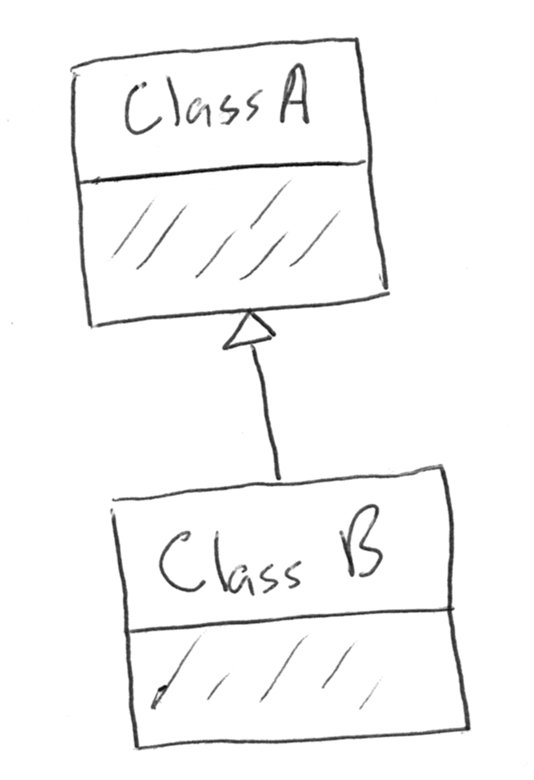
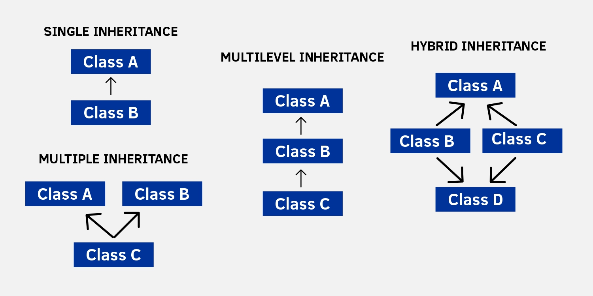
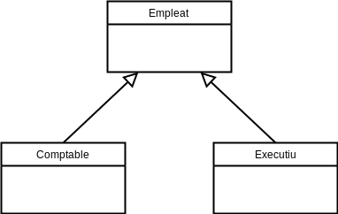
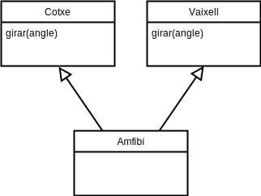
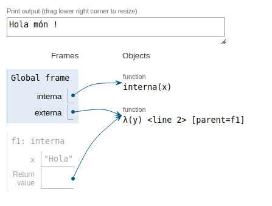
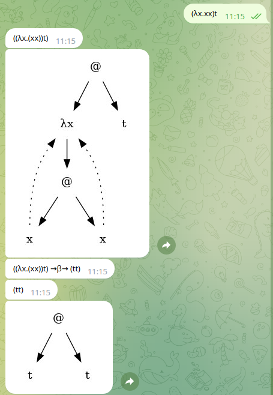

class: center, middle

### Llenguatges de Programació

## Conceptes avançats

<br><br>

**Jordi Petit, Fernando Orejas, Gerard Escudero**


---
class: left, middle, inverse

## Contingut

- .cyan[Recursivitat]

  - .cyan[*Tail Call*]

  - *Continuation-Passing Style*

  - *Trampolining*

  - Continuacions en Haskell

- Orientació a Objectes

- Subtipus i variància de tipus

- Clausures

- Programació asíncrona

---

# Recursivitat

*Tail Recursion*: la crida recursiva es fa just abans de retornar el valor.

.cols5050[
.col1[
**Factorial recursiu**:

```python
def f_rec(n):
  if n == 0:
    return 1
  else:
    return n * f_rec(n-1)
```
]
.col2[
**Factorial tail recursion**:

```python
def f_tailrec(n, resultat = 1):
  if n == 0:
    return resultat
  else:
    return f_tailrec(n-1, n*resultat)
```
]]

- **Tail Recursion Optimization**: optimització en que el compilador substitueix la crida per recursiva per un salt. 

- Python no ho suporta:

  ```python
  f_rec(1000)
  RecursionError: maximum recursion depth exceeded in comparison
  ```

- Altra opció és passar-la a **iterativa**.

---

# *Tail Recursion*

Però encara és útil:

.cols5050[
.col1[
**Recursivitat normal**:

```python
def slow_fib(n):
    if n < 2:
        return 1
    else:
        return slow_fib(n - 1) + 
               slow_fib(n - 2)

```
]
.col2[
**Tail recursion**:

```python
def quick_fib(n, acc1=1, acc2=1):
    if n < 2:
        return acc1
    else:
        return quick_fib(n - 1, 
                         acc1 + acc2, 
                         acc1)
```
]]

.cols5050[
.col1[
```python
fib(40) = 165580141
temps(s): 21.715350
```
]
.col2[

```python
fib(40) = 165580141
temps(s): 0.000117
```
]]

.footnote[.blue[*] Hem utilitzat el mòdul `pytictoc` per mostrar el temps d'execució.]

---

# Tail Recursion

Per què funciona?

.cols5050[
.col1[
```python
>>> slow_fib(4)
4 ##         # paràmetre i pila
3 ###
2 ####
1 #####
0 #####
1 ####
2 ###
1 ####
0 ####
5            # resultat
```
]
.col2[
```python
>>> quick_fib(4)
4 ##
3 ###
2 ####
1 #####
5
```
]]

.footnote[.blue[*] Hem utilitzat el mòdul `traceback` per mostrar la mida de la pila.]

---
class: left, middle, inverse

## Contingut

- .cyan[Recursivitat]

  - .brown[*Tail Call*]

  - .cyan[*Continuation-Passing Style*]

  - *Trampolining*

  - Continuacions en Haskell

- Orientació a Objectes

- Subtipus i variància de tipus

- Clausures

- Programació asíncrona

---

# *Continuation-Passing Style*

Les funcions no retornen resultats directament, sinó que passen els seus resultats a una altra funció (la continuació), que s'encarrega de processar-los.

**Exemple**:

```python
expr = lambda: (1 + 2) * 3 + 4
expr()  👉  13
```

Fem una funció per cada operació.

.cols5050[
.col1[
```python
mes2 = lambda x, cont: cont(2 + x)
per3 = lambda x, cont: cont(3 * x)
mes4 = lambda x, cont: cont(4 + x)

def expr_cps(x, cont):
  mes2(x, (lambda y:
    per3(y, (lambda z: 
      mes4(z, (lambda res:
        cont(res)))))))

expr_cps(1, print)  👉  13
```
]
.col2[
Com funciona la pila?

```python
expr ##
mes2 ###
per3 #####
mes4 #######
13
```

Recorda una mica als *thunks* del Haskell.
]]

---

# CPS amb funcions recursives

Amb una funció recursiva és més natural.

**Exemple**:

.cols5050[
.col1[
```python
identitat = lambda x: x

def fact_cps(n, cont):
    if n == 0:
        return cont(1)
    else:
        return fact_cps(n - 1, 
            lambda value: 
                cont(n * value))

fact_cps(6, identitat)  👉  720
```
]
.col2[
Pila?

```python
fact_cps ##
fact_cps ###
fact_cps ####
fact_cps #####
fact_cps ######
fact_cps #######
fact_cps ########
720
```
]]

Continuem tenint el problema de la pila:

```python
fact_cps(1000, identitat)
RecursionError: maximum recursion depth exceeded while calling a Python object
```

---
class: left, middle, inverse

## Contingut

- .cyan[Recursivitat]

  - .brown[*Tail Call*]

  - .brown[*Continuation-Passing Style*]

  - .cyan[*Trampolining*]

  - Continuacions en Haskell

- Orientació a Objectes

- Subtipus i variància de tipus

- Clausures

- Programació asíncrona

---

# *Trampolining*

La tècnica del trampolí converteix la recursió en iteració retornant crides de funcions ajornades en lloc d'executar-les directament; així s'evita el creixement de la pila.

.cols5050[
.col1[
**Funció trampolí**:

```python
def trampoline(f, *args):
    v = f(*args)
    while callable(v):
        v = v()
    return v
```

```python
trampoline(fact_cps2, 6, identitat)
👉  720
```

Crida a la funció mentre la continuació sigui de tipus funció (*callable*).
]
.col2[
**Adaptació per al trampolí**:

```python
def fact_cps1(n, cont):
    if n == 0:
        return cont(1)
    else:
        return fact_cps1(n - 1, 
            lambda value: 
                cont(n * value))

def fact_cps2(n, cont):
    if n == 0:
        return cont(1)
    else:
        return lambda: fact_cps2(n - 1, 
            lambda value: 
                lambda: cont(n * value))
```
]]

---

# *Trampolining*

**Funcionament de la pila**:

```python
trampoline(fact_cps2, 6, identitat)
👉
trampoline ##
fact_cps2 ###
fact_cps2 ####
fact_cps2 ####
fact_cps2 ####
fact_cps2 ####
fact_cps2 ####
fact_cps2 ####
720
```


**Funciona!**

```python
trampoline(fact_cps2, 1000, identitat)
👉  4023872600770.....0000000000000000
```

---
class: left, middle, inverse

## Contingut

- .cyan[Recursivitat]

  - .brown[*Tail Call*]

  - .brown[*Continuation-Passing Style*]

  - .brown[*Trampolining*]

  - .cyan[Continuacions en Haskell]

- Orientació a Objectes

- Subtipus i variància de tipus

- Clausures

- Programació asíncrona

---

# Continuacions en Haskell

```haskell
facCPS :: Integer -> (Integer -> Integer) -> Integer
facCPS 0 cont = cont 1
facCPS n cont = facCPS (n - 1) $ \f -> cont (n * f)
```

```haskell
facCPS 10 id
👉  3628800
```

### Mònade Cont

```haskell
import Control.Monad.Cont    -- en ghci: :set -package mtl
facCPS :: Integer -> Cont r Integer
facCPS 0 = return 1
facCPS n = do
    f <- facCPS (n - 1)
    return (n * f)
```

.cols5050[
.col1[
```haskell
runCont (facCPS 10) id
👉  3628800
```
]
.col2[
```haskell
runCont (facCPS 4 >>= facCPS) id
👉  620448401733239439360000
```
]]

.footnote[[font](https://web.cs.dal.ca/~nzeh/Teaching/3137/haskell/monads/continuations/cont/)]

---
class: left, middle, inverse

## Contingut

- .brown[Recursivitat]

- .cyan[Orientació a Objectes]

  - .cyan[Herència]

  - Declaració de subclasses

  - Vinculació

- Subtipus i variància de tipus

- Clausures

- Programació asíncrona

---

# Programació orientada a objectes

Elements principals de la POO:

- Reutilització de codi

- Modularitat

- Facilitat de manteniment

- Ampliació de funcionalitats

- Abstracció

- Encapsulació

- Herència

---

# Herència i subclasses

L'herència i la relació de subclasses tenen per objectiu:

- Estructurar millor el codi.

- Reaprofitar millor el codi.

- Simplificar el disseny.

---

# Herència i subclasses

Exemple:

```typescript
class Empleat {...}

function sou(e: Empleat): number {...}

e = new Empleat()
s = sou(e)
```


.cols5050[
.col1[
Amb programació "clàssica":

```typescript
function sou(e: Empleat): number {
    if (e.es_venedor()) {
        ...
    } else if (e.es_contable()) {
        ...
    } else if (e.es_executiu()) {
        ...
    } 
}
```
]
.col2[
Amb POO:

```typescript
class Empleat {
    function sou(): number {...}
    ...
}

class Venedor extends Empleat {
    function sou(): number {...}
    ...
}

class Comptable extends Empleat {
    function sou(): number {...}
    ...
}
```
]
]

---

# Herència i subclasses

A cada subclasse es poden re definir operacions de la classe base.

```typescript
class Empleat {
    function sou(): number {...}
}

class Venedor extends Empleat {
    function sou(): number {...}
}

class Comptable extends Empleat {
    function sou(): number {...}
}
```


---

# Herència i subclasses

A cada subclasse es poden definir noves operacions.


```typescript
class Empleat {
    function sou(): number {...}
}

class Venedor extends Empleat {
    function comissio(): number {...}
}

class Comptable extends Empleat {
    function fulls_de_calcul(): FullCalcul[] {...}
}
```

---

# Herència i subclasses

L'operació que es crida depèn de la (sub)classe de l'objecte en temps d'execució (*late binding*). 

```typescript
function escriure(e: Empleat) {
    print(e.nom, e.sou())
}

Empleat e = new Empleat()
Empleat v = new Venedor()
Empleta c = new Comptable()

escriure(e)         // usa el sou() d'Empleat
escriure(v)         // usa el sou() de Venedor
escriure(c)         // usa el sou() de Comptable
```

---

# Herència

<br>
<center>

</center>

---

# Herència simple

Una classe només pot ser subclasse d'una altra classe.

<center>

</center>

---

# Herència múltiple

Una classe pot ser subclasse de més d'una classe.

<center>

</center>

 .small[ &nbsp;
📖  Vaixell amb Rodes d'en J. Petit: [Oasi #25](https://upcommons.upc.edu/handle/2117/127184)
]

---

# Promesa de l'OO

Si es canvia l'estructura salarial:

- En programació "clàssica" cal refer del tot la funció `sou()` (i potser més operacions).

- En programació "OO", es canvien les classes i el mètode `sou()` d'algunes.

---
class: left, middle, inverse

## Contingut

- .brown[Recursivitat]

- .cyan[Orientació a Objectes]

  - .brown[Herència]

  - .cyan[Declaració de subclasses]

  - Vinculació

- Subtipus i variància de tipus

- Clausures

- Programació asíncrona

---

# Declaració de subclasses en C++

```c++
class Empleat { ... };
class Venedor: Empleat { ... };
```

O també:

```c++
class Venedor: public    Empleat { ... };
class Venedor: protected Empleat { ... };
class Venedor: private   Empleat { ... };
```

Amb herència múltiple:

```c++
class Cotxe { ... };
class Vaixell { ... };
class Hibrid: public Cotxe, public Vaixell { ... };
```

Resolució de conflictes:

```c++
hibrid.Cotxe::girar(90);
hibrid.Vaixell::girar(90);
```

---

# Declaració de subclasses en Java

```java
class Empleat { ... }

class Venedor extends Empleat { ... }
```

En Java no hi herència múltiple amb classes, però sí amb interfícies:

```java
interface Cotxe { ... }

interface Vaixell { ... }

class Hibrid implements Cotxe, Vaixell { ... }
```

Les interfícies de Java són com les classes de Haskell (quin embolic!).

---

# Declaració de subclasses en Python


```python
class Empleat: 
    ...

class Venedor(Empleat): 
    ...
```

Amb herència múltiple:

```python
class Hibrid(Cotxe, Vaixell): 
    ...
```

Resolució de conflictes:

- Quan a les dues classes hi ha mètodes amb el mateix nom, s'hereta el de la primera.

---

# Visibilitat dels membres

Els LPs limiten la visibilitat dels membres (atributs i mètodes) de les classes:

Ajuda a:

- Encapsular els objectes en POO.

- Definir una interfície clara i independent de la implementació.

- Prevenir errors en el codi.


---

# Visibilitat en C++

Els **especificadors d'accés** defineixen la visibilitat dels membres d'una classe.

```c++
class Classe {
    public:
        ...
    protected:
        ...
    private:
        ...
};
```

- **public**: els membres són visibles des de fora de la classe

- **privat**: no es pot accedir (ni veure) als membres des de fora de la classe

- **protegit**: no es pot accedir als membres des de fora de la classe, <br>però s'hi pot accedir des de classes heretades. 

.cols5050[
.col1[
```c++
class Classe {
    // privat per defecte
};
```
]
.col2[
```c++
struct Estructura {
    // public per defecte
};
```
]]

---

# Visibilitat en C++

Els **especificadors d'accés** també defineixen la visibilitat dels membres quan es deriva una classe:

```c++
class SubClasse: public Classe { ... };
```

- Els membres protegits de `Classe` són membres protegits de `SubClasse`.<br>
- Els membres públics de `Classe` són membres públics de `SubClasse`.


```c++
class SubClasse: protected Classe { ... };
```

- Els membres protegits i públics de `Classe` són membres protegits de `SubClasse`.


```c++
class SubClasse: private Classe { ... };
class SubClasse: Classe { ... };            // 'private' per defecte en classes
```

- Els membres públics i protegits de `Classe` són membres privats de `SubClasse`.


---

# Visibilitat en C++

```c++
class A {
    public:
       int x;
    protected:
       int y;
    private:
       int z;
};

class B : public A {
    // x és public
    // y és protegit
    // z no és visible des de B
};

class C : protected A {
    // x és protegit
    // y és protegit
    // z no és visible des de C
};

class D : private A {           
    // x és privat
    // y és privat
    // z no és visible des de D
};
```

---

# Visibilitat en Java

Els **nivells d'accés** defineixen la visibilitat dels membres (atributs i mètodes) d'una classe.

```java
class Classe {
    public ...
    protected ...
    private ...
    ...
}
```

- **public**: aquest membre és accessible des de fora de la classe

- **privat**: no es pot accedir (ni veure) en aquest membre des de fora de la classe

- **protegit**: no es pot accedir en aquest membre des de fora de la classe, <br>però s'hi pot accedir des de classes heretades. 

- *res*: només el codi en el `package` actual pot accedir aquest membre. 

---

# Visibilitat en Java

En Java no es pot limitar la visibilitat heretant classes (sempre és "`public`").

```java
class SubClasse extends Classe { ... }
```

- Els membres protegits de `Classe` són membres protegits de `SubClasse`.<br>
- Els membres públics de `Classe` són membres públics de `SubClasse`.

---

# Visibilitat en Java

.cols5050[
.col1[
```java
package p;

public class A {
    public int a;
    protected int b;
    private int c;
    int d;
}

class B extends A {
    // a és visible des de B
    // b és visible des de B
    // c no és visible des de B
    // d és visible des de B
}

// A.a és visible des de p
// A.b és visible des de p
// A.c no és visible des de p
// A.d és visible des de p
```
]
.col2[
```java
package q;

import p.*;


class C extends p.A {
    // a és visible des de C
    // b és visible des de C
    // c no és visible des de C
    // d no és visible des de C
}

// A.a és visible des de q
// A.b no és visible des de q
// A.c no és visible des de q
// A.d no és visible des de q
```
]]

---

# Visibilitat en Python

En Python no hi ha restriccions de visibilitat.

Tot és visible.

Per *convenció*, els membres que comencen per `_` (però no per `__`) són privats.

---
class: left, middle, inverse

## Contingut

- .brown[Recursivitat]

- .cyan[Orientació a Objectes]

  - .brown[Herència]

  - .brown[Declaració de subclasses]

  - .cyan[Vinculació]

- Subtipus i variància de tipus

- Clausures

- Programació asíncrona

---

# Tipatge estàtic i tipatge dinàmic

**Tipatge estàtic**: La verificació de tipus que es realitza durant la compilació del codi. 

- El compilador comprova si les variables s'utilitzen de manera coherent amb el seu tipus  durant la compilació del codi. 

- Si hi ha un error de tipus, el compilador no genera codi. 

- Ajuda a detectar i corregir errors abans d'executar el codi, evitant problemes durant l'execució.


**Tipatge dinàmic**: La verificació de tipus que es realitza durant l'execució del codi. 

- El tipus de la variable es determina en temps d'execució

- Si hi ha un error de tipus, aquest no es detectarà fins que el codi s'executi.

---

# Late binding (vinculació)

.small[
El **late binding** és el procés pel qual es determina (en temps d'execució) quin mètode cal cridar en funció del tipus dinàmic d'un objecte.

.cols5050[
.col1[
```typescript
class Animal {
    parlar() {
        print("grr")
    }
}

class Gat extends Animal {
    parlar() {
        print("mèu")
    }
}

class Gos extends Animal {
    parlar() {
        print("bub")
    }
}

function parlarN(animal: Animal, 
                 n: number) {
    repeat (n) {
        animal.parlar() ⬅️ late binding
    }
}
```
]
.col2[
```typescript
animal: Animal = new Animal()
gat: Gat = new Gat()
gos: Gos = new Gos()

animal.parlar()      👉 grr            
gat.parlar()         👉 mèu
gos.parlar()         👉 bub

parlarN(animal, 3)   👉 grr grr grr
parlarN(gat, 3)      👉 mèu mèu mèu
parlarN(gos, 3)      👉 bub bub bub
```
]]]

---

# Vinculació en Java

En Java, els objectes tenen un tipus estàtic i un tipus dinàmic:

```java
Animal animal;
animal = new Gat();
```

- El tipus estàtic d'`animal` és `Animal`.

- El tipus dinàmic d'`animal` és `Gat`.

El tipus dinàmic ha de ser un subtipus del tipus estàtic.

En temps de compilació, es comprova que les crides es puguin aplicar al tipus estàtic.

En temps d'execució, la vinculació es fa en funció del tipus dinàmic.


---

# Vinculació en Java

Donada una declaració `C c;` i una operació `c.m()`:

- En temps de compilació, es verifica que la classe C tingui el mètode `m` (directament o a través d'herència).

- En temps d'execució, es crida al `m` de la classe corresponent al tipus dinàmic de `c` o de la seva superclasse més propera que l'implementi.

---

# Vinculació en Java


.cols5050[
.col1[
```java
class Animal {
    void parlar() {
        print("grr");
    }
}

class Gat extends Animal {
    void parlar() {
        print("mèu");
    }
    void filar() {
        print("rum-rum");
    }
}

void parlarN(Animal animal, int n) {
    for (int i = 0; i < n; ++i) {
        animal.parlar(); 
    }
}
```
]
.col2[
```java
Animal animal = new Animal();
Gat gat = new Gat();

animal.parlar();       👉 grr
gat.parlar();          👉 mèu

parlarN(animal, 3);    👉 grr grr grr
parlarN(gat, 3);       👉 mèu mèu mèu

gat.filar();      👉 rum-rum
animal.filar()    ❌ error compilació
```
]]

---

# Vinculació en Python

En Python, el tipus dels objectes és dinàmic.

```python
>>> e = Empleat()
>>> v = Venedor()
>>> type(e)
<class '__main__.Empleat'>
>>> type(v)
<class '__main__.Venedor'>
>>> v = e     
>>> type(v)
<class '__main__.Empleat'>
```


Donada una operació `c.m()`:

- En temps d'execució, es crida al `m` de la classe corresponent al tipus dinàmic de `c` o de la seva superclasse més propera que l'implementi.

---

# Vinculació en Python


.cols5050[
.col1[
```python
class Animal:
    def parlar(self):
        print("grr")

class Gat(Animal):
    def parlar(self):
        print("mèu")
    def filar(self):
        print("rum-rum")

def parlarN(animal, n):
    for _ in range(n):
        animal.parlar()
```
]
.col2[
```python
animal = Animal()
gat = Gat()

animal.parlar()       👉 grr            
gat.parlar()          👉 mèu

parlarN(animal, 3)    👉 grr grr grr
parlarN(gat, 3)       👉 mèu mèu mèu

gat.filar();     👉 rum-rum
animal.filar()   ❌ error execució
```
]]

---

# Vinculació en C++

En C++, els objectes estàtics tenen un tipus estàtic.

```c++
Animal a = Gat();
```

- El tipus estàtic d'`a` és `Animal`: quan se li assigna un `Gat` es perd la part extra.
- (Recordeu: El pas per còpia fa una assignació)

Els objectes dinàmics (punters i referències) tenen un tipus estàtic i un tipus dinàmic.

```c++
Animal* a = new Gat();
```

- El tipus estàtic d'`a` és punter a `Animal`.
- El tipus dinàmic d'`a` és punter a `Gat`.


```c++
Animal& a = Gat();
```

- El tipus estàtic d'`a` és referència a `Animal`.
- El tipus dinàmic d'`a` és referència a `Gat`.


---

# Vinculació en C++

Per a objectes estàtics, la vinculació és estàtica.

El tipus dinàmic ha de ser un subtipus del tipus estàtic.

En temps de compilació, es comprova que les crides es puguin aplicar al tipus estàtic.

En temps d'execució, la vinculació es fa en funció del tipus dinàmic, sobre els mètodes marcats `virtual`.


---

# Vinculació en C++

.cols5050[
.col1[
```c++
class Animal {
    virtual void parlar() {
        print("grr");
    }
}

class Gat: Animal {
    virtual void parlar() {
        print("mèu");
    }
    virtual void filar() {
        print("rum-rum");
    }
}

void parlarN(Animal animal, n: int) {
    for (int i = 0; i <n; ++i) {
        animal.parlar(); 
    }
}
```
]
.col2[
```c++
Animal animal;
Gat gat;

animal.parlar();       👉 grr
gat.parlar();          👉 mèu

parlarN(animal, 3);    👉 grr grr grr
parlarN(gat, 3);       👉 grr grr grr *️⃣

gat.filar();      👉 rum-rum
animal.filar()    ❌ error compilació
```

*️⃣ Com que `parlarN` rep un `Animal` per còpia, al cridar `parlarN(gat, 3)` es perd la part de gat.

]]


---

# Vinculació en C++

.cols5050[
.col1[
```c++
class Animal {
    virtual void parlar() {
        print("grr");
    }
}

class Gat: Animal {
    virtual void parlar() {
        print("mèu");
    }
    virtual void filar() {
        print("rum-rum");
    }
}

void parlarN(Animal* animal, n: int) {
    for (int i = 0; i <n; ++i) {
        animal->parlar(); 
    }
}
```
]
.col2[
```c++
Animal animal;
Gat gat;

animal.parlar();       👉 grr
gat.parlar();          👉 mèu

parlarN(animal, 3);    👉 grr grr grr
parlarN(&gat, 3);      👉 mèu mèu mèu *️⃣

gat.filar();      👉 rum-rum
animal.filar()    ❌ error compilació
```

*️⃣ Com que `parlarN` rep un punter a `Animal`, al cridar `parlarN(gat, 3)` el tipus dinàmic continua sent `Gat`.

]]

---

# Vinculació en C++

.cols5050[
.col1[
```c++
class Animal {
    virtual void parlar() {
        print("grr");
    }
}

class Gat: Animal {
    virtual void parlar() {
        print("mèu");
    }
    virtual void filar() {
        print("rum-rum");
    }
}

void parlarN(Animal& animal, n: int) {
    for (int i = 0; i <n; ++i) {
        animal.parlar(); 
    }
}
```
]
.col2[
```c++
Animal animal;
Gat gat;

animal.parlar();       👉 grr
gat.parlar();          👉 mèu

parlarN(animal, 3);    👉 grr grr grr
parlarN(gat, 3);       👉 mèu mèu mèu *️⃣

gat.filar();      👉 rum-rum
animal.filar()    ❌ error compilació
```

*️⃣ Com que `parlarN` rep un `Animal` per referència, al cridar `parlarN(gat, 3)` el tipus dinàmic continua sent `Gat`.

]]

---

# Vinculació en C++

.cols5050[
.col1[
```c++
class Animal {
    void parlar() {
        print("grr");
    }
}

class Gat: Animal {
    void parlar() {
        print("mèu");
    }
}

void parlarN(Animal& animal, n: int) {
    for (int i = 0; i <n; ++i) {
        animal.parlar(); 
    }
}
```
]
.col2[
```c++
Animal animal;
Gat gat;

parlarN(animal, 3);    👉 grr grr grr
parlarN(gat, 3);       👉 grr grr grr *️⃣
```

*️⃣ Com que `parlar` no és `virtual`, `parlarN` no fa late binding.

]]

---
class: left, middle, inverse

## Contingut

- .brown[Recursivitat]

- .brown[Orientació a Objectes]

- .cyan[Subtipus i variància de tipus]

- Clausures

- Programació asíncrona


---

# Noció de subtipus

**Definició 1:**

`s` és subtipus de `t` si tots els valors d'`s` són valors de `t`.

<br>


**Exemple en Pearl:**

```
subset Evens of Int where {$_ % 2 == 0}
```

<br>

➡️ Aquesta mena de subtipus no són habituals en els LPs.

---

# Noció de subtipus

**Definició 2:**

`s` és subtipus de `t` si qualsevol funció que es pot aplicar a un objecte de tipus `t` es pot aplicar a un objecte de tipus `s`.

<br>


**Exemple en C++:**

```c++
class Forma;
class Quadrat: Forma;           // Forma és subtipus de Forma

double area(const Forma& f);

Forma f;
area(f);     ✅
Quadrat q;
area(q);     ✅
```

<br>

➡️ Aquesta és la definició en què es basa la programació orientada a objectes.


---

# Noció de subtipus

**Definició 2':**

`s` és subtipus de `t` si en tot context que es pot usar un objecte de tipus `t` es pot usar un objecte de tipus `s`.

<br>


➡️ Aquesta és la definició en què (a vegades es diu que) es basa la programació orientada a objectes.


---

# Noció de subtipus

Les definicions 1 i 2 no són equivalents:

- Si `s` és subtipus de `t` segons la Def.&nbsp;1, <br>llavors també ho és d'acord amb la Def.&nbsp;2.

- La inversa, en general, no és certa. És a dir, si `s` és
subtipus de `t` d'acord amb la Def.&nbsp;2, llavors no té
perquè ser-ho d'acord amb la Def.&nbsp;1.

    Exemple:

    ```c++
    class T {
        int x;
    };

    class S : T {
        int y;
    }
    ```

    Els valors de `S` no es poden veure com un subconjunt dels valors de `T`, ja que tenen més elements.

---

# Noció de subtipus

**Definició 3:**

`s` és subtipus de `t` si tots els objectes de `s` es poden convertir implícitament a objectes de `t` (*type casting* o coerció). 
<br>


---

# Comprovació i inferència amb subtipus

- Si `e :: s` i `s <= t`, llavors `e :: t`.

- Si `e :: s`, `s <= t` i `f :: t -> t'`, llavors `f e :: t'`.


<br>

La notació `e :: t` indica que `e` és de tipus de `t`.<br>
La notació `s ≤ t` indica que `s` és un subtipus de `t`.

---

# Comprovació i inferència amb subtipus

- Si `e :: s` i `s <= t`, llavors `e :: t`.

- Si `e :: s`, `s <= t` i `f :: t -> t'`, llavors `f e :: t'`.

Per tant,

- Si `e :: s`, `s <= t` i `f :: t -> t`, llavors `f e :: t`.

Però no podem assegurar que `f e :: s`! Per exemple, si tenim

- `x :: parell`
- `parell <= int`
- `function es_positiu(int): boolean`
- `function incrementa(int): int`

Llavors

- `es_positiu(x) :: bool`   ✅
- `incrementa(x) :: int`    ✅
- `incrementa(x) :: parell` ❌

---

# El cas de l'assignació

- Si `x :: t` i `e :: s` i `s <= t`, llavors `x = e` és una assignació correcta.

- Si `x :: s` i `e :: t` i `s <= t`, llavors `x = e` és una assignació incorrecta.

Exemples:

- Si `x :: int` i `e :: parell` , `x = e` no té problema.

- Si `x :: parell` i `e :: int` , `x = e` crearia un problema: `e` potser no és parell.


---

# El cas de les funcions

- Si `s <= t` i `s' <= t'`, llavors `(s -> s') <= (t -> t')`?

--

    No!

    Suposem que `f :: parell -> parell` i que `g :: int -> int`.

    Si `(s -> s') <= (t -> t')`, llavors sempre que puguem usar `g`, podem usar `f` al seu lloc. Com que `g 5` és legal, `f 5` també seria legal. Però `f` espera un `parell` i 5 no ho és.


--

- En canvi, si `s <= t` i `s' <= t'`, llavors `(t -> s') <= (s -> t')` és correcte.


---

# El cas dels constructors de tipus

- Si `s ≤ t`, podem assegurar que `List s ≤ List t`?

--

    No!

    ```typescript
    class Animal
    class Gos extends Animal
    class Gat extends Animal

    function f(animals: List<Animal>) {
        animals.push(new Gat())             // perquè no?
    }

    gossos: List<Gos> = ...
    f(gossos)                              // ai, ai
    ```

---


# El cas dels constructors de tipus

- Si `s ≤ t`, podem assegurar que `List t ≤ List s`?

--

    No!

    ```typescript
    class Animal
    class Gos extends Animal {
        function borda() {...}
    }
    class Gat extends Animal;

    function f(gossos: List<Gos>) {
        for (var gos: Gos of gossos) gos.borda()
    }

    List<Animal> animals = [new Gos(), new Animal, new Gat()]
    f(animals)                  // alguns animals no borden 🙀
    ```

---

# Variància de constructors de tipus

Sigui `C` un constructor de tipus i sigui `s <= t`.

- Si `C s <= C t`, llavors `C` és **covariant**.

- Si `C t <= C s`, llavors `C` és **contravariant**.

- Si no és covariant ni contravariant, llavors `C` és **invariant**.


<br>
--
Hem vist doncs que:

- El constructor `->` és contravariant amb el primer paràmetre.

- El constructor `->` és covariant amb el segon paràmetre.

- El constructor `List` és invariant.

---
class: left, middle, inverse

## Contingut

- .brown[Recursivitat]

- .brown[Orientació a Objectes]

- .brown[Subtipus i variància de tipus]

- .cyan[Clausures]

  - *Partial*

  - Objectes sense classe

  - Memorització

  - Decoradors

- Programació asíncrona

---

# Clausures

Al retornar funcions es creen clausures (*closure*):
- tanca l'abast (*scope*) lèxic del voltant i captura els seus valors.

.cols5050[
.col1[
```clojure
def interna(x):
    z = "!"
    return lambda y: print(x, y, z)
    
externa = interna("Hola")

externa("món")  👉  Hola món !
```

Fixeu-vos en que si la funció interna tornés només una funció, no funcionaria.
]
.col2[


.small[diagrama: [Python Tutor](https://pythontutor.com)]
]]

---
class: left, middle, inverse

## Contingut

- .brown[Recursivitat]

- .brown[Orientació a Objectes]

- .brown[Subtipus i variància de tipus]

- .cyan[Clausures]

  - .cyan[*Partial*]

  - Objectes sense classe

  - Memorització

  - Decoradors

- Programació asíncrona

---

# *Partial*

Podem currificar en python?

```python
def partial ( f , x ):
    def g(* args ):
        return f (*(( x ,) + args ))
    return g
```

Exemple:

```python
multiplica = lambda x, y: x * y

doble = partial(multiplica , 2)
```

```python
doble(3)  👉  6
```

---

# *Partial++*

Més general:

```python
def partialN (* args ):
    def g(* args2 ):
        f = args [0]
        xs = args [1:] + args2
        return f (* xs)
    return g
```

Exemple:

```python
from functools import reduce

def sumaRed(*args):
    suma = lambda x, y: x + y
    return reduce(suma, list ( args ), 0)

sumaRed(1,2,3,4)  👉  10
```

```python
sumaRed10 = partialN(sumaRed, 1, 2, 3, 4)

print(sumaRed10(5, 5, 5))  👉  25
```

---
class: left, middle, inverse

## Contingut

- .brown[Recursivitat]

- .brown[Orientació a Objectes]

- .brown[Subtipus i variància de tipus]

- .cyan[Clausures]

  - .brown[*Partial*]

  - .cyan[Objectes sense classe]

  - Memorització

  - Decoradors

- Programació asíncrona

---

# Objecte punt sense classe

```python
from math import pi, atan2, degrees

def punt(x, y):
    def temp(*args):
        if args[0] == 'crt':
            return x, y
        elif args[0] == 'plr':
            return (x ** 2 + y ** 2) ** 0.5, \
                   degrees(atan2(y, x))
        elif args[0] == 'dst':
            p2 = args[1]('crt')
            return ((x-p2[0])**2 + (y-p2[1])**2)**0.5
    return temp
```

```python   
punt(1, 0)('crt')  👉  (1, 0)
punt(1, 0)('plr')  👉  (1.0, 0.0)
punt(1, 1)('crt')  👉  (1, 1)
punt(1,1)('plr')  👉  (1.4142135623730951, 45.0)
punt(1, 1)('dst', punt(2, 0))  👉  1.4142135623730951
punt(1, 1)('dst', punt(1, 1))  👉  0.0
```

---
class: left, middle, inverse

## Contingut

- .brown[Recursivitat]

- .brown[Orientació a Objectes]

- .brown[Subtipus i variància de tipus]

- .cyan[Clausures]

  - .brown[*Partial*]

  - .brown[Objectes sense classe]

  - .cyan[Memorització]

  - Decoradors

- Programació asíncrona

---

# Test de funcions

```python3
from pytictoc import TicToc

def test(n):
    def prec(x):
        return '{:.6f}'.format(x)

    def clausura(f):
        t = TicToc()
        t.tic();
        print('f(', n,') = ', f(n), sep='')
        print('temps(s):', prec(t.tocvalue()))

    return clausura
```
.cols5050[
.col1[
```python3
def fib(n):
    if n in [0, 1]:
        return n
    return fib(n-1) + fib(n-2)
```
]
.col2[
```python3
test40 = test(40)
test40(fib)
👉
f(40) = 102334155
temps(s): 23.586690
```
]]

---

# Memorització genèrica

```python3
def memoritza (f):
    mem = {}       # la memòria

    def f2 (x):
        if x not in mem:
            mem[x] = f(x)
        return mem[x]
    return f2
```

```python3
fib = memoritza(fib)
test40(fib)
👉
f(40) = 102334155
temps(s): 0.000051
```

---
class: left, middle, inverse

## Contingut

- .brown[Recursivitat]

- .brown[Orientació a Objectes]

- .brown[Subtipus i variància de tipus]

- .cyan[Clausures]

  - .brown[*Partial*]

  - .brown[Objectes sense classe]

  - .brown[Memorització]

  - .cyan[Decoradors]

- Programació asíncrona

---

# Decoradors

Són un mètode per alterar quelcom invocable (*callable*).

Ho podem fer mitjançant les clausures.

.col5050[
.col1[
```python3
def testDec(f):
    def wrapper(*args):
        valor = f(*args)
        print('fib(' + str(args[0]) + ') = ' + \
              str(valor))
        return valor

    return wrapper

@testDec
def fib(n):
    if n in [0, 1]:
        return n
    return fib(n-1) + fib(n-2)
```
]
.col2[
```python3
test4 = test(4)
test4(fib)
👉
fib(1) = 1
fib(0) = 0
fib(2) = 1
fib(1) = 1
fib(3) = 2
fib(1) = 1
fib(0) = 0
fib(2) = 1
fib(4) = 3
f(4) = 3
temps(s): 0.000089

```
]
]

Funciona també aplicant `fib = memoritza(fib)`.

---

# Decoradors parametritzats

Podem afegir arguments parametritzant els decoradors:

.col5050[
.col1[
```python3
def testInterval(inici, fi):
    def decorador(f):
        def wrapper(*args):
            valor = f(*args)
            n = args[0]
            if inici <= n <= fi:
                print('fib(' + str(n) + ') = ' + \
                      str(valor))
            return valor

        return wrapper
    return decorador

@testInterval(35, 40)
def fib(n):
    if n in [0, 1]:
        return n
    return fib(n-1) + fib(n-2)
```
]
.col2[
```python3
test40(fib)
👉
fib(35) = 9227465
fib(36) = 14930352
fib(37) = 24157817
fib(38) = 39088169
fib(39) = 63245986
fib(40) = 102334155
f(40) = 102334155
temps(s): 0.000119
```
]
]

---

# Memorització genèrica amb decoradors

```python3
def memoritza (f):
    mem = {}
    def f2 (x):
        if x not in mem:
            mem[x] = f(x)
        return mem[x]
    return f2

@testInterval(38, 40)
@memoritza
def fib(n):
    if n in [0, 1]:
        return n
    return fib(n-1) + fib(n-2)
```

```python3
fib(38) = 39088169
fib(39) = 63245986
fib(38) = 39088169
fib(40) = 102334155
f(40) = 102334155
temps(s): 0.000078
```

---
class: left, middle, inverse

## Contingut

- .brown[Recursivitat]

- .brown[Orientació a Objectes]

- .brown[Subtipus i variància de tipus]

- .brown[Clausures]

- .cyan[Programació asíncrona]

  - .cyan[Introducció]

  - Exemples

  - Aplicacions

---

# Introducció

.cols5050[
.col1[
- .blue[Paral·lelisme] i .blue[multiprocés]: programes que involucren diversos processadors al mateix temps. No és possible en python.

- .blue[Concurrència]: quan el sistema admet que hi hagi 2 o més tasques funcionant al mateix temps.

- Programació .blue[asíncrona]: programació multitasca en front de la seqüencial (síncrona).
]
.col2[
 <br>
.center[.small[font: [Real Python: Async IO in Python](https://realpython.com/async-io-python/)]]
]]

- .blue[Threading]: model asíncron clàssic molt útil per programació multitasca amb memòria compartida.

- .blue[Async IO]: nou model de programació asíncrona alternatiu als *threads*, però que no el substitueix. .red[No soluciona els problemes de les *race conditions*]

---

# Model AsyncIO

.blue[Corutina]: funció asíncrona: podem aturar-la i fer-la continuar de nou.

**Hello World!**

```python3
import asyncio

async def say_hello_async():
    await asyncio.sleep(3) 
    print("Hola món!")

asyncio.run(say_hello_async()) 
```

.cols5050[
.col1[
**Funcions de l'Async IO**:

- .blue[async def]: defineix la corutina.

- .blue[await]: torna el control fins que s'acompleix la tasca encomanada.

- .blue[asyncio.run]: crida.
]
.col2[
**Exemples d'ús**:

- Mòbils: consulta d'urls.

- Chatbots de telegram.

- Motors de vídeojocs.
]]

---
class: left, middle, inverse

## Contingut

- .brown[Recursivitat]

- .brown[Orientació a Objectes]

- .brown[Subtipus i variància de tipus]

- .brown[Clausures]

- .cyan[Programació asíncrona]

  - .brown[Introducció]

  - .cyan[Exemples]

  - Aplicacions

---

# Gestió de diferents tasques

.cols5050[
.col1[
**Codi**:

```python3
import asyncio

async def task_one():
    print("Starting task one")
    await asyncio.sleep(1)
    print("Finishing task one")
    return 1

async def task_two():
    print("Starting task two")
    await asyncio.sleep(2)
    print("Finishing task two")
    return 2

async def main():
    # Wait for all the coroutines
    results = await 
         asyncio.gather(task_one(), 
                        task_two())
    print(results)

asyncio.run(main())
```
]
.col2[
**Sortida**:

```
Starting task one
Starting task two
Finishing task one
Finishing task two
[1, 2]
```

font: [Hascker Culture: Python asyncio](https://www.hackerculture.com/python-asyncio-guide-to-asynchronous-programming/)

**Funcions**:

.blue[asyncio.gather]: crida a diverses corutines.

]]

---

# Espera i fallada

.cols5050[
.col1[
**Codi**:

```python3
import asyncio

async def might_fail():
    try:
        await asyncio.sleep(2)
        print("Success!")
    except asyncio.CancelledError:
        print("Operation cancelled")

async def main():
    task = asyncio.create_task(
            might_fail())

    try:
        await asyncio.wait_for(task, 
            timeout=1)
    except asyncio.TimeoutError:
        print("Operation timed out")
        task.cancel()
        await task

if __name__ == "__main__":
    asyncio.run(main())
```
]
.col2[
**Sortida**:

```
Operation cancelled
```

font: [Medium: Master asyncio in Python](https://medium.com/pythoniq/master-asyncio-in-python-a-comprehensive-step-by-step-guide-4fc2cfa49925)

**Funcions**:

.blue[asyncio.wait_for]

.blue[task.cancel]

]]

---

# Obtenint URLs

**Codi**:

```python3
import aiohttp
import asyncio
import time

async def fetch_async(url, session):
    async with session.get(url) as response:
        return await response.text()

async def main():
    async with aiohttp.ClientSession() as session:
        page1 = asyncio.create_task(fetch_async('http://example.com', session))
        page2 = asyncio.create_task(fetch_async('http://example.org', session))
        await asyncio.gather(page1, page2)

start_time = time.time()
asyncio.run(main())
print(f"Done in {time.time() - start_time} seconds")
```

font: [Medium: Mastering Python’s Asyncio](https://medium.com/@moraneus/mastering-pythons-asyncio-a-practical-guide-0a673265cf04)

---
class: left, middle, inverse

## Contingut

- .brown[Recursivitat]

- .brown[Orientació a Objectes]

- .brown[Subtipus i variància de tipus]

- .brown[Clausures]

- .cyan[Programació asíncrona]

  - .brown[Introducció]

  - .brown[Exemples]

  - .cyan[Aplicacions]

---

# Telegram

[Pràctica d'LP (primavera del 23)](https://github.com/gebakx/lp-achurch-23): intèrpret de λ-càlcul.

.cols5050[
.col1[
.small[
```python3
async def start(update: Update, 
        context: ContextTypes
            .DEFAULT_TYPE):
    context.user_data['visitor'] = 
        EvalVisitor()
    user = update.effective_user
    msg = '''
AChurchBot!
Benvingut %s !
''' % user.first_name
    await update.message.reply_text(msg)

def main() -> None:
    TOKEN = open('token.txt').read()
        .strip()
    application = Application.builder()
        .token(TOKEN).build()
    application.add_handler(
        CommandHandler("start", start))
    ...
    application.run_polling()
```
]
*python-telegram-bot* funciona sobre *asyncio*.
]
.col2[

]]

---

# Algorisme de Flocking

Algorisme asíncron per simular el moviment grupal d'animals com peixos, abelles, ocells... [(Reynolds, 1999)](http://www.red3d.com/cwr/papers/1999/gdc99steer.pdf)

Ho veurem en C# i Unity (motor de vídeojocs) per apreciar millor l'efecte.

**Algorisme bàsic**:

- [Apunt de Flocking](https://gebakx.github.io/gameAIUnity/mv/flocking.html)

- [Vídeo demostració](figures/avancat/flocking.mp4)

**Implementació més complexa**:

- Sebastian Lague. [Coding adventure: Boids](https://www.youtube.com/watch?v=bqtqltqcQhw), 2019.

- [Repositori github](https://github.com/SebLague/Boids)


