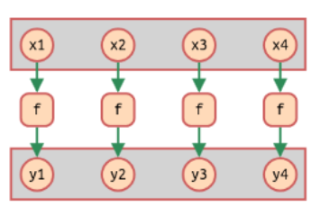
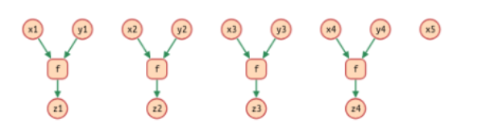
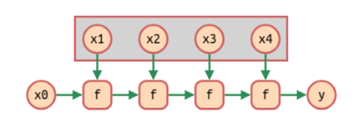
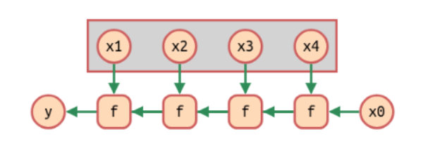
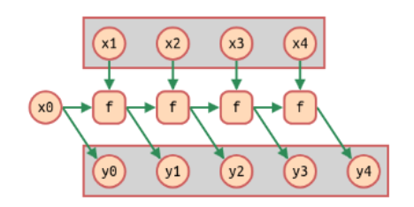

class: center, middle

### Llenguatges de Programació

## Sessió 2: funcions d'ordre superior

<br><br>

**Jordi Petit**


---
class: left, middle, inverse

## Contingut

- .cyan[Funcions d'ordre superior]

- Funcions d'ordre superior habituals

- Aplicacions

- Exercicis

---

# Funcions d'ordre superior

Una **funció d'ordre superior** (FOS) és una funció que rep o retorna
funcions.

Punt clau: les funcions són objectes de primera classe.

<br>
**Exemple en C++:**

```c++
bool compare(int x, int y) {
    return x > y;
}

int main() {
    vector<int> v = { ... };
    sort(v.begin(), v.end(), compare);      // sort és funció d'ordre superior
}
```

---

# Funcions d'ordre superior

**Exemples:** 

La funció predefinida `map` aplica una funció a cada element d'una llista.

```haskell
map :: (a -> b) -> [a] -> [b]
map f [] = []
map f (x:xs) = f x : map f xs
```

```haskell
λ> map odd [1..5]
👉 [True, False, True, False, True]
```

La funció predefinida `(.)` retorna la composició de dues funcions:

```haskell
(.) :: (b -> c) -> (a -> b) -> (a -> c)
(f . g) x = f (g x)
```

```haskell
λ> (reverse . sort) [5, 3, 5, 2]
👉 [5, 5, 3, 2]
```

---

# Funcions d'ordre superior


**Exemple:** La funció `apli2` aplica dos cops una funció a un element.

```haskell
apli2 :: (a -> a) -> a -> a
apli2 f x = f (f x)
```

```haskell
λ> apli2 sqrt 16.0
👉 2.0
```

De forma equivalent:

```haskell
apli2 :: (a -> a) -> (a -> a)
apli2 f = f . f
```

```haskell
λ> apli2 sqrt 16.0
👉 2.0
```

Petit exercici:

```haskell
λ> per2 x = 2 * x
λ> apli2 (apli2 per2) 2
👉 ?
```

---

# Funcions anònimes

Les funcions anònimes (funcions λ) són expressions que representen
una funció sense nom.

```haskell
\x -> x + 3         -- defineix funció anònima que, donada una x, retorna x + 3
                    -- si proveu d'escriure-la, Haskell s'enfada perquè no ho sap fer
(\x -> x + 3) 4     -- aplica la funció anònima sobre 4
👉 7
```

Funció amb nom:

```haskell
doble x = 2 * x                     -- equival a doble = \x -> 2 * x

λ> doble 3                          👉 6
λ> map doble [1, 2, 3]              👉 [2, 4, 6]
```

Funció anònima:

```haskell
λ> map (\x -> 2 * x) [1, 2, 3]      👉 [2, 4, 6]
```

**Utilitat**: quan són curtes i només s'utilitzen un cop.

També són útils per realitzar transformacions de programes.

---

# Funcions anònimes

Múltiples paràmetres:

```haskell
\x y -> x + y
```

és equivalent a

```haskell
\x -> \y -> x + y
```

que vol dir

```haskell
\x -> (\y -> x + y)
```

---

# Seccions

Les **seccions** permeten aplicar operadors infixos parcialment.

.cols5050[
.col1[
Per la dreta: <br>
`(⦻ y) ≡ \x -> x ⦻ y`
]
.col2[
Per l'esquerra: <br>
`(y ⦻) ≡ \x -> y ⦻ x`
]]

Exemples:

```haskell
λ> doble = (* 2)           -- ≡ (2 *)
λ> doble 3
👉 6

λ> map (* 2) [1, 2, 3]    -- millor que map (\x -> x * 2) [1, 2, 3]
👉 [2, 4, 6]

λ> meitat = (/ 2)          -- ≢ (2 /)
λ> meitat 6
👉 3

λ> ésMajúscula = (`elem` ['A'..'Z'])
λ> ésMajúscula 'b'
👉 False
```

---
class: left, middle, inverse

## Contingut

- .brown[Funcions d'ordre superior]

- .cyan[Funcions d'ordre superior habituals]

- Aplicacions

- Exercicis

---

# Funcions d'ordre superior habituals

Algunes funcions d'ordre superior predefined s'utilitzen molt habitualment:

- `(.)`
- `($)`
- `const`
- `id`
- `flip`
- `map`
- `filter`
- `zipWith`
- `all`, `any`
- `dropWhile`, `takeWhile`
- `iterate`,
- `foldl`, `foldr`
- `scanl`, `scanr`

---

# composició `(.)`


- Signatura:

    ```Haskell
    (.) :: (b -> c) -> (a -> b) -> a -> c
    ```

- Descripció:

    `f . g` és la composició de les funcions `f` i `g`.

- Exemples:

    ```Haskell
    λ> tresMesGrans = take 3 . reverse . sort

    λ> :type tresMesGrans
    tresMesGrans :: Ord a => [a] -> [a]

    λ> tresMesGrans [3, 1, 2, 6, 7]
    👉 [7, 6, 3]
    ```


---

# aplicació `($)`


- Signatura:

    ```Haskell
    ($) :: (a -> b) -> a -> b
    ```

- Descripció:

    `f $ x` és el mateix que `f x`. Sembla inútil, però degut a la baixa prioritat d'aquest operador,
    ens permet ometre molts parèntesis de tancar!

- Exemples:

    ```Haskell
    λ> tail (tail (tail (tail "Jordi")))
    👉 "i"
    λ> tail $ tail $ tail $ tail "Jordi"
    👉 "i"
    ```

---

# const

- Signatura:

    ```Haskell
    const :: a -> b -> a
    ```

- Descripció:

    `const x` és una funció que sempre retorna `x`, independentment de què se li apliqui.

- Exemples:

    ```Haskell
    λ> map (const 42) [1 .. 5]
    👉 [42, 42, 42, 42, 42]
    ```

---

# id

- Signatura:

    ```Haskell
    id :: a -> a
    ```

- Descripció:

    `id` és la funció identitat. També sembla inútil, pero va bé en algun moment.

- Exemples:

    ```Haskell
    λ> map id [1 .. 5]
    👉 [1, 2, 3, 4, 5]
    ```

---

# flip

- Signatura:

    ```Haskell
    flip :: (a -> b -> c) -> (b -> a -> c)
    ```

- Descripció:

    `flip f` retorna la funció `f` però amb els seus dos paràmetres invertits.
    Es defineix per

    ```Haskell
    flip f x y = f y x
    ```

- Exemples:

    ```Haskell
    λ> meitat = flip div 2

    λ> meitat 10
    👉 5
    ```

---

# map

- Signatura:
    ```Haskell
    map :: (a -> b) -> [a] -> [b]
    ```

- Descripció:
    `map f xs` és la llista que s'obté al aplicar la funció `f`
    a cada element de la llista `xs`, de forma que
    `map f [x1, x2, ..., xn]` és `[f x1, f x2, ..., f xn]`.
.center[]
    `[y1, y2, y3, y4] = map f [x1, x2, x3, x4]`

- Exemples:
    ```Haskell
    λ> map even [2, 4, 6, 7]  👉 [True, True, True, False]
    λ> map (*2) [2, 4, 6, 7]  👉 [4, 8, 12, 14]
    ```
---

# filter

- Signatura:

    ```Haskell
    filter :: (a -> Bool) -> [a] -> [a]
    ```

- Descripció:

    `filter p xs` és la subllista dels elements de `xs` que compleixen el
    predicat `p`.

    (Un **predicat** és una funció que retorna un Booleà.)


- Exemples:

    ```Haskell
    λ> filter even [2, 1, 4, 6, 7]
    👉 [2, 4, 6]
    ```

---

# zipWith

- Signatura:
    ```Haskell
    zipWith :: (a -> b -> c) -> [a] -> [b] -> [c]
    ```

- Descripció:
    `zipWith op xs ys` és la llista obtinguda operant cada element de `xs`
    amb cada element de `ys` via la funció `op`, d'esquerra a dreta, mentre n'hi hagi.
.center[]
    `[z1, z2, z3, z4] = zipWith f [x1, x2, x3, x4, x5] [y1, y2, y3, y4]`

- Exemples:
    ```Haskell
    λ> zipWith (+) [1, 2, 3] [5, 1, 8, 9]
    👉 [6, 3, 11]
    ```

---

# all

- Signatura:

    ```Haskell
    all :: (a -> Bool) -> [a] -> Bool
    ```

- Descripció:

    `all p xs` indica si tots els elements de `xs` compleixen el predicat `p`.


- Exemples:

    ```Haskell
    λ> all even [2, 1, 4, 6, 7]
    👉 False
    λ> all even [2, 4, 6]
    👉 True
    ```

---

# any

- Signatura:

    ```Haskell
    any :: (a -> Bool) -> [a] -> Bool
    ```

- Descripció:

    `any p xs` indica si algun dels elements de `xs` compleix el predicat `p`.


- Exemples:

    ```Haskell
    λ> any even [2, 1, 4, 6, 7]
    👉 True
    λ> any odd [2, 4, 6]
    👉 False
    ```

---

# dropWhile

- Signatura:

    ```Haskell
    dropWhile :: (a -> Bool) -> [a] -> [a]
    ```

- Descripció:

    `dropWhile p xs` és la subllista de `xs` que elimina els primers elements de `xs`
    que compleixen el predicat `p` (fins al final o al primer que no la compleix).


- Exemples:

    ```Haskell
    λ> dropWhile even [2, 4, 6, 7, 8]
    👉 [7, 8]
    λ> dropWhile even [2, 4]
    👉 []
    ```

---

# takeWhile

- Signatura:

    ```Haskell
    takeWhile :: (a -> Bool) -> [a] -> [a]
    ```

- Descripció:

    `takeWhile p xs` és la subllista de `xs` que conté els primers elements de `xs` que compleixen el predicat `p` (fins al final o al primer que no la compleix).


- Exemples:

    ```Haskell
    λ> takeWhile even [2, 4, 6, 7, 8]
    👉 [2, 4, 6]
    λ> takeWhile even [1, 3]
    👉 []
    ```

---

# iterate

- Signatura:

    ```Haskell
    iterate :: (a -> a) -> a -> [a]
    ```

- Descripció:

    `iterate f x` retorna la llista infinita `[x, f x, f (f x), f (f (f x)), ...]`.

    <div id='cy_iterate' style='width: 20em; height: 6em;'></div>

    `ys = iterate f x`


- Exemples:

    ```Haskell
    λ> iterate (*2) 1
    👉 [1, 2, 4, 8, 16, ...]
    ```

---

# foldl

- Signatura:
    ```Haskell
    foldl :: (b -> a -> b) -> b -> [a] -> b
    ```

- Descripció:
    `foldl ⊕ x0 xs` desplega un operador ⊕ per l'esquerra, de forma que
    `foldl ⊕ x0 [x1, x2, ..., xn]` és `(((x0 ⊕ x1) ⊕ x2) ⊕ ...) ⊕ xn`.
.center[]
    `y = foldl f x0 [x1, x2, x3, x4]`

- Exemples:
    ```Haskell
    λ> foldl (+) 0 [3, 2, (-1)]             -- (((0 + 3) + 2) + (-1))
    👉 4
    ```

---

# foldr

- Signatura:

    ```Haskell
    foldr :: (a -> b -> b) -> b -> [a] -> b
    ```

- Descripció:
    `foldr ⊕ x0 xs` desplega un operador per la dreta, de forma que
    `foldr ⊕ x0 [x1, x2, ..., xn]` és `x1 ⊕ (x2 ... ⊕ (xn ⊕ x0)))`.
.center[]
    `y = foldr f x0 [x1, x2, x3, x4]`

- Exemples:

    ```Haskell
    λ> foldr (+) 0 [3, 2, (-1)]             -- 3 + ((2 + ((-1) + 0)))
    👉 4
    ```

---

# scanl

- Signatura:

    ```Haskell
    scanl :: (b -> a -> b) -> b -> [a] -> [b]
    ```

- Descripció:
    `scanl f x0 xs` és com `foldl f x0 xs` però enlloc de retornar el valor final, retorna la llista amb tots els resultats intermigs.
.center[]
    `[y0, y1, y2, y3, y4] = scanl f x0 [x1, x2, x3, x4]`

- Exemples:

    ```Haskell
    λ> scanl (+) 0 [3, 2, (-1)]
    👉 [0, 3, 5, 4]
    ```

---

# scanr

- Signatura:

    ```Haskell
    scanr :: (a -> b -> b) -> b -> [a] -> [b]
    ```

- Descripció:
    `scanr f x0 xs` és com `foldr f x0 xs` però enlloc de retornar el valor final, retorna la llista amb tots els resultats intermigs.
.center[]
    `[y0, y1, y2, y3, y4] = scanr f x0 [x1, x2, x3, x4]`

- Exemples:

    ```Haskell
    λ> scanr (+) 0 [3, 2, (-1)]
    👉 [4, 1, -1, 0]
    ```
---

# Perspectiva

## map

- C++

    ```c++
    vector<X> xs = { ... };

    vector<Y> ys;
    for (int i = 0; i < xs.size(); ++i) {
        ys.push_back(func(xs[i]));
    }
    ```

- Haskell

    ```haskell
    ys = map func xs
    ```
---

# Perspectiva

## filter

- C++

    ```c++
    vector<X> xs = { ... };

    vector<X> ys;
    for (int i = 0; i < xs.size(); ++i) {
        if (pred(xs[i])) {
            ys.push_back(xs[i]);
        }
    }
    ```

- Haskell

    ```haskell
    ys = filter pred xs
    ```
---

# Perspectiva

## foldl

- C++

    ```c++
    vector<X> xs = { ... };

    Y y = zero;
    for (int i = 0; i < xs.size(); ++i) {
        y = oper(y, xs[i]);
    }
    ```

- Haskell

    ```haskell
    y = foldl oper zero xs
    ```
---

# Perspectiva

## composició

- Haskell

    ```haskell
    (take 3 . reverse . sort) dades
    ```

- Shell

    ```bash
    cat dades | sort | tac | head -3
    ```

---
class: left, middle, inverse

## Contingut

- .brown[Funcions d'ordre superior]

- .brown[Funcions d'ordre superior habituals]

- .cyan[Aplicacions]

- Exercicis

---

# Diccionaris amb FOSs

Volem definir un Diccionari de Strings a Ints amb
valors per defecte
usant funcions d'ordre superior.

## Interfície

```haskell
type Dict = (String -> Int)     -- Defineix un tipus sinònim a la typedef

create :: Int -> Dict
search :: Dict -> String -> Int
insert :: Dict -> String -> Int -> Dict
```

---

# Diccionaris

Volem definir un TAD Diccionari de Strings a Ints amb
valors per defecte
usant funcions d'ordre superior.

**Interfície**

```haskell
type Dict = (String -> Int)     -- Defineix un tipus sinònim a la typedef

create :: Int -> Dict
search :: Dict -> String -> Int
insert :: Dict -> String -> Int -> Dict
```

.cols5050[
.col1[
**Primera versió**

```haskell
type Dict = (String -> Int)

create def = \key -> def

search dict key = dict key

insert dict key value = \x ->
    if key == x then value
    else search dict x
```
]
.col2[
**Segona versió**

```haskell
type Dict = (String -> Int)

create = const

search = ($)

insert dict key value x
    | key == x      = value
    | otherwise     = dict x

```
]]

---

# Dividir i vèncer

Funció d'ordre superior genèrica `dIv` per
l'esquema de dividir i vèncer.

**Interfície**

```haskell
dIv :: (a -> Bool) -> (a -> b) -> (a -> (a, a)) -> (a -> (a, a) -> (b, b) -> b) -> a -> b
```

on `a` és el tipus del problema, `b` és el tipus de la solució, i
<br>`dIv trivial directe dividir vènçer x` utilitza:


- `trivial :: a -> Bool` per saber si un problema és trivial.

- `directe :: a -> b` per solucionar directament un problema trivial.

- `dividir :: a -> (a, a)` per dividir un problema no trivial en un parell de subproblemes més petits.

- `vènçer :: a -> (a, a) -> (b, b) -> b` per, donat un problema no trivial, els seus subproblemes i les seves respectives subsolucions, obtenir la solució al problema original.

- `x :: a` denota el problema a solucionar.

---

# Dividir i vèncer

**Solució**

```haskell
dIv :: (a -> Bool) -> (a -> b) -> (a -> (a, a)) -> (a -> (a, a) -> (b, b) -> b) -> a -> b

dIv trivial directe dividir vènçer x
    | trivial x     = directe x
    | otherwise     = vènçer x (x1, x2) (y1, y2)
                          where
                              (x1, x2) = dividir x
                              y1 = dIv trivial directe dividir vènçer x1
                              y2 = dIv trivial directe dividir vènçer x2

```

---

# Dividir i vèncer

**Solució capturant el context**

```haskell
dIv :: (a -> Bool) -> (a -> b) -> (a -> (a, a)) -> (a -> (a, a) -> (b, b) -> b) -> a -> b

dIv trivial directe dividir vènçer = dIv'
    where
        dIv' x
            | trivial x = directe x
            | otherwise = vènçer x (x1, x2) (y1, y2)
                              where
                                  (x1, x2) = dividir x
                                  y1 = dIv' x1
                                  y2 = dIv' x2
```


---

# Dividir i vèncer

**Implementació de Quicksort amb Dividir i vèncer**

```haskell
qs :: Ord a => [a] -> [a]

qs = dIv trivial directe dividir vèncer
  where
    trivial []   = True
    trivial [_]  = True
    trivial _    = False

    directe = id

    dividir (x:xs) = (menors, majors)
      where menors = filter (<= x) xs
        majors = filter (>  x) xs

    dividir' (x:xs) = partition (<= x) xs   -- equivalent amb funció predefinida

    vèncer (x:_) _ (ys1, ys2) = ys1 ++ [x] ++ ys2
```

---
class: left, middle, inverse

## Contingut

- .brown[Funcions d'ordre superior]

- .brown[Funcions d'ordre superior habituals]

- .brown[Aplicacions]

- .cyan[Exercicis]

---

# Exercicis

1. Feu aquests problemes de Jutge.org:

    - [P93632](https://jutge.org/problems/P93632) Usage of higher-order functions (1)
    - [P31745](https://jutge.org/problems/P31745) Usage of higher order functions (2)
    - [P90677](https://jutge.org/problems/P90677) Definition of higher-order functions (1)
    - [P71775](https://jutge.org/problems/P71775) Definition of higher-order functions (2)

1. Re-implementeu les funcions habituals sobre llistes.

    - Useu `myLength` enlloc de `length` per evitar xocs de noms.
    - No useu recursivitat: useu funcions d'ordre superior.

1. Busqueu a [Hoogλe](https://www.haskell.org/hoogle/) informació sobre aquestes funcions:

    - `foldl1`, `foldr1`, `scanl1`, `scanr1`
    - `partition`
    - `concatMap`
    - `zipWith3`
    - `mapAccumL`, `mapAccumR`
