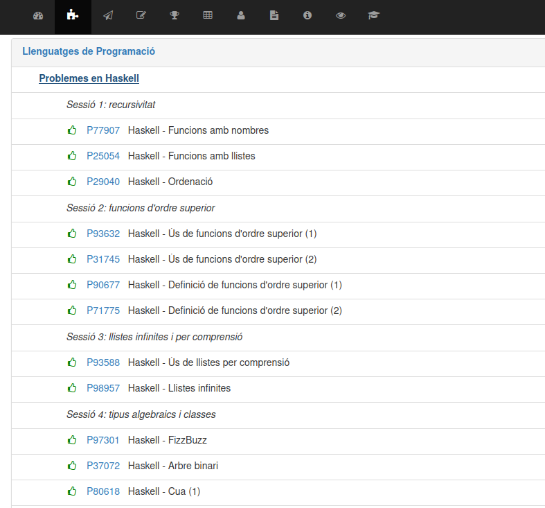
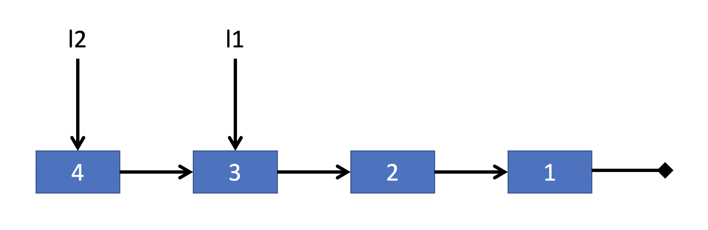
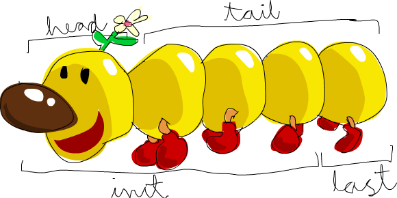

class: center, middle

### Llenguatges de Programació

## Sessió 1: Recursivitat

<br><br>

**Jordi Petit**


---
class: left, middle, inverse

## Contingut

- .cyan[Aperitiu]

- Eines

- Tipus bàsics

- Funcions

- Tuples

- Llistes

- Funcions habituals en llistes

- Exercicis

---

# Haskell

Haskell és llenguatge de programació funcional pura.

.cols5050[
.col1[
No hi ha:

  - assignacions,

  - bucles,

  - efectes laterals,

  - gestió explícita de la memòria.
]
.col1[
Hi ha:

  - avaluació *lazy*,

  - funcions com a objectes de primer ordre,

  - sistema de tipus estàtic,

  - inferència de tipus automàtica.
]]

Haskell és elegant, concís i fa pensar d'una forma diferent!

---

# Expressions

```haskell
λ> 3 + 2 * 2
👉 7
```

```haskell
λ> (3 + 2) * 2
👉 10
```

```haskell
λ> even 42
👉 True
```

```haskell
λ> even(42)             -- 💩 parèntesis absurds
👉 True
```

```haskell
λ> even "Arnau"           -- ❌ error de tipus
```

```haskell
λ> div 14 4
👉 3
```

---

# Tipus

```haskell
λ> :type 'R'
👉 'R' :: Char
```

```haskell
λ> :type "Marta"
👉 "Marta" :: [Char]
```

```haskell
λ> :type not
👉 not :: Bool -> Bool
```

```haskell
λ> :type length
👉 length :: [a] -> Int
```

---

# Factorial

```haskell
factorial :: Integer -> Integer

factorial 0 = 1
factorial n = n * factorial (n - 1)
```

```haskell
λ> factorial 5
👉 120
```

```haskell
λ> map factorial [0..5]
👉 [1, 1, 2, 6, 24, 120]
```

---

# Quicksort

```haskell
quicksort []     = []
quicksort (p:xs) = (quicksort menors) ++ [p] ++ (quicksort majors)
    where
        menors = [x | x <- xs, x <  p]
        majors = [x | x <- xs, x >= p]
```

```haskell
λ> :type quicksort
👉 quicksort :: Ord t => [t] -> [t]
```

```haskell
λ> quicksort [5, 3, 6, 3, 1]
👉 [1, 3, 3, 5, 6]
```

```haskell
λ> quicksort ["joan", "sara", "pep", "jana"]
👉 ["jana", "joan", "pep", "sara"]
```

---

# Arbres binaris

```haskell
data Arbin t = Buit
             | Node t (Arbin t) (Arbin t)
```

```haskell
alcada :: Arbin t -> Integer

alcada Buit = 0
alcada (Node x fe fd) = 1 + max (alcada fe) (alcada fd)
```

```haskell
preordre :: Arbin t -> [t]

preordre Buit = []
preordre (Node x fe fd) = [x] ++ preordre fe ++ preordre fd
```

---
class: left, middle, inverse

## Contingut

- .brown[Aperitiu]

- .cyan[Eines]

- Tipus bàsics

- Funcions

- Tuples

- Llistes

- Funcions habituals en llistes

- Exercicis

---

# Eines necessàries

Glasgow Haskell Compiler (GHC):

  - compilador (`ghc`)

  - intèrpret (`ghci`)

Editor de codi

Terminal

Jutge


---

# Instal·lació del GHC

**Linux i Mac**:

Utilitzeu el `ghcup` ([referència](https://www.haskell.org/ghcup/)):

```bash
curl --proto '=https' --tlsv1.2 -sSf https://get-ghcup.haskell.org | sh
```

<br>

**Windows**:

Seguiu aquest [video](https://www.youtube.com/watch?v=bB4fmQiUYPw).

<br><br>

Font: [GHCup: How to install](https://www.haskell.org/ghcup/install/#how-to-install)

---

.cols5050[
.col1[
# Jutge
]
.col2[

]]

Apunteu-vos al curs "Problems in Haskell" de [Jutge.org](https://jutge.org). 




---

# Comandes de l'intèrpret

**Intèrpret**:

`ghci`.

**Comandes més usuals**:

| Comanda | Exemple | Descripció |
|:---|:---|:---|
| `:load` | `:l arxiu` | càrrega un script |
| `:quit` | `:q` | sortida de l'intèrpret |
| `:reload` | `:r` | recarrega l'últim arxiu carregat |
| `:type` | `:t 3` | tipus de l'expressió |
| `:info` | `:i []` | informació associada al paràmetre (útil a partir del tema de classes) |
| `:sprint` | | visualització dels *thunks* (útil per l'avaluació mandrosa) |
| `:help` | | ajuda |

---
class: left, middle, inverse

## Contingut

- .brown[Aperitiu]

- .brown[Eines]

- .cyan[Tipus bàsics]

- Funcions

- Tuples

- Llistes

- Funcions habituals en llistes

- Exercicis

---

# Booleans

Tipus: `Bool`

Literals: `False` i `True`

Operacions:

```haskell
not  :: Bool -> Bool                -- negació
(||) :: Bool -> Bool -> Bool        -- disjunció
(&&) :: Bool -> Bool -> Bool        -- conjunció
```

Exemples:

```haskell
not True                    👉 False
not False                   👉 True

True || False               👉 True
True && False               👉 False

(False || True) and True    👉 True
not (not True)              👉 True
not not True                ❌ -- vol dir: (not not) True
```

---

# Enters

Tipus:
- `Int`: Enters de 64 bits en Ca2
- `Integer`: Enters (arbitràriament llargs)

Literals: `16`, ⚠️ `(-22)`, `587326354873452644428`

Operacions: `+`,  `-`, `*`, `div`, `mod`, `rem`, `^`.

Operadors relacionals: `<`, `>`, `<=`, `>=`, `==`, `/=` (⚠️ no `!=`)

Exemples:

```haskell
3 + 4 * 5                   👉 23
(3 + 4) * 5                 👉 35
(3 + 4) * 5                 👉 35
2^10                        👉 1024
3 + 1 /= 4                  👉 False

div 11 2                    👉 5
mod 11 2                    👉 1
rem 11 2                    👉 1
mod (-11) 2                 👉 1
rem (-11) 2                 👉 -1
```

---

# Reals

Tipus:
- `Float`: Reals de coma flotant de 32 bits
- `Double`: Reals de coma flotant de 64 bits

Literals: `3.14`, `1e-9`, `-3.0`

Operacions: `+`,  `-`, `*`, `/`, `**`.

Operadors relacionals: `<`, `>`, `<=`, `>=`, `==`, `/=`

Conversió enter a real: `fromIntegral`

Conversió real a enter: `round`, `floor`, `ceiling`

Exemples:

```haskell
10.0 / 3.0      👉 3.3333333333333335
2.0 ** 3.0      👉 8.0
fromIntegral 4  👉 4.0
```

---

# Caràcters

Tipus: `Char`

Literals: `'a'`, `'A'`, `'\n'`

Operadors relacionals: `<`, `>`, `<=`, `>=`, `==`, `/=`

Funcions de conversió: (cal un `import Data.Char`)

- `ord :: Char -> Int`
- `chr :: Int -> Char`

---

# Precedència dels operadors

| Precedència |   Associatius per l'esquerra   |    No associatius   | Associatius per la dreta |
|:-------|:---------------------|:----------------------|:------------------|
| 9      | `!!`                   |                       | `.`                 |
| 8      |                      |                       | `^`, `^^`, `**`         |
| 7      | `*`  `/`  `div`          |                       |                   |
|        | `mod`  `rem`  `quot` |                       |                   |
| 6      | `+`  `-`                 |                       |                   |
| 5      |                      |                       | `:`  `++`             |
| 4      |                      | `==`  `/=`  `<`  `<=`  `>`  `>=`  |                   |
|        |                      | `elem`  `notElem`     |                   |
| 3      |                      |                       | `&&`                |
| 2      |                      |                       | `⎮⎮`                |
| 1      | `>>`  `>>=`          |                       |                   |
| 0      |                      |                       | `$`  `$!`  `seq`      |

<br>

.small[
    Font: [Haskell report](https://www.haskell.org/onlinereport/decls.html#fixity)
]

---

# Funcions predefinides habituals

és parell/senar:
```haskell
even :: Integral a => a -> Bool
odd  :: Integral a => a -> Bool
```

mínim i màxim de dos valors:
```haskell
min :: Ord a => a -> a -> a
max :: Ord a => a -> a -> a
```


màxim comú divisor, mínim comú múltiple:
```haskell
gcd :: Integral a => a -> a -> a
lcm :: Integral a => a -> a -> a
```

matemàtiques:
```haskell
abs  :: Num a      => a -> a
sqrt :: Floating a => a -> a
log  :: Floating a => a -> a
exp  :: Floating a => a -> a
cos  :: Floating a => a -> a
```

---
class: left, middle, inverse

## Contingut

- .brown[Aperitiu]

- .brown[Eines]

- .brown[Tipus bàsics]

- .cyan[Funcions]

- Tuples

- Llistes

- Funcions habituals en llistes

- Exercicis

---

# Transparència referencial

- Les funcions en Haskell són *pures*:
només retornen resultats calculats en relació als seus paràmetres.

- Les funcions no tenen efectes laterals (*side effects*).
    - no modifiquen els paràmetres
    - no modifiquen la memòria
    - no modifiquen l'entrada/sortida

- Una funció sempre retorna el mateix resultat aplicada sobre els
mateixos paràmetres.

---

# Definició de funcions

Els identificadors de funcions comencen amb minúscula.

Per introduir una funció:

1. Primer es dóna la seva declaració de tipus (capçalera).

2. Després es dóna la seva definició, utilitzant paràmetres formals.

Exemples:

```haskell
doble :: Int -> Int                     -- calcula el doble d'un valor
doble x = 2 * x

perimetre :: Int -> Int -> Int          -- calcula l'àrea d'un rectangle
perimetre amplada alçada = doble (amplada + alçada)

xOr :: Bool -> Bool -> Bool             -- o exclusiva
xOr a b = (a || b) && not (a && b)

factorial :: Integer -> Integer         -- calcula el factorial d'un natural
factorial n = if n == 0 then 1 else n * factorial (n - 1)
```

---

# Definicions amb patrons

Les funcions es poden definir amb **patrons**:

```haskell
factorial :: Integer -> Integer
    -- calcula el factorial d'un natural

factorial 0 = 1
factorial n = n * factorial (n - 1)
```

L'avaluació dels patrons és de dalt a baix i retorna el resultat de la primera
branca que casa.

Els patrons es consideren més elegants que el `if-then-else` i tenen moltes més aplicacions.

`_` representa una **variable anònima**: (no hi ha relació entre diferents `_`)


```haskell
nand :: Bool -> Bool -> Bool             -- conjunció negada

nand True True = False
nand _ _ = True
```

---

# Definicions amb guardes

Les funcions es poden definir amb **guardes**:

```haskell
valAbs :: Int -> Int
    -- retorna el valor absolut d'un enter

valAbs n
    | n >= 0    =  n
    | otherwise = -n
```

L'avaluació de les guardes és de dalt a baix i retorna el resultat de la primera
branca certa. (Error si cap és certa)

Les definicions per patrons també poden tenir guardes.

El `otherwise` és el mateix que `True`, però més llegible.

⚠️ La igualtat va després de cada guarda!

---

# Definicions locals

Per definir noms locals en una expressió s'utilitza el `let-in`:

```haskell
fastExp :: Integer -> Integer -> Integer       -- exponenciació ràpida
fastExp _ 0 = 1
fastExp x n =
    let y   = fastExp x n_halved
        n_halved  = div n 2
    in
        if even n
        then y * y
        else y * y * x
```

El `where` permet definir noms en més d'una expressió:

```haskell
fastExp :: Integer -> Integer -> Integer      -- exponenciació ràpida
fastExp _ 0 = 1
fastExp x n
    | even n    = y * y
    | otherwise = y * y * x
    where
        y  = fastExp x n_halved
        n_halved = div n 2
```

La identació del `where` defineix el seu àmbit.

---

# Currificació

Totes les funcions tenen un únic paràmetre.

Les funcions de més d'un paràmetre retornen, en realitat, una nova funció.

No cal passar tots els paràmetres (aplicació parcial).

**Exemple:**

`prod 3 5` és, en realitat, `(prod 3) 5`

Primer apliquem 3 i el resultat és un funció que espera un altre enter.

```haskell
prod :: Int -> Int -> Int
```

```haskell
prod :: Int -> (Int -> Int)
```

```haskell
(prod 3) :: (Int -> Int)
```

```haskell
(prod 3) 5 :: Int
```

---

# Inferència de tipus

Si no es dóna la capçalera d'una funció, Haskell infereix el seu tipus.

Amb aquestes definicions,
```haskell
factorial 0 = 1
factorial n = n * factorial (n - 1)
```

Haskell infereix que `factorial :: Num t => t -> t`.


Es pot preguntar el tipus d'una expressió amb `:type` a l'intèrpret:

```
λ> :type factorial
👉 factorial :: Num t => t -> t
```

<br>💬 Al principi, no useu la inferència de tipus (generalitza massa i perdeu disciplina).
<br>💬 Pels problemes del Jutge, copieu les capçaleres donades als exercicis.

---

# Notació prefixa/infixa

```haskell
2 + 3           👉 5
(+) 2 3         👉 5
```
Els operadors són infixes ⇒ posar-los entre parèntesis per fer-los prefixes

<br>

```haskell
div 9 4         👉 2
9 `div` 4       👉 2
```
Les funcions són prefixes ⇒ posar-les entre *backticks* per fer-les infixes


---

# Sumari

- Les funcions en Haskell tenen un sol paràmetre (currificació).
    - `a -> b -> c` vol dir `a -> (b -> c)`.
    - `f x y` vol dir `(f x) y`.

- Per escriure una funció cal donar
    - la seva capçalera i
    - la seva definició.

- La inferència de tipus evita descriure les capçaleres de les funcions.
<br> Eviteu-la al principi.

- Les definicions poden ser úniques o amb patrons i cada definició pot tenir guardes.

- Els patrons i les guardes es trien de dalt a baix.

- Es poden crear definicions locals amb el `let` i el `where`
i es poden usar patrons localment amb el `case`.

---
class: left, middle, inverse

## Contingut

- .brown[Aperitiu]

- .brown[Eines]

- .brown[Tipus bàsics]

- .brown[Funcions]

- .cyan[Tuples]

- Llistes

- Funcions habituals en llistes

- Exercicis

---

# Tuples

Una tupla és un tipus estructurat que permet desar diferents valors
de tipus `t1, t2, ..., tn`
en un únic valor de tipus `(t1, t2, ..., tn)`.

- El nombre de camps és fix.
- Els camps són de tipus heterogenis.

```haskell
(3, 'z', False) :: (Int, Char, Bool)
(6, 9)          :: (Int, Int)
(True, (6, 9))  :: (Bool, (Int, Int))
```

```haskell
caracterMesFrequent :: String -> (Char, Int)
caracterMesFrequent "PATATA"  👉 ('A', 3)
```

```haskell
descomposicioHoraria :: Int -> (Int, Int, Int)    -- hores, minuts, segons

descomposicioHoraria segons = (h, m, s)
    where
        h = div segons 3600
        m = div (mod segons 3600) 60
        s = mod segons 60
```

---

# Accés a tuples

Per a tuples de dos elements, es pot accedir amb `fst` i `snd`:

```Haskell
fst :: (a, b) -> a
snd :: (a, b) -> b

fst (3, "rave")         👉 3
snd (3, "rave")         👉 "rave"
```

<br>

Per a tuples generals, no hi ha definides funcions d'accés
<br>⇒ Es poden crear fàcilment usant patrons:
.cols5050[
.col1[
```haskell
primer (x, y, z) = x
segon  (x, y, z) = y
tercer (x, y, z) = z
```

]
.col2[
```haskell
primer (x, _, _) = x
segon  (_, y, _) = y
tercer (_, _, z) = z
```

]
]

---

# Descomposició de tuples en patrons

Lleig:

```haskell
distancia :: (Float, Float) -> (Float, Float) -> Float
    -- calcula la distància entre dos punts 2D, cadascun donat amb una tupla

distancia p1 p2 = sqrt ((fst p1 - fst p2)^2 + (snd p1 - snd p2)^2)
```

Millor: Descompondre per patrons als propis paràmetres:

```haskell
distancia (x1, y1) (x2, y2) = sqrt ((x1 - x2)^2 + (y1 - y2)^2)
```

També: Descompondre per patrons usant noms locals:

```haskell
distancia p1 p2 = sqrt (sqr dx + sqr dy)
    where
        (x1, y1) = p1
        (x2, y2) = p2
        dx = x1 - x2
        dy = y1 - y2
        sqr x = x * x
```

---

# Tupla buida (*unit*)

Existeix el tipus de tupla sense cap dada, que només té un possible
valor: la dada buida.

Concepte semblant al `void` del C.

- Tipus: `()`
- Valor: `()`


En algun moment en farem ús.

---
class: left, middle, inverse

## Contingut

- .brown[Aperitiu]

- .brown[Eines]

- .brown[Tipus bàsics]

- .brown[Funcions]

- .brown[Tuples]

- .cyan[Llistes]

- Funcions habituals en llistes

- Exercicis

---

# Llistes

Una llista és un tipus estructurat que conté una seqüència
d'elements, <br>
tots del mateix tipus.

`[t]` denota el tipus de les llistes d'elements de tipus `t`.

```haskell
[]                                      -- llista buida

[3, 9, 27]                              :: [Int]

[(1, "un"), (2, "dos"), (3, "tres")]    :: [(Int, String)]

[[7], [3, 9, 27], [1, 5], []]           :: [[Int]]

[1 .. 10]                               -- el mateix que [1,2,3,4,5,6,7,8,9,10]

[1, 3 .. 10]                            -- el mateix que [1,3,5,7,9]
```

---

# Constructors de llistes

Les llistes tenen dos **constructors**: `[]` i `:`

  - La llista buida:
  ```haskell
  [] :: [a]
  ```

  - Afegir per davant:
  ```haskell
  (:) :: a -> [a] -> [a]
  ```

---

# Constructors de llistes

La notació

```haskell
[16, 12, 21]
```

és una drecera per

```haskell
16 : 12 : 21 : []
```

que vol dir

```haskell
16 : (12 : (21 : []))
```

---

# Implementació i eficiència

Les llistes de Haskell són llistes simplement encadenades.

Els contructors `[]` i `:` funcionen en temps constant (*DS sharing*).

```haskell
l1 = 3 : 2 : 1 : []
l2 = 4 : l1
```



L'operador `++` retorna la concatenació de dues llistes
(temps proporcional a la llargada de la primera llista).

---

# Llistes i patrons

La discriminació per patrons permet **descompondre** les llistes:

```haskell
suma [] = 0
suma (x:xs) = x + suma xs
```

Diem que $e_1$ *matches* $e_2$ si existeix una substitució per les
variables de $e_1$ que la fan igual que $e_2$.

**Exemples**:

- `x:xs` *matches* `[2, 5, 8]` perquè `[2, 5, 8]` és `2 : (5 : 8 : [])`
  substituint `x` amb `2` i `xs` amb `(5 : 8 : [])`
  que és `[5, 8]`.

- `x:xs` *does not match* `[]` perquè `[]` i `:` són constructors
  diferents.

- `x1:x2:xs` *matches* `[2, 5, 8]`
  substituint `x1` amb `2`, `x2` amb `5`
  i `xs` amb `[8]`.

- `x1:x2:xs` *matches* `[2, 5]`
  substituint `x1` amb `2`, `x2` amb `5`
  i `xs` amb `[]`.

**Nota:** El mecanisme de *matching* no és el mateix que el d'*unificació*
(Prolog).

---

# Llistes i patrons

La descomposició per patrons també es pot usar als `case`, `where` i `let`.

```haskell
suma llista =
    case llista of
        []      -> 0
        x:xs    -> x + suma xs
```

```haskell
divImod n m
    | n < m      = (0, n)
    | otherwise  = (q + 1, r)
    where (q, r) = divImod (n - m) m
```

```haskell
primerIsegon llista =
    let primer:segon:resta = llista
    in (primer, segon)
```

---

# Textos

Els textos (*strings*) en Haskell són llistes de caràcters.

El tipus `String` és una sinònim de `[Char]`.<br>
Les cometes dobles són sucre sintàctic per definir textos.


```haskell
nom1 :: [Char]
nom1 = 'p':'e':'p':[]

nom2 :: String
nom2 = "pepa"

λ> nom1 == nom2
👉 False
λ> nom1 < nom2
👉 True
```

---
class: left, middle, inverse

## Contingut

- .brown[Aperitiu]

- .brown[Eines]

- .brown[Tipus bàsics]

- .brown[Funcions]

- .brown[Tuples]

- .brown[Llistes]

- .cyan[Funcions habituals en llistes]

- Exercicis

---

# head, last

- Signatura:

    ```haskell
    head :: [a] -> a
    last :: [a] -> a
    ```

- Descripció:

    - `head xs` és el primer element de la llista `xs`.
    - `last xs` és el darrer element de la llista `xs`.

    Error si `xs` és buida.

- Exemples:

    ```haskell
    λ> head [1..4]
    👉 1
    λ> last [1..4]
    👉 4
    ```

---

# tail, init

- Signatura:

    ```haskell
    tail :: [a] -> [a]
    init :: [a] -> [a]
    ```

- Descripció:

    - `tail xs` és la llista `xs` sense el seu primer element.
    - `init xs` és la llista `xs` sense el seu darrer element.

    Error si `xs` és buida.

- Exemples:

    ```haskell
    λ> tail [1..4]
    👉 [2, 3, 4]
    λ> init [1..4]
    👉 [1, 2, 3]
    ```
---

# head, last, init, tail

<br>

.center[

]

<br>

.right[.small[Dibuix: [Learn You a Haskell, M. Lipovača](http://learnyouahaskell.com/)]]

---

# reverse

- Signatura:

    ```haskell
    reverse :: [a] -> [a]
    ```

- Descripció:

    `reverse xs` és la llista `xs` del revés.

- Exemples:

    ```haskell
    λ> reverse [1..4]
    👉 [4, 3, 2, 1]
    ```
---

# length

- Signatura:

    ```haskell
    length :: [a] -> Int
    ```

- Descripció:

    `length xs` és el nombre d'elements a la llista `xs`.

- Exemples:

    ```haskell
    λ> length []
    👉 0
    λ> length [1..5]
    👉 5
    λ> length "Marta"
    👉 5
    ```

---

# null

- Signatura:

    ```haskell
    null :: [a] -> Bool
    ```

- Descripció:

    `null xs` indica si la llista `xs` és buida.

- Exemples:

    ```haskell
    λ> null []
    👉 True
    λ> null [1..5]
    👉 False
    ```

---

# elem

- Signatura:

    ```haskell
    elem :: Eq a => a -> [a] -> Bool
    ```

- Descripció:

    `elem x xs` indica si `x` és a la llista `xs`.

- Exemples:

    ```haskell
    λ> elem 3 [1..10]
    👉 True
    λ> 3 `elem` [1..10]
    👉 True
    λ> 'k' `elem` "Jordi"
    👉 False
    ```

---

# Indexació: `(!!)`

- Signatura:

    ```haskell
    (!!) :: [a] -> Int -> a
    ```

- Descripció:

    `xs !! i` és l'`i`-èsim element de la llista `xs` (començant per zero).

- Exemples:

    ```haskell
    λ> [1..10] !! 3
    👉 4
    λ> [1..10] !! 11
    ❌ Exception: index too large
    ```

---

# Concatenació de dues llistes: `(++)`

- Signatura:

    ```haskell
    (++) :: [a] -> [a] -> [a]
    ```

- Descripció:

    `xs ++ ys` és la llista resultant de posar `ys` darrera de `xs`.

- Exemples:

    ```haskell
    λ> "PEP" ++ "ET"
    👉 "PEPET"
    λ> [1..5] ++ [1..3]
    👉 [1,2,3,4,5,1,2,3]
    ```

---

# maximum, minimum

- Signatura:

    ```haskell
    maximum :: Ord a => [a] -> a
    minimum :: Ord a => [a] -> a
    ```

- Descripció:

    - `maximum xs` és l'element més gran de la llista (no buida!) `xs`.
    - `minimum xs` és l'element més petit de la llista (no buida!) `xs`.


- Exemples:

    ```haskell
    λ> maximum [1..10]
    👉 10
    λ> minimum [1..10]
    👉 1
    λ> minimum []
    ❌ Exception: empty list
    ```

---

# sum, product

- Signatura:

    ```haskell
    sum     :: Num a => [a] -> a
    product :: Num a => [a] -> a
    ```

- Descripció:

    - `sum xs` és la suma de la llista `xs`.
    - `prod xs` és el producte de la llista `xs`.

- Exemples:

    ```haskell
    λ> sum [1..5]
    👉 15

    factorial n = product [1 .. n]

    λ> factorial 5
    👉 120
    ```

---

# and, or

- Signatura:

    ```haskell
    and :: [Bool] -> Bool
    or  :: [Bool] -> Bool
    ```

- Descripció:

    - `and bs` és la conjunció de la llista de booleans `bs`.
    - `or bs` és la disjunció de la llista de booleans `bs`.


- Observació:

    - Distingiu bé entre `and/or` i `(&&)/(||)`.

---

# take, drop

- Signatura:

    ```haskell
    take :: Int -> [a] -> [a]
    drop :: Int -> [a] -> [a]
    ```

- Descripció:

    - `take n xs` és el prefixe de llargada `n` de la llista `xs`.
    - `drop n xs` és el sufixe de la llista `xs` quan se li treuen els
      `n` primers elements.


- Exemples:

    ```haskell
    λ> take 3 [1 .. 7]
    👉 [1, 2, 3]
    λ> drop 3 [1 .. 7]
    👉 [4, 5, 6, 7]
    ```

---

# zip

- Signatura:

    ```haskell
    zip :: [a] -> [b] -> [(a, b)]
    ```

- Descripció:

    `zip xs ys` és la llista que combina, en ordre, cada parell d'elements de `xs` i `ys`. Si en falten,
    es perden.

- Exemples:

    ```haskell
    λ> zip [1, 2, 3] ['a', 'b', 'c']
    👉 [(1, 'a'), (2, 'b'), (3, 'c')]
    λ> zip [1 .. 10] [1 .. 3]
    👉 [(1, 1), (2, 2), (3, 3)]
    ```

---

# repeat

- Signatura:

    ```haskell
    repeat :: a -> [a]
    ```

- Descripció:

    `repeat x` és la llista infinita on tots els elements són `x`.

- Exemples:

    ```haskell
    λ> repeat 3
    👉 [3, 3, 3, 3, 3, 3, 3, 3, 3, 3, 3, 3, 3, 3, ...]
    λ> take 4 (repeat 3)
    👉 [3, 3, 3, 3]
    ```

---

# concat

- Signatura:

    ```haskell
    concat :: [[a]] -> [a]
    ```

- Descripció:

    `concat xs` és la llista que concatena totes les llistes de `xs`.

- Exemples:

    ```haskell
    λ> concat [[1, 2, 3], [], [3], [1, 2]]
    👉 [1, 2, 3, 3, 1, 2]
    ```

---
class: left, middle, inverse

## Contingut

- .brown[Aperitiu]

- .brown[Eines]

- .brown[Tipus bàsics]

- .brown[Funcions]

- .brown[Tuples]

- .brown[Llistes]

- .brown[Funcions habituals en llistes]

- .cyan[Exercicis]

---

# Exercicis

1. Instal·leu-vos les eines per treballar.

1. Proveu de cercar documentació de funcions a [Hoogλe](https://www.haskell.org/hoogle/).

1. Feu aquests problemes de Jutge.org:

    - [P77907](https://jutge.org/problems/P77907) Functions with numbers
    - [P25054](https://jutge.org/problems/P25054) Functions with lists
    - [P29040](https://jutge.org/problems/P29040) Sorting
    - Novetats:

        - Problemes amb puntuacions parcials 💯. No cal que feu totes les
          funcions demanades.
        - Inspector de Haskell: comprova condicions de l'enunciat en el
          codi de la solució. Veredicte NC 🚩 *Non compliant*. [TFG d'en Jan Mas]

1. Implementeu les funcions habituals sobre llistes vistes anteriorment.

    - Useu notació tipus `myLength` enlloc de `length` per evitar xocs de noms.
    - Useu recursivitat quan calgui o useu altres funcions `my*` que ja hagueu definit.
