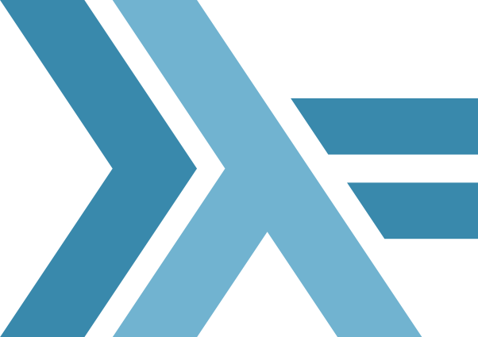
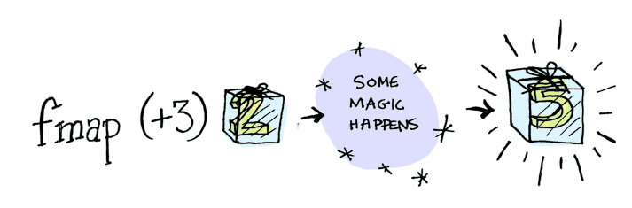
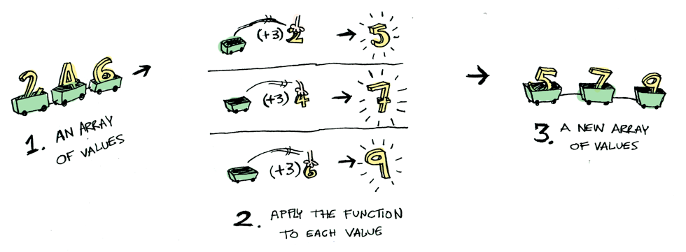
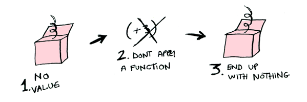
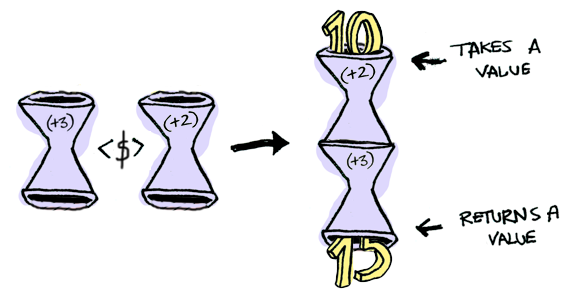
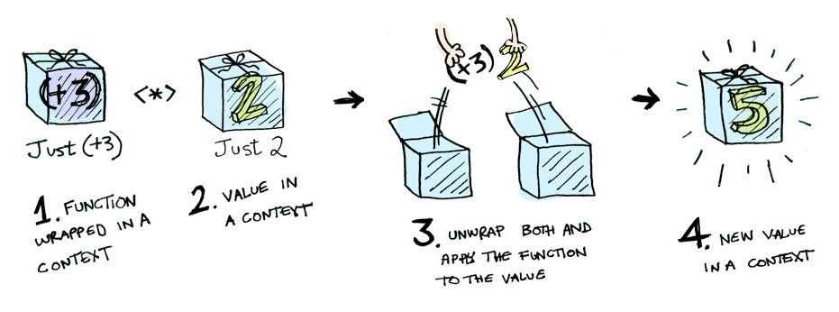
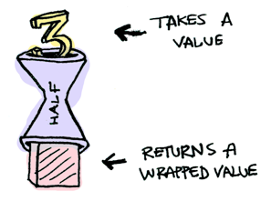
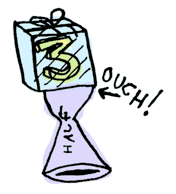
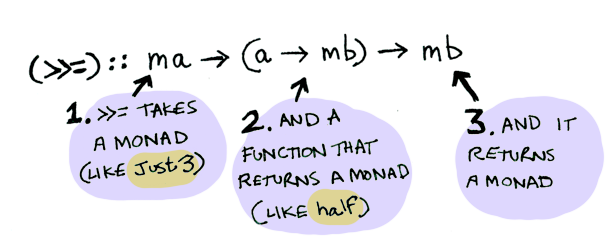
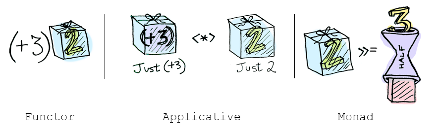

class: center, middle

### Llenguatges de Programació

## Sessió 5: mònades

<br><br>

**Jordi Petit**


---
class: left, middle, inverse

## Contingut

- .cyan[Functors]

- Aplicatius

- Mònades

- Entrada/sortida

- Exercicis

---

# Functors

.cols5050[
.col1[
Ja sabem aplicar funcions:

```haskell
λ> (+3) 2                   👉  5
```
]
.col2[
Però...

```haskell
λ> (+3) (Just 2)            ❌
```
]
]
En aquest cas, podem fer servir `fmap`!

```haskell
λ> fmap (+3) (Just 2)       👉  Just 5
λ> fmap (+3) Nothing        👉  Nothing
```

I també funciona amb `Either`, llistes, tuples i funcions:

```haskell
λ> fmap (+3) (Right 2)      👉  Right 5
λ> fmap (+3) (Left "err")   👉  Left "err"

λ> fmap (+3) [1, 2, 3]      👉  [4, 5, 6]        -- igual que map

λ> fmap (+3) (1, 2)         👉  (1, 5)           -- perquè (,) és un tipus

λ> (fmap (*2) (+1)) 3       👉  8                -- igual que (.)
```

---

# Functors

`fmap` aplica una funció als elements d'un contenidor
genèric  `f a` retornant un contenidor del mateix tipus.

`fmap` és una funció de les instàncies de la classe `Functor`:

```haskell
λ> :type fmap
fmap :: Functor f => (a -> b) -> (f a -> f b)
```

On

```haskell
λ> :info Functor
class Functor f where
    fmap :: (a -> b) -> (f a -> f b)
```

---

#  `Maybe` és functor

El tipus `Maybe` és instància de `Functor`:

```haskell
λ> :info Maybe
data Maybe a = Nothing | Just a
instance Ord a => Ord (Maybe a)
instance Eq a => Eq (Maybe a)
instance Applicative Maybe
*instance Functor Maybe
instance Monad Maybe
⋮
```

Concretament,

```haskell
instance Functor Maybe where
    fmap f Nothing = Nothing
    fmap f (Just x) = Just (f x)
```


---

# Aplicació

Consulta a una BD:

- Llenguatge sense `Maybe`:

    ```python
    post = Posts.find(1234)
    if post is None:
        return None
    else:
        return post.title
    ```

- En Haskell:

    ```haskell
    fmap getPostTitle (findPost 1234)
    ```

    o també:

    ```haskell
    getPostTitle `fmap` findPost 1234
    ```

    o millor (`<$>` és l'operador infix per a `fmap`):
.xs[(es llegeix *fmap*)]

    ```haskell
    getPostTitle <$> findPost 1234
    ```

---

#  `Either a` és functor

El tipus `Either a` és instància de `Functor`:


```haskell
instance Functor (Either a) where
    fmap f (Left  x) = Left x
    fmap f (Right x) = Right (f x)
```

Fixeu-vos que `Either` té dos paràmetres:
- el tipus `Either a` és la instància de `Functor`,
- el tipus `Either` no.


---

# Les llistes són functors

El tipus `[]` (llista) és instància de `Functor`:


```haskell
instance Functor [] where
    fmap = map                  -- potser és al revés, poc importa
```


---

# Les funcions són functors

Les funcions també són instàncies de `Functor`:

```haskell
instance Functor ((->) r) where
    fmap = (.)
```

Exemple:

```haskell
λ> (*3) <$> (+2) <$> Just 1      👉   Just 9
λ> (*3) <$> (+2) <$> Nothing     👉   Nothing
```


---

# Lleis dels functors

Les instàncies de functors han de tenir aquestes propietats:

1. Identitat: `fmap id ≡ id`.

2. Composició: `fmap (g1 . g2) ≡ fmap g1 . fmap g2`.

<!--
De fet, es pot demostrar que només existeix una única possible
instància de `Functor` que compleixi aquestes lleis.
-->

<br>
**Nota:**
Haskell no verifica aquestes propietats (però les pot utilitzar), és
responsabilitat del programador fer-ho.

<br>
**Exercici:**
Comproveu que `Maybe`, `Either a`, `[]`, `(,)`
i `(->)` compleixen les lleis dels functors.


---

# Arbres binaris com a functors

Instanciació pròpia dels functors pels arbres binaris:

```haskell
data Arbin a
    = Buit
    | Node a (Arbin a) (Arbin a)
    deriving (Show)
```

```haskell
instance Functor (Arbin) where

    fmap f Buit = Buit
    fmap f (Node x fe fd) = Node (f x) (fmap f fe) (fmap f fd)
```

```haskell
a = Node 3 Buit (Node 2 (Node 1 Buit Buit) (Node 1 Buit Buit))

λ> fmap (*2) a
👉 Node 6 Buit (Node 4 (Node 2 Buit Buit) (Node 2 Buit Buit))

λ> fmap even a
👉 Node False Buit (Node True (Node False Buit Buit) (Node False Buit Buit))
```

<br>
**Exercici:**
Comproveu que `Arbin` compleix les lleis dels functors.

---

# Sumari

La classe `Functor` captura la idea de tipus contenidor  genèric al qual es
pot aplicar una funció als seus elements per canviar el seu contingut (però no
el contenidor).

.cols5050[
.col1[
.center[


]]
.col2[
.center[


]]]


Dibuixos: [adit.io](http://adit.io/posts/2013-04-17-functors,_applicatives,_and_monads_in_pictures.html)

---
class: left, middle, inverse

## Contingut

- .brown[Functors]

- .cyan[Aplicatius]

- Mònades

- Entrada/sortida

- Exercicis

---

# Aplicatius

.cols5050[
.col1[
Ja sabem aplicar funcions:

```haskell
λ> (+3) 2                   👉  5
```
]
.col2[
I ho sabem fer sobre contenidors:

```haskell
λ> fmap (+3) (Just 2)       👉  Just 5
```
]
]
Però què passa si la funció és en un contenidor?

```haskell
λ> (Just (+3)) (Just 2)     ❌
```

En aquest cas, podem fer servir `<*>`! .xs[(es llegeix *app*)]

```haskell
λ> Just (+3) <*> Just 2             👉   Just 5
λ> Just (+3) <*> Nothing            👉   Nothing
λ> Nothing <*> Just (+3)            👉   Nothing
λ> Nothing <*> Nothing              👉   Nothing

λ> Right (+3) <*> Right 2           👉   Right 5
λ> Right (+3) <*> Left "err"        👉   Left "err"
λ> Left "err" <*> Right 2           👉   Left "err"
λ> Left "err1" <*> Left "err2"      👉   Left "err1 "

λ> [(*2), (+2)] <*> [1, 2, 3]       👉   [2, 4, 6, 3, 4, 5]
```

---

# Aplicatius

L'operador `<*>` és una operació de la classe `Applicative` (que també ha de ser functor):

```haskell
class Functor f => Applicative f where

    (<*>) :: f (a -> b) -> (f a -> f b)

    pure  :: a -> f a

```

- `<*>` aplica una funció dins d'un contenidor a uns valors
dins d'un contenidor. Els contenidors són genèrics i del mateix tipus.


- `pure` construeix un contenidor amb un valor.


---

# Limitació dels functors

Una de les limitacions dels functors és que només treballen amb funcions d'un únic paràmetre. 

```haskell
λ> (+) (Just 3) (Just 2)     ❌
```

<br>

Els aplicatius afegeixen la possibilitat de les aplicacions parcials:

```haskell
λ> (+) <$> Just 3 <*> Just 2       👉  Just 5
```

Fixeu-vos en que: `(+) <$> Just 3  👉  Just (+3)`

<br>

La funció `pure` ens pot servir per l'aplicació parcial sense utilitzar l'`fmap`:

```haskell
λ> pure (+) <*> Just 3 <*> Just 2       👉  Just 5
```

---


# Lleis dels aplicatius

Les instàncies d'aplicatius han de tenir aquestes propietats:

1. Identitat:
    <br><br>
    `pure id <*> v ≡ v`.

2. Homomorfisme:
    <br><br>
    `pure f <*> pure x ≡ pure (f x)`.

3. Intercanvi:
    <br><br>
    `u <*> pure y ≡ pure ($ y) <*> u`.

4. Composició:
    <br><br>
    `u <*> (v <*> w) ≡ pure (.) <*> u <*> v <*> w`.

5. Relació amb el functor:
    <br><br>
    `fmap g x ≡ pure g <*> x`.


---

# Instanciacions d'aplicatius

`Maybe` és aplicatiu:

```haskell
instance Applicative Maybe where
    pure = Just
    Nothing <*> _ = Nothing
    Just f <*> x = fmap f x
```

`Either a` és aplicatiu:

```haskell
instance Applicative (Either a) where
    pure = Right
    Left x <*> _ = Left x
    Right f <*> x = fmap f x
```

<br>
**Exercici:** Instancieu les llistes com a aplicatius. Hi ha dues
formes de fer-ho.

---

# Sumari

Els aplicatius permeten aplicar funcions dins d'un contenidor a objectes
dins del mateix contenidor.

- `pure` construeix un contenidor amb un valor.

- `<*>` aplica una funció dins d'un contenidor a uns valors
dins d'un contenidor:

.center[

]

Dibuixos: [adit.io](http://adit.io/posts/2013-04-17-functors,_applicatives,_and_monads_in_pictures.html)

---
class: left, middle, inverse

## Contingut

- .brown[Functors]

- .brown[Aplicatius]

- .cyan[Mònades]

- Entrada/sortida

- Exercicis

---

# Mònades

Considerem que `meitat` és una funció que només té sentit
sobre parells:

```haskell
meitat :: Int -> Maybe Int

meitat x
    | even x    = Just (div x 2)
    | otherwise = Nothing
```

.cols5050[
.col1[
.small[Podem veure la funció així: Donat un valor, retorna un valor empaquetat.]


]
.col2[
.small[Però llavors no li podem ficar valors empaquetats!]


]]

Dibuixos: [adit.io](http://adit.io/posts/2013-04-17-functors,_applicatives,_and_monads_in_pictures.html)

---

# Mònades

Cal una funció que
desempaqueti,
apliqui `meitat` i
deixi empaquetat.

Aquesta funció es diu `>>=`
.xs[(es llegeix *bind*)]

```haskell
λ> Just 40 >>= meitat   👉 Just 20
λ> Just 31 >>= meitat   👉 Nothing
λ> Nothing >>= meitat   👉 Nothing

λ> Just 20 >>= meitat >>= meitat             👉 Just 5
λ> Just 20 >>= meitat >>= meitat >>= meitat  👉 Nothing
```

L'operador `>>=` és una operació de la classe `Monad`:

```haskell
class Applicative m => Monad m where
    (>>=) :: m a -> (a -> m b) -> m b
    -- i més coses
```

El tipus `Maybe` és instància de `Monad`:

```haskell
instance Monad Maybe where
    Nothing >>= f   =   Nothing
    Just x  >>= f   =   f x
```

---

# Mònades

De fet, les mònades tenen tres operacions:

```haskell
class Monad m where
    return :: a -> m a
    (>>=)  :: m a -> (a -> m b) -> m b
    (>>)   :: m a -> m b -> m b

    r >> k   =   r >>= (\_ -> k)
```

- `return` empaqueta.
- `>>=` desempaqueta, aplica i empaqueta.
- `>>` és purament estètica.

---

# Instanciacions

Els tipus `Maybe`, `Either a` i `[]` són instàncies de `Monad`:

```haskell
instance Monad Maybe where
    return          =   Just
    Nothing >>= f   =   Nothing
    Just x  >>= f   =   f x

instance Monad (Either a) where
    return          =   Right
    Left x  >>= f   =   Left x
    Right x >>= f   =   f x

instance Monad [] where
    return x        =   [x]
    xs >>= f        =   concatMap f xs
```

---

# Lleis de les mònades

Les instàncies de mònades han de tenir aquestes propietats:

1. Identitat per l'esquerra:

    `return x >>= f ≡ f x`.

2. Identitat per la dreta:

    `m >>= return ≡ m`.

3. Associativitat:

    `(m >>= f) >>= g ≡ m >>= (\x -> f x >>= g`).

<br>
**Nota:**
Haskell no verifica aquestes propietats (però les pot utilitzar), és
responsabilitat del programador fer-ho.

<br>
**Exercici:** Comproveu que `Maybe`, `Either a` i `[]` compleixen
les lleis de les mònades.

---

# Notació `do`

La **notació `do`** és sucre sintàctic
per facilitar l'ús de les mònades.
<br>⇒ Amb `do`, codi funcional *sembla* codi imperatiu
amb assignacions.

.cols5050[
.col1[
Els còmputs es poden **seqüenciar**:

```haskell
do { e1 ; e2 }
```
.center[≡]
```haskell
do
    e1
    e2
```
.center[≡]
```python
e1 >> e2
```
.center[≡]
```python
e1 >>= \_ -> e2
```
]
.col2[
I amb `<-` **extreure** el seus resultats:

```haskell
do { x <- e1 ; e2 }
```
.center[≡]
```haskell
do
    x <- e1
    e2
```
.center[≡]
```python
e1 >>= \x -> e2
```
]]

---

# Notació `do`: Exemple

Tenim llistes associatives amb informació sobre propietaris de cotxes, les
seves matrícules, els seus models i les seves etiquetes d'emissions:

.small[
```haskell
data Model = Seat127 | TeslaS3 | NissanLeaf | ToyotaHybrid deriving (Eq, Show)

data Etiqueta = Eco | B | C | Cap deriving (Eq, Show)

matricules = [("Joan", 6524), ("Pere", 6332), ("Anna", 5313), ("Laia", 9999)]

models = [(6524, NissanLeaf), (6332, Seat127), (5313, TeslaS3), (7572, ToyotaHybrid)]

etiquetes = [(Seat127, Cap), (TeslaS3, Eco), (NissanLeaf, Eco), (ToyotaHybrid, B)]
```
]

Donat un nom de propietari, volem saber quina és la seva etiqueta
d'emissions:

```haskell
etiqueta :: String -> Maybe Etiqueta
```

És `Maybe` perquè, potser el propietari no existeix, o no tenim
la seva matrícula, o no tenim el seu model, o no tenim la seva etiqueta...

---

# Notació `do`: Exemple


Ens anirà bé usar aquesta funció predefinida de cerca:
```haskell
lookup :: Eq a => a -> [(a, b)] -> Maybe b
```

Solució amb `case`: 💩
```Haskell
etiqueta nom =
    case lookup nom matricules of
        Nothing  -> Nothing
        Just mat -> case lookup mat models of
                        Nothing  -> Nothing
                        Just mod -> lookup mod etiquetes
```

Solució amb notació `do`: 💜
```Haskell
etiqueta nom = do
    mat <- lookup nom matricules
    mod <- lookup mat models
    lookup mod etiquetes

```

---

# Notació `do`: Exemple

Amb notació `do`:
```Haskell
etiqueta nom = do
    mat <- lookup nom matricules
    mod <- lookup mat models
    lookup mod etiquetes

```

Transformació de notació `do` a funcional:
```Haskell
etiqueta nom =
    lookup nom matricules >>= \mat -> lookup mat models >>= \mod -> lookup mod etiquetes
```

Amb un format diferent queda clara l'equivalència: 😜
```Haskell
etiqueta nom =
    lookup nom matricules >>= \mat ->
    lookup mat models >>= \mod ->
    lookup mod etiquetes
```

---

# Funcions predefinides per a mònades

Moltes funcions predefinides tenen una extensió per la classe `Monad`:

-   `mapM`, `filterM`, `foldM`, `zipWithM`, ...

També disposem d’operacions per extendre (*lift*) operacions
per treballar amb elements de la classe Monad. S'han d'importar:

```haskell
import Control.Monad
liftM  :: Monad m => (a -> b) -> m a -> m b
liftM2 :: Monad m => (a -> b -> c) -> m a -> m b -> m c
```

Per exemple, podem crear una funció per suma `Maybe`s:

```haskell
sumaMaybes :: Num a => Maybe a -> Maybe a -> Maybe a
sumaMaybes = liftM2 (+)

λ> sumaMaybes (Just 3) (Just 4)  👉 Just 7
```

O fer-ho directament:

```haskell
λ> liftM2 (+) (Just 3) (Just 4)  👉 Just 7
```

---

# Sumari (1)


- Les mònades permeten aplicar una funció que retorna un valor en un contenidor
a un valor en un contenidor.

.center[

]
Dibuixos: [adit.io](http://adit.io/posts/2013-04-17-functors,_applicatives,_and_monads_in_pictures.html)

- Molts tipus predefinits són instàncies de mònades.

- La notació `do` simplifica l'ús de les mònades.

---

# Sumari (2)

- Aplicacions:

  - IO
  - Parsers
  - Logging
  - Estat mutable
  - No determinisme
  - Paral·lelisme

- Lectura recomanada: [Monads for functional programming](https://homepages.inf.ed.ac.uk/wadler/papers/marktoberdorf/baastad.pdf) de P. Wadler.

---
class: left, middle, inverse

## Contingut

- .brown[Functors]

- .brown[Aplicatius]

- .brown[Mònades]

- .cyan[Entrada/sortida]

- Exercicis

---

# Entrada/Sortida

L'entrada/sortida en Haskell es basa en una mònada:
- El programa principal és `main :: IO ()`
- S'usa el constructor de tipus `IO` per gestionar l'entrada/sortida.
- `IO` és instància de `Monad`.
- Es sol usar amb notació `do`.

Algunes operacions bàsiques:

```haskell
getChar     :: IO Char              -- obté següent caràcter
getLine     :: IO String            -- obté següent línia
getContents :: IO String            -- obté tota l'entrada

putChar     :: Char -> IO ()        -- escriu un caràcter
putStr      :: String -> IO ()      -- escriu un text
putStrLn    :: String -> IO ()      -- escriu un text i un salt de línia
print       :: Show a => a -> IO () -- escriu qualsevol showable

readFile    :: FilePath -> IO String         -- getContents d'un arxiu
writeFile   :: FilePath -> String -> IO ()   -- operació inversa
```

`()` és una tupla de zero camps
i `()` és l'únic valor de tipus `()`.
<br>
(⇔ `void` de C).

---

#  Hello world!

```haskell
main = do
    putStrLn "Com et dius?"
    nom <- getLine
    putStrLn $ "Hola " ++ nom ++ "!"
```

Compilació i execució:

```bash
*> ghc programa.hs
[1 of 1] Compiling Main             ( programa.hs, programa.o )
Linking programa ...

*> ./programa
Com et dius?
*Jordi
Hola Jordi!
```

---

#  Del revés

```haskell
main = do
    x <- getLine
    let y = reverse x
    putStrLn x
    putStrLn y
```

Compilació i execució:

```bash
*> ghc programa.hs
[1 of 1] Compiling Main             ( programa.hs, programa.o )
Linking programa ...

*> ./programa
*GAT
GAT
TAG
```

---

#  Exemple

Llegir seqüència de línies acabades en `*`
i escriure cadascuna del revés:

```haskell
main = do
    line <- getLine
    if line /= "*" then do
        putStrLn $ reverse line
        main
    else
        return ()
```

---

#  Exemple


Llegir seqüència de línies
i escriure cadascuna del revés:

```haskell
main = do
    contents <- getContents
    mapM_ (putStrLn . reverse) (lines contents)
```

L'E/S també és *lazy*, no cal preocupar-se perquè l'entrada
sigui massa llarga.

---

# `where` en  notació `do`

Degut a la definició del `>>=`, el `where` pot donar problemes:

```haskell
main = do
    x <- getLine
    print f
        where f = factorial (read x)

    ❌ error: Variable not in scope: x :: String
```

Si ho escrivim amb `>>=`, tenim

```haskell
main = getLine >>= \x -> print f
    where f = factorial (read x)
```

que no pot ser, ja que a les definicions del `where` no podem usar la
variable abstreta `x`.

---

# `let` en  notació `do`

Amb el `do` cal usar el `let` (sense `in`):

```haskell
main = do
    x <- getLine
    let f = factorial (read x)
    print f
```

Alternativament (més lleig):

```haskell
main = do
    x <- getLine
    f <- return $ factorial (read x)
    print f
```

---

# Intuïció sobre la mònada `IO`

Entrada/sortida com funcions
que modifiquen el món: `món1 ⟿ món2`.

Cadascuna s'encadena amb l'anterior, com un relleu.


**Exemple:** Llegir i escriure dos caràcters.

.cols5050[
.col1[
```haskell
data World = ... -- descripció del món

myGetChar :: World -> (World, Char)

myPutChar :: Char -> World -> (World, ())

myMain :: World -> (World, ())

myMain w0 = let (w1, c1) = myGetChar w0
                (w2, c2) = myGetChar w1
                (w3, ()) = myPutChar c1 w2
                (w4, ()) = myPutChar c2 w3
            in  (w4, ())
```
(1) Passant el relleu.
]
.col2[
]
]

---

# Intuïció sobre la mònada `IO`

Entrada/sortida com funcions
que modifiquen el món: `món1 ⟿ món2`.

Cadascuna s'encadena amb l'anterior, com un relleu.


**Exemple:** Llegir i escriure dos caràcters.

.cols5050[
.col1[
```haskell
data World = ... -- descripció del món

myGetChar :: World -> (World, Char)

myPutChar :: Char -> World -> (World, ())

myMain :: World -> (World, ())

myMain w0 = let (w1, c1) = myGetChar w0
                (w2, c2) = myGetChar w1
                (w3, ()) = myPutChar c1 w2
                (w4, ()) = myPutChar c2 w3
            in  (w4, ())
```
(1) Passant el relleu.
]
.col2[
```haskell
type IO a = World -> (World, a)

getChar :: IO Char

putChar :: Char -> IO ()

main :: IO ()

main =
    getChar >>= \c1 ->
    getChar >>= \c2 ->
    putChar c1 >>
    putChar c2
```
(2) Fent que `IO` sigui instància de `Monad`.
]
]

---

# Intuïció sobre la mònada `IO`

Entrada/sortida com funcions
que modifiquen el món: `món1 ⟿ món2`.

Cadascuna s'encadena amb l'anterior, com un relleu.


**Exemple:** Llegir i escriure dos caràcters.


.cols5050[
.col1[
```haskell
type IO a = World -> (World -> a)

getChar :: IO Char

putChar :: Char -> IO ()

main :: IO ()

main =
    getChar >>= \c1 ->
    getChar >>= \c2 ->
    putChar c1 >>
    putChar c2
```
(2) Fent que `IO` sigui instància de `Monad`.
]
.col2[
```haskell


main = do
    c1 <- getChar
    c2 <- getChar
    putChar c1
    putChar c2
```
(3) Usant notació `do`.
]
]

---

#  Sumari

- Hem vist tres classes predefinides molt importants en Haskell:
    Functors, Aplicatius, Mònades.

.center[

]

- Molts tipus predefinits són instàncies d'aquestes classes:
    `Maybe`, `Either`, llistes, tuples, funcions, `IO`, ...

- La notació `do` simplifica l'ús de les mònades.

- La classe `IO` permet disposar d'entrada/sortida en un llenguatge
funcional pur.

---

# Final

L'**estat d'un programa** descriu tota la informació
que no és local a una funció en particular. Això inclou:

- variables globals
- entrada
- sortida

Pensar sobre un programa amb estat és difícil perquè:

- L'estat perviu d'una crida d'una funció a una altra.
- L'estat és a l'abast de totes les funcions.
- L'estat és mutable.
- L'estat canvia en el temps.
- Cap funció és responsable de l'estat.

Estat: 💩
<br>Sense estat: 💜

Les mònades no eliminen la noció d'estat en un programa,
però eliminen la necessitat de mencionar-lo.

---
class: left, middle, inverse

## Contingut

- .brown[Functors]

- .brown[Aplicatius]

- .brown[Mònades]

- .brown[Entrada/sortida]

- .cyan[Exercicis]

---

# Exercicis

Feu aquests problemes de Jutge.org:

- Functors, aplicatius i mònades:

    - [P70540](https://jutge.org/problems/P70540) Expressions
    - [P50086](https://jutge.org/problems/P50086) Cua 2
    - [P58738](https://jutge.org/problems/P58738) Arbres amb talla

- Entrada/sortida:

    - [P87974](https://jutge.org/problems/P87974) Hola / Adéu
    - [P87082](https://jutge.org/problems/P87082) Índex massa corporal
