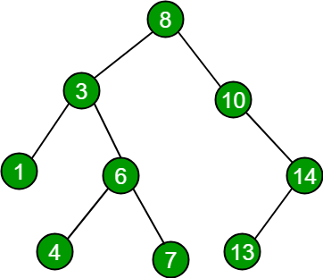
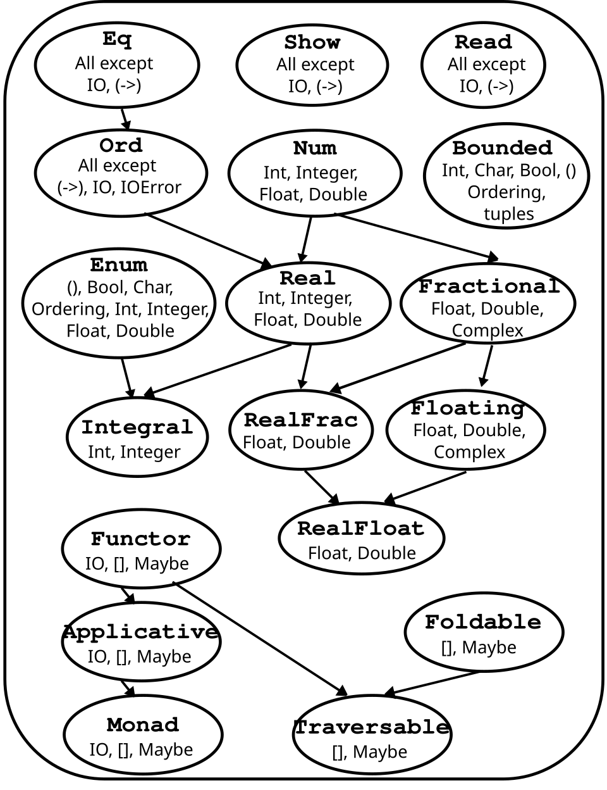
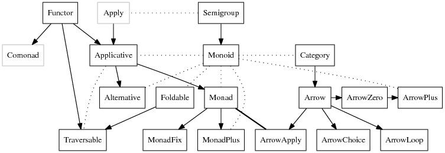

class: center, middle

### Llenguatges de Programació

## Sessió 4: tipus algebraics i classes

<br><br>

**Jordi Petit**


---
class: left, middle, inverse

## Contingut

- .cyan[Tipus]

- Tipus algebraics

- Tipus genèrics predefinits

- Classes

- Exercicis

---

# Tipus predefinits

Ja hem vist que existeixen una sèrie de tipus predefinits:

- Tipus simples:
    - `Int`, `Integer`, `Float`, `Double`
    - `Bool`
    - `Char`

- Tipus estructurats:
    - Llistes
    - Tuples
    - Funcions

```haskell
     5  :: Integer
   True :: Bool
    'a' :: Char
[1,2,3] :: [Integer]
('b',4) :: (Char,Integer)
    not :: Bool -> Bool
```

Tots els identificadors de tipus comencem amb majúscula.

---

# Tipus polimòrfics

```haskell
length :: [a] -> Int
map :: (a -> b) -> [a] -> [b]
```

El **polimorfisme paramètric**  és un mecanisme senzill que permet
definir funcions (i tipus) que s'escriuen genèricament, sense
dependre dels tipus dels objectes sobre els quals s'apliquen.

En Haskell, les **variables de tipus** poden prendre qualsevol valor
i estan quantificades universalment. Per convenció `a`, `b`, `c`, ...


---

# Tipus polimòrfics


Per a utilitzar funcions amb tipus polimòrfics cal que hi hagi
una substitució de les variables de tipus que s’adeqüi a l’aplicació que estem fent.

**Exemple:**  `map even [3,6,1]` té tipus `[Bool]` ja que:

- el tipus de `map` és `(a -> b) -> [a] -> [b]`,
- el tipus de `even` és `Int -> Bool`,
- per tant, `a` es pot substituir per `Int` i `b` es pot substituir per `Bool`,
- i el tipus final de l'expressió és `[Bool]`.

<br>

Una expressió dóna error de tipus si no existeix una substitució
per a les seves variables de tipus.

**Exemple:** `map not ['b','c']` dóna error de tipus ja que:

- per una banda, `a` hauria de ser `Bool`,
- per altre banda, `a` hauria de ser `Char`.


---

# Tipus sinònims

La construcció `type` permet substituir un tipus (complex)
per un nou nom.

Els dos tipus són intercanviables.

```haskell
type Euros = Float

sou :: Persona -> Euros
```

```haskell
type Diccionari = String -> Int

crear :: Diccionari
cercar :: Diccionari -> String -> Int
inserir :: Diccionari -> String -> Int -> Diccionari
esborrar :: Diccionari -> String -> Diccionari
```

Els tipus sinònims aporten claredat (però no més seguretat).

💡 Per a més seguretat, mireu `newtype` (no el considerem).


---
class: left, middle, inverse

## Contingut

- .brown[Tipus]

- .cyan[Tipus algebraics]

- Tipus genèrics predefinits

- Classes

- Exercicis

---

# Tipus enumerats

Els **tipus enumerats** donen la llista de valors possibles
dels objectes d'aquell tipus.

```haskell
data Jugada = Pedra | Paper | Tisores

data Operador
    = Suma
    | Resta
    | Producte
    | Divisio

data Bool = False | True    -- predefinit
```

Els valors enumerats (**constructors**), han de començar amb majúscula.

Els tipus enumerats es poden desconstruir amb patrons:

```haskell
guanya :: Jugada -> Jugada -> Bool
    -- diu si la primera jugada guanya a la segona

guanya Paper Pedra = True
guanya Pedra Tisores = True
guanya Tisores Paper = True
guanya _ _ = False
```


---

# Tipus algebraics

Els **tipus algebraics** defineixen diversos constructors,
cadascun amb zero o més dades associades.


```haskell
data Forma
    = Rectangle Float Float         -- alçada, amplada
    | Quadrat Float                 -- mida
    | Cercle Float                  -- radi
    | Punt
```

Les dades es creen especificant el constructor i els seus valors respectius:

```haskell
λ> r = Rectangle 3 4
λ> :type r
👉 r :: Forma

λ> c = Cercle 2.0
λ> :type c
👉 c :: Forma
```


---

# Tipus algebraics

```haskell
data Forma
    = Rectangle Float Float         -- alçada, amplada
    | Quadrat Float                 -- mida
    | Cercle Float                  -- radi
    | Punt
```

Els tipus algebraics es poden desconstruir amb patrons:

```haskell
area :: Forma -> Float

area (Rectangle amplada alçada) = amplada * alçada
area (Quadrat mida) = area (Rectangle mida mida)
area (Cercle radi) = pi * radi^2
area Punt = 0
```

```haskell
λ> area (Rectangle 3 4)
👉 12

λ> c = Cercle 2.0
λ> area c
👉 12.566370614359172
```

---

# Tipus algebraics

Per escriure valors algebraics, cal afegir `deriving (Show)` al final
del tipus.
<br>⟹ més endavant veurem què vol dir.

```haskell
data Punt = Punt Int Int
    deriving (Show)

data Rectangle = Rectangle Punt Punt
    deriving (Show)
```

```haskell
λ> p1 = Punt 2 3
λ> p1
👉 Punt 2 3

λ> p2 = Punt 4 6
λ> p2
👉 Punt 4 6

λ> r = Rectangle p1 p2
λ> r
👉 Rectangle (Punt 2 3) (Punt 4 6)
```

---

# Arbres binaris d'enters

Els tipus algebraics també es poden definir recursivament!

```haskell
data Arbin = Buit | Node Int Arbin Arbin
    deriving (Show)
```

```haskell
λ> a1 = Node 1 Buit Buit
λ> a2 = Node 2 Buit Buit
λ> a3 = Node 3 a1 a2
λ> a4 = Node 4 a3 Buit
λ> a4
👉 Node 4 (Node 3 (Node 1 Buit Buit) (Node 2 Buit Buit)) Buit

λ> a5 = Node 5 a4 a4        -- I 💜 sharing
λ> a5
👉 Node 5 (Node 4 (Node 3 (Node 1 Buit Buit) (Node 2 Buit Buit)) Buit) 
          (Node 4 (Node 3 (Node 1 Buit Buit) (Node 2 Buit Buit)) Buit)
```

Com sempre, la desconstrucció via patrons marca el camí: 👣

```haskell
alcada :: Arbin -> Int

alcada Buit = 0
alcada (Node _ fe fd) = 1 + max (alcada fe) (alcada fd)
```

---

# Arbres binaris genèrics

Els tipus algebraics també tenen polimorfisme paramètric!

```haskell
data Arbin a = Buit | Node a (Arbin a) (Arbin a)
    deriving (Show)
```

```haskell
a1 :: Arbin Int
a1 = Node 3 (Node 1 Buit Buit) (Node 2 Buit Buit)

a2 :: Arbin Forma
a2 = Node (Rectangle 3 4) (Node (Cercle 2) Buit Buit) (Node Punt Buit Buit)
```

```haskell
alcada :: Arbin a -> Int

alcada Buit = 0
alcada (Node _ fe fd) = 1 + max (alcada fe) (alcada fd)
```


```haskell
preordre :: Arbin a -> [a]

preordre Buit = []
preordre (Node x fe fd) = [x] ++ preordre fe ++ preordre fd
```

---

# Arbres generals genèrics

```haskell
data Argal a = Argal a [Argal a]  -- (no hi ha arbre buit en els arbres generals)
    deriving (Show)
```

```haskell
a = Argal 4 [Argal 1 [], Argal 2 [], Argal 3 [Argal 0 []]]
```

```haskell
mida :: Argal a -> Int

mida (Argal _ fills) = 1 + sum (map mida fills)
```


```haskell
preordre :: Argal a -> [a]

preordre (Argal x fills) = x : concatMap preordre fills
```

---

# Arbres binaris de cerca

.center[]

```haskell
data Abc a = Buit | Node a (Abc a) (Abc a)       -- arbre binari de cerca
```

```haskell
buit        :: Abc a                           -- retorna un arbre buit
cerca       :: Ord a => a -> Abc a -> Bool     -- diu si un abre conté un element
insereix    :: Ord a => a -> Abc a -> Abc a    -- inserció d'un element
esborra     :: Ord a => a -> Abc a -> Abc a    -- esborrat d'un element (exercici)
```

---

# Arbres binaris de cerca


```haskell
data Abc a = Buit | Node a (Abc a) (Abc a)  -- arbre binari de cerca


buit :: Abc a                               -- retorna un arbre buit

buit = Buit

cerca :: Ord a => a -> Abc a -> Bool        -- diu si un abre conté un element

cerca x Buit = False
cerca x (Node k fe fd)
    | x <  k        = cerca x fe
    | x >  k        = cerca x fd
    | x == k        = True


insereix :: Ord a => a -> Abc a -> Abc a    -- inserció d'un element

insereix x Buit = Node x Buit Buit
insereix x (Node k fe fd)
    | x <  k        = Node k (insereix x fe) fd
    | x >  k        = Node k fe (insereix x fd)
    | x == k        = Node k fe fd


esborra :: Ord a => a -> Abc a -> Abc a    -- esborrat d'un element (exercici)
```

---

# Expressions booleanes amb variables

```haskell
data ExprBool
    = Val Bool
    | Var Char
    | Not ExprBool
    | And ExprBool ExprBool
    | Or  ExprBool ExprBool
    deriving (Show)

type Dict = Char -> Bool
```

```haskell
eval :: ExprBool -> Dict -> Bool

eval (Val x) d = x
eval (Var v) d = d v
eval (Not e) d = not $ eval e d
eval (And e1 e2) d = eval e1 d && eval e2 d
eval (Or  e1 e2) d = eval e1 d || eval e2 d
```


```haskell
e = (And (Or (Val False) (Var 'x')) (Not (And (Var 'y') (Var 'z'))))
d = (`elem` "xz")
eval e d
    -- evalua (F ∨ x) ∧ (¬ (y ∧ z)) amb x = z = T i y = F
```


---

# Perspectiva


```haskell
data Expr a
    = Val a
    | Var String
    | Neg (Expr a)
    | Sum (Expr a) (Expr a)
    | Res (Expr a) (Expr a)
    | Mul (Expr a) (Expr a)
    | Div (Expr a) (Expr a)
```

Com seria en C++?


---

# Perspectiva

.cols5050[
.col1[
```c++
template <typename a> class Expr {

    struct ValData {
        a x;
    };

    struct VarData {
        string v;
    };

    struct NegData {
        Node* e;
    };

    struct OpData {
        Node* e1;
        Node* e2;
    };

    enum Constructor {Val, Var, Neg,
            Sum, Res, Mul, Div};
```
]
.col2[
```c++
    struct Node {
        Constructor c;
        union {
            ValData val;
            VarData var;
            NegData neg;
            OpData  op;
        };
    };

    Node* p; // punter al node amb 
             // l'expressió
public:

    Expr ExprVal (const a& x);
    Expr ExprVar (const string& v);
    Expr ExprNeg (const Expr& e);
    Expr ExprSum (const Expr& e1,
                  const Expr& e2);
    ...
};
```
]]

I encara falten les operacions i la gestió de la memòria!  😰🧟

---
class: left, middle, inverse

## Contingut

- .brown[Tipus]

- .brown[Tipus algebraics]

- .cyan[Tipus genèrics predefinits]

- Classes

- Exercicis

---

# Llistes genèriques

```haskell
data Llista a = Buida | a `DavantDe` (Llista a)
```

```haskell
l1 = 3 `DavantDe` 2 `DavantDe` 4 `DavantDe` Buida
```

```haskell
llargada :: Llista a -> Int

llargada Buida = 0
llargada (cap `DavantDe` cua) = 1 + llargada cua
```

--

Les llistes de Haskell són exactament això!
(amb una mica de sucre sintàctic 🍬)


```haskell
data [a] = [] | a : [a]
```

```haskell
l1 = 3:2:4:[]    -- l1 = [3, 2, 4]
```

```haskell
length :: [a] -> Int

length [] = 0
length (x:xs) = 1 + length xs
```

---

# Maybe a

El tipus polimòrfic `Maybe a` està predefinit així:

```haskell
data Maybe a = Just a | Nothing
```

Expressa dues possibilitats:

- la presència d'un valor (de tipus `a` amb el constructor `Just`), o
- la seva absència (amb el constructor buit `Nothing`).

Aplicacions:

- Indicar possibles valor nuls.
- Indicar absència d'un resultat.
- Reportar un error.

Exemples: (busqueu doc a [Hoogλe](https://www.haskell.org/hoogle/))

```haskell
find :: (a -> Bool) -> [a] -> Maybe a
    -- cerca en una llista amb un predicat

lookup :: Eq a => a -> [(a,b)] -> Maybe b
    -- cerca en una llista associativa
```

---

# Either a b

El tipus polimòrfic `Either a b` està predefinit així:

```haskell
data Either a b = Left a | Right b
```

Expressa dues possibilitats per un valor:

- un valor de tipus `a` (amb el constructor `Left`), o
- un valor de tipus `b` (amb el constructor `Right`).

Aplicacions:

- Indicar que un valor pot ser, alternativament, de dos tipus.
- Reportar un error. Habitualment:
    - `a` és un `String` i és el diagnòstic de l'error.
    - `b` és del tipus del resultat esperat.
    - **Mnemotècnic:** *right* vol dir *dreta* i també *correcte*.

Exemple:

```haskell
secDiv :: Float -> Float -> Either String Float
secDiv _ 0 = Left "divisió per zero"
secDiv x y = Right (x / y)
```

---
class: left, middle, inverse

## Contingut

- .brown[Tipus]

- .brown[Tipus algebraics]

- .brown[Tipus genèrics predefinits]

- .cyan[Classes]

- Exercicis

---

# Classes de tipus

Una **classe de tipus** (*type class*) és una interfície que defineix un comportament.

Els tipus poden **instanciar** (implementar seguint la interfície)
una o més classes de tipus.

La instanciació es pot fer

- automàticament pel compilador per a certes classes predefinides, o
- a mà.

Les classes de tipus

- són la forma de tenir sobrecàrrega en Haskell, i
- proporcionen una altra forma de polimorfisme.

<br>
<br>
⚠️ Les classes de tipus de Haskell no són classes de OOP com a C++ o Java
(més aviat són com els `interface`s de Java).

---

# La classe `Eq`

La funció `elem` necessita comparar elements per igualtat:

```haskell
elem :: (Eq a) => a -> [a] -> Bool
elem x [] = False
elem x (y:ys) = x == y || elem x ys
```

La declaració `(Eq a) =>` indica que els tipus `a`
sobre els quals es pot aplicar la funció `elem`
han de ser instàncies de la classe `Eq`.

La classe predefinida `Eq`
dóna operacions d'igualtat i desigualtat:

```haskell
class Eq a where
    (==) :: a -> a -> Bool
    (/=) :: a -> a -> Bool
```

I fins i tot ja proporciona definicions per defecte (circulars, què hi farem!):

```haskell
class Eq a where
    (==) :: a -> a -> Bool
    (/=) :: a -> a -> Bool
    x == y  = not (x /= y)
    x /= y  = not (x == y)
```

---

# La classe `Eq`

El nostre tipus `Jugada` (encara) no dóna suport a la classe `Eq`:

```haskell
data Jugada = Pedra | Paper | Tisora

λ> Paper /= Paper
💣 error: "No instance for (Eq Jugada) arising from a use of ‘/=’"

λ> Pedra `elem` [Paper, Pedra, Paper]
💣 error: "No instance for (Eq Jugada) arising from a use of ‘elem’"
```

Amb `deriving (Eq)` demanem al compilador que
instanciï automàticament la classe `Eq` (usant igualtat estructural):


```haskell
data Jugada = Pedra | Paper | Tisora
    deriving (Eq)

λ> Paper /= Paper
👉 False

λ> Pedra `elem` [Paper, Pedra, Paper]
👉 True
```

---

# La classe `Eq`

Per alguns tipus, la igualtat estructural no és suficient:

```haskell
data Racional = Racional Int Int        -- numerador, denominador
    deriving (Eq)

λ> Racional 3 2 == Racional 6 4
👎 False
```

En aquests casos cal instanciar la classe a mà:

```haskell
instance Eq Racional where
    (Racional n1 d1) == (Racional n2 d2) = n1 * d2 == n2 * d1

λ> Racional 3 2 == Racional 6 4
👍 True

λ> Racional 3 2 /= Racional 6 4
👍 False
```

Només cal definir `==` perquè la definició per defecte de `/=` ja ens convé.

---

# La classe `Eq`

Per alguns tipus, instanciar una classe també requereix alguna altra classe:

```haskell
data Arbin a = Buit | Node a (Arbin a) (Arbin a)

instance Eq a => Eq (Arbin a) where

    Buit == Buit = True
    (Node x1 fe1 fd1) == (Node x2 fe2 fd2) = x1 == x2 && fe1 == fe2 && fd1 == fd2
    _ == _ = False
```

---

# Informació sobre instàncies

Amb la comanda `:info T` (o `:i T`) de l'intèrpret es pot veure de quines
classes és instància un tipus `T`:

```haskell
λ> :i Racional
data Racional = Racional Int Int
*instance Eq Racional

λ> :i Int
data Int = GHC.Types.I# GHC.Prim.Int#
*instance Eq Int
instance Ord Int
instance Show Int
instance Read Int
instance Enum Int
instance Num Int
instance Real Int
instance Bounded Int
instance Integral Int
```

---

# La classe `Ord`

La classe predefinida `Ord` (que requereix la classe `Eq`)
dóna operacions d'ordre:

```haskell
data Ordering = LT | EQ | GT    -- possibles resultats d'una comparació d'ordre

class (Eq a) => Ord a where
    compare               :: a -> a -> Ordering
    (<), (<=), (>=), (>)  :: a -> a -> Bool
    max, min              :: a -> a -> a
    compare x y
        | x == y    = EQ
        | x <= y    = LT
        | otherwise = GT
    x <  y = compare x y == LT
    x >  y = compare x y == GT
    x <= y = compare x y /= GT
    x >= y = compare x y /= LT
```

El mínim que cal per fer la instanciació és definir el `<=` o el `compare`.

Tot i que no es verifica, s'espera que les instàncies d'`Ord` compleixin
les lleis:

- Transitivitat: si `x <= y && y <= z` llavors `x <= z`.
- Reflexivitat: `x <= x`.
- Antisimetria: si `x <= y && y <= x` llavors `x == y`.

---

# La classe `Show`

La classe predefinida `Show` dóna suport per convertir valors en textos:

```haskell
class Show a where
    show :: a -> String
```

Amb `deriving (Show)`, el compilador la ofereix automàticament (usant
sintaxi Haskell):

```haskell
data Racional = Racional Int Int        -- numerador, denominador
    deriving (Eq, Show)

λ> show $ Racional 3 2  👉 "Racional 3 2"
λ> show $ Racional 6 4  👉 "Racional 6 4"    💔
```

Alternativament, per fer la instanciació a mà només cal definir el `show`:


```haskell
instance Show Racional where
    show (Racional n d) = (show $ div n m) ++ "/" ++ (show $ div d m)
        where m = gcd n d

λ> show $ Racional 3 2  👉 "3/2"
λ> show $ Racional 6 4  👉 "3/2"             💖
```

---

# La classe `Read`

La classe predefinida `Read` dóna suport per convertir textos en valors:

```haskell
class Read a where
    read :: String -> a
```

Amb `deriving (Read)`, el compilador la ofereix automàticament (usant
sintaxi Haskell).

Alternativament, per fer la instanciació a mà cal definir el `readPrec`, que forma part dels 
*parsers* interns de Haskell.

**Compte:** Al usar `read`, sovint cal especificar el tipus de retorn, perquè
el compilador sàpiga a quin de tots els `read`s sobrecarregats ens referim:

```haskell
λ> read "38"                    💣 "Exception: Prelude.read: no parse"
λ> (read "38") :: Int           👉 38
λ> (read "38") :: Integer       👉 38
λ> (read "38") :: Float         👉 38.0
```

---

# La classe `Num`

La classe predefinida `Num` dóna suport a operadors aritmètics bàsics:

```haskell
class (Eq a, Show a) => Num a where
    (+), (-), (*)       :: a -> a -> a
    negate, abs, signum :: a -> a
    fromInteger         :: Integer -> a

    x - y    = x + negate y
    negate x = 0 -x
```

Per fer la instanciació cal definir totes les operacions
menys `negate` o `-`.

Els tipus `Int`, `Integer`, `Float` i `Double` són instàncies de la classe `Num`.

---

# Classes base predefinides

.center[

]

Font: [Haskell/Classes and types](https://en.wikibooks.org/wiki/Haskell/Classes_and_types)

---

# Altres classes predefinides

.center[

]

Font: [Typeclassopedia](https://wiki.haskell.org/Typeclassopedia)

---

# Ús de classes en declaracions de tipus

```haskell
suma [] = 0
suma (x:xs) = x + suma xs
```

Quin és el tipus de `suma`?

--

```haskell
suma :: [Int] -> Int
```

.center[❌ més general!]

--

```haskell
suma :: [a] -> a
```
.center[❌ el tipus `a` no pot ser qualsevol: ha de tenir l'operació `+`!]

--

```haskell
suma :: Num a => [a] -> a
```

.center[✅ el tipus `a` ha de ser instància de `Num`!]

--

`=>` : condicions sobre les variables de tipus

Haskell és capaç d'inferir tipus i condicions automàticament (més endavant veurem com).

---

# Definició de classes pròpies

Només cal utilitzar la mateixa sintaxi que ja hem vist.

**Exemple:** Classe per a predicats.

```haskell
class Pred a where
    sat   :: a -> Bool
    unsat :: a -> Bool

    unsat = not . sat
```

Instanciació pels enters:

```haskell
instance Pred Int where
    sat 0 = False
    sat _ = True
```

Instanciació pels arbres binaris:

```haskell
instance Pred a => Pred (Arbin a) where
    sat Buit = True
    sat (Node x fe fd) = sat x && sat fe && sat fd
```

---
class: left, middle, inverse

## Contingut

- .brown[Tipus]

- .brown[Tipus algebraics]

- .brown[Tipus genèrics predefinits]

- .brown[Classes]

- .cyan[Exercicis]

---

# Exercicis

Feu aquests problemes de Jutge.org:

- [P97301](https://jutge.org/problems/P97301) FizzBuzz

- [P37072](https://jutge.org/problems/P37072) Arbre binari

- [P80618](https://jutge.org/problems/P80618) Cua (1)
