class: center, middle

## Llenguatges de Programació

# Inferència de tipus

 

<br>

**Gerard Escudero, Jordi Petit, Albert Rubio**


---
class: left, middle, inverse

# Contingut

- .cyan[Introducció]

- Tipus i funcions prefefinides

- Funcions i condicionals

- Funcions d'ordre superior

- Patrons

- Classes

- Errors de tipus

- Exercicis

---

# Inferència de tipus

La **inferència de tipus** és la detecció automàtica
dels tipus de les expressions en un llenguatge de programació.

Permet fer més fàcils moltes tasques de programació,
sense comprometre la seguretat de la comprovació de tipus.

Té sentit en llenguatges fortament tipats.

És un característica habitual dels llenguatges funcionals.

Alguns LPs amb inferència de tipus:

- C++ >= 11
- Haskell
- C#
- D
- Go
- Java >= 10
- Scala
- ...

---

# Inferència de tipus a C++

La inferència de tipus apareix a la versió 11 de l'estàndard de C++.

-   `auto`: Dedueix el tipus d'una variable a través de
    la seva inicialització:

    ```c++
    map<int, string> m;
    auto x = 12;                // x és un int
    auto it = m.find(x);        // x és un map<int, string>::iterator
    ```

-  `decltype`: Obté el tipus d'una expressió.

    ```c++
    int x = 12;
    decltype(x + 1) y = 0;      // y és un int
    ```


---

# Inferència de tipus a Haskell

- En la majoria de casos no cal definir els tipus.

- Es poden demanar els tipus inferits (que inclouen classes, si cal).

    ```haskell
    λ> :type 3 * 4
    👉 3 * 4 :: Num a => a

    λ> :type odd (3 * 4)
    👉 odd (3 * 4) :: Bool
    ```

- Algunes situacions estranyes.

    - *Monomorphism restriction*:
    Sovint no es pot sobrecarregar una funció si no es dona una declaració
    explícita de tipus.

---

# Inferència de tipus

**Problema:** Donat un programa,
trobar el tipus més general de les seves expressions
dins del sistema de tipus del LP.

.cols5050[
.col1[
**Algorisme de Milner**

- Curry i Hindley havien desenvolupat idees similars
independentment en el context del λ-càlcul.

- Hindley–Milner i Damas–Milner

- L'algorisme és similar a la "unificació".


.small[Foto: Domini públic]
]
.col2[
**Propietats**

- Complet.

- Computa el tipus més general possible sense necessitat d'anotacions.

- Eficient: gairebé lineal (inversa de la funció d'Ackermann).
    <br>
    L'eficiència depèn de l'algorisme d'unificació que s'apliqui.
]]

---

# Algorisme de Milner

**Descripció general**

1. Es genera l'arbre de sintaxi de l'expressió (currificant totes les aplicacions).

2. S'etiqueta cada node de l'arbre amb un tipus:

    - Si el tipus és conegut, s'etiqueta amb aquest tipus.
    - Altrament, s'etiqueta amb una nova variable de tipus.

3. Es genera un conjunt de restriccions (d'igualtat principalment) a
   partir de l'arbre de l'expressió i les operacions que hi intervenen:

    - Aplicació,
    - Abstracció,
    - `let`, `where`,
    - `case`, guardes, patrons,
    - ...

4. Es resolen les restriccions mitjançant unificació.

---
class: left, middle, inverse

# Contingut

- .brown[Introducció]

- .cyan[Tipus i funcions prefefinides]

- Funcions i condicionals

- Funcions d'ordre superior

- Patrons 

- Classes

- Errors

- Exercicis

---

# Haskell i λ-càlcul

Les expressions simples en .blue[Haskell] es tradueixen a un .blue[λ-càlcul] ampliat amb tipus simples i les seves funcions predefinides associades.red[*]:

- `Int`, `Bool`, `Char`...

- `3`, `True`...

- `+`, `-`, `*`, `==`, `&&`...

**Exemples**:

```
2 + 3            →  (+) 2 3 

(+) 2 3          →  (+) 2 3

not True         →  not True

(\x -> x + x) 3  →  (λx.(+) x x) 3
```

.footnote[.red[*] .red[Model matemàtic]: λ-càlcul amb tipus ( λ → ) (_simply typed lambda calculus_)]

---

# Primer exemple

Expressió currificada i sense operadors infixes:

```haskell
\x -> 2 + x   →   \x -> (+) 2 x
```

Arbre de l'expressió currificada:

.center[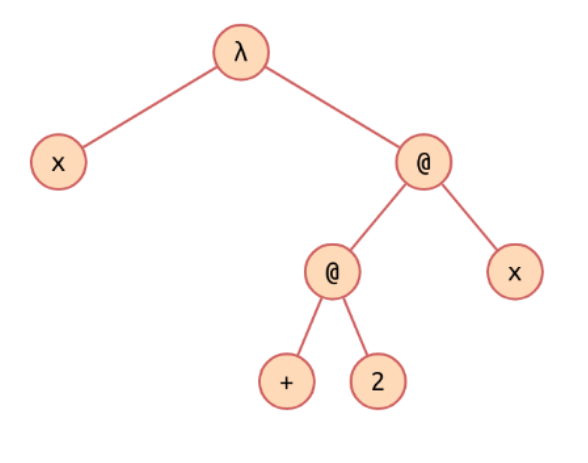]

---

# Primer exemple

```haskell
\x -> (+) 2 x
```

Etiquetem els nodes:

- Si el tipus és conegut, se'ls etiqueta amb el seu tipus.
- Altrament, se'ls etiqueta amb una nova variable de tipus.
- Nodes iguals han de tenir etiquetes iguals.

.center[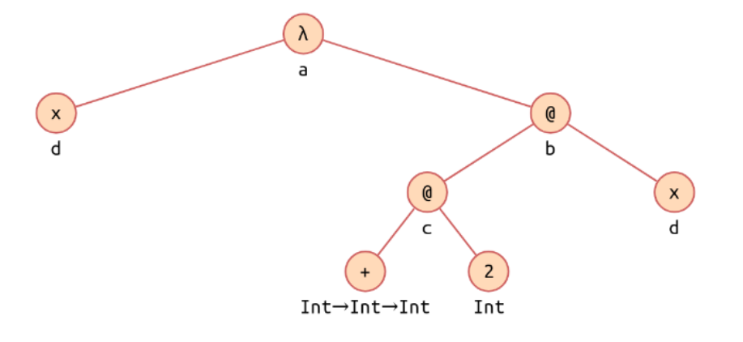]

---

# Algorisme de Milner

**Regles per generar les equacions**

.cols5050[
.col1[
- Abstracció:

.center[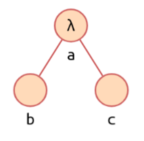]

- Equació: `a = b → c`
]
.col2[
- Aplicació:

.center[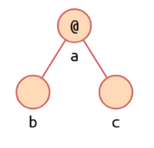]

- Equació: `b = c → a`
]]

---

# Primer exemple

- Obtenim les equacions:

    `a = d → b` <br>
    `c = d → b` <br>
    `Int → Int → Int = Int → c`

- Solucionem les equacions:

    `a = Int → Int`<br>
    `b = Int` <br>
    `c = Int → Int`<br>
    `d = Int`

- El tipus de l'expressió és el de l'arrel (`a`):

    `\x -> (+) 2 x :: Int → Int`

<br>
- Recordeu: `->` associa per la dreta: `a → b → c = a → (b → c)`
- Recordeu: aplicació associa per l'esquerra': `f x y = (f x) y`

---

# Àmbits locals

.blue[Traducció]:

```
let v = B in E  ≡  (λv.E) B
```

.blue[Exemple]:

.cols5050[
.col1[
Haskell:

```
let x = 1
    y = 2
in (x + y)
```
]
.col2[
λ-càlcul:

```
(λx.λy.(+) x y) 1 2
```
]]

.blue[where]:

Es codifica de forma similar.

---
class: left, middle, inverse

# Contingut

- .brown[Introducció]

- .brown[Tipus i funcions prefefinits]

- .cyan[Funcions i condicionals]

- Funcions d'ordre superior 

- Patrons 

- Classes

- Errors

- Exercicis

---

# Funcions

.blue[Supercombinador]: funció que només conté referències als seus paràmetres o a altres *supercombinadors*.

.blue[Exemples]:

```haskell
inc x = x + 1

mes2 x = inc (inc x)
```

.blue[Traducció]:

```
f x y = E  ≡  λx.λy.E 
```

### Exercici 

```
inc :: Int -> Int
:t mes2
```

---

# Condicionals

S'exten el λ-càlcul amb un "if lazy".

- Condicional `if-then-else`:

.center[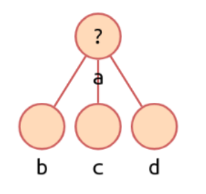]

- .blue[Equacions]:

    - `b = Bool`
    - `a = c = d`

- Les .blue[guardes] es codifiquen amb aquesta estructura.

---

# Exercici

```haskell
positiu x 
  | x >= 0 = True
  | otherwise = False
```

--

.center[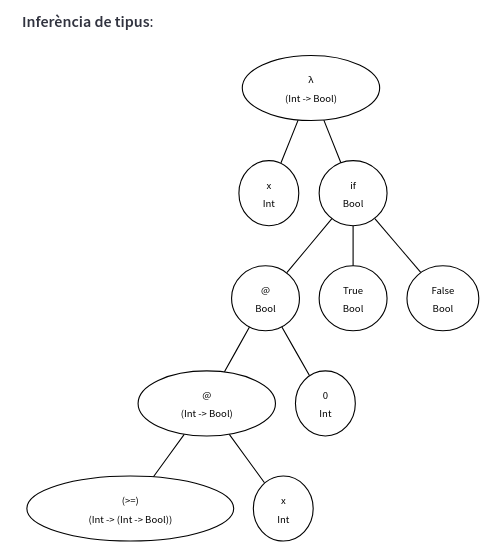]

---
class: left, middle, inverse

# Contingut

- .brown[Introducció]

- .brown[Tipus i funcions prefefinits]

- .brown[Funcions i condicionals]

- .cyan[Funcions d'ordre superior]

- Patrons 

- Classes

- Errors

- Exercicis

---

# Composició

.blue[Exemple]:

```haskell
((.) ((+) 1) ((*) 2)) 3
```

.blue[Implementació]:

```
(.)  ≡  λf.λg.λx.f(gx) 
```

S'ha d'afegir .blue[polimorfisme] a la inferència de tipus (variables de tipus):

```
(.) :: (b -> c) -> (a -> b) -> a -> c
```

.blue[Exercici]

```
mes1 :: Int -> Int
per2 :: Int -> Int
:t mes1 . per2
```

.footnote[.red[*] .red[Model matemàtic]: λ-càlcul polimòrfic (System F o λ-càlcul de 2on ordre). Introdueix un mecanisme de quantificació universal (lògica amb ∀x) sobre els tipus.]

---

# Exemple

```haskell
map f l = if null l then [] else f (head l) : map f (tail l)
```

```haskell
\f -> \l -> if null l then [] else f (head l) : map f (tail l)
```

.center[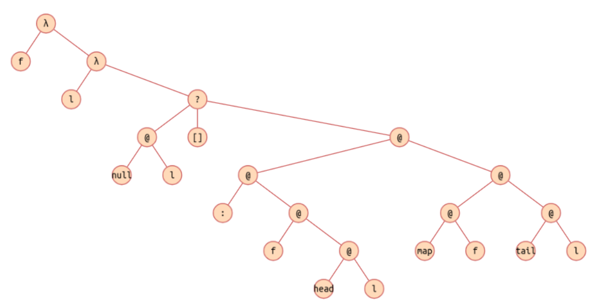]

---

# Exemple

```haskell
\f -> \l -> if null l then [] else f (head l) : map f (tail l)
```

Arbre etiquetat amb tipus:

.center[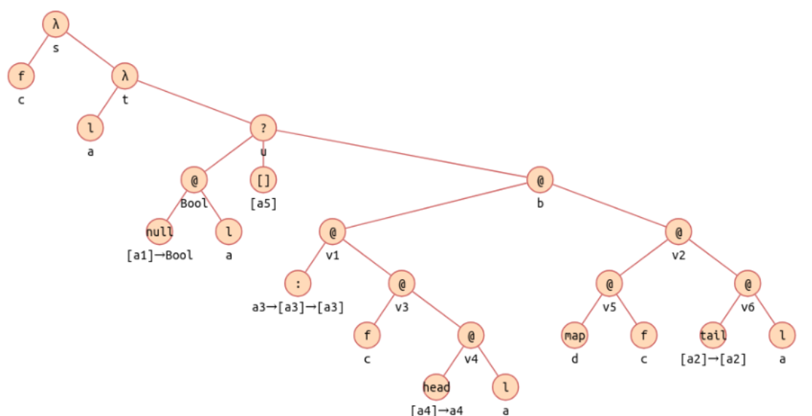]

---

# Exemple

```haskell
\f -> \l -> if null l then [] else f (head l) : map f (tail l)
```

Equacions:

- `s = c → t`
- `t = a → u`
- `u = [a5]`
- `u = b`
- `[a1] → Bool = a → Bool`
- `v1 = v2 → b`
- `a3 → [a3] → [a3] = v3 → v1`
- `c = v4 → v3`
- `[a4] → a4 = a → [v4]`
- `v5 = v6 → v2`
- `d = c → v5`
- `[a2] → [a2] = a → v6`<br><br>
- `s = d` (per establir que el `map` té el mateix tipus a la definició i a l'ús recursiu)

---

# Exemple

```haskell
\f -> \l -> if null l then [] else f (head l) : map f (tail l)
```

Solució:

- `a    =  [a1] `
- `a2  =  a1 `
- `a4  =  a1 `
- `a5  =  a3 `
- `b    =  [a3] `
- `c    =  a1 →  a3 `
- `v1  =  [a3] →  [a3] `
- `v2  =  [a3] `
- `v3  =  a3 `
- `v4  =  a1 `
- `v5  =  [a1] →  [a3] `
- `v6  =  [a1] `
- `d    =  (a1 →  a3) →  [a1] →  [a3] `
- `s    =  (a1 →  a3) →  [a1] →  [a3] ` *(arrel)*

---
class: left, middle, inverse

# Contingut

- .brown[Introducció]

- .brown[Tipus i funcions prefefinits]

- .brown[Funcions i condicionals]

- .brown[Funcions d'ordre superior]

- .cyan[Patrons]

- Classes

- Errors

- Exercicis

---

# Definició de funció amb patrons

```haskell
map f (x : xs) = f x : map f xs
```

En aquest cas la introducció de lambdes és una mica diferent, ja que
tractem els patrons com si fossin variables lliures:

```haskell
\f -> \(x : xs) -> f x : map f xs
```

Noteu que ara hem de considerar que el primer argument de la lambda pot
ser una expressió, que tractarem igual que les demés.

Totes les variables del patró queden lligades per la lambda.

En l'avaluació d'expressions amb patrons, el sistema ha de fer matching entre el paràmetre i el patró per assegurar-se de que l'aplicació és vàlida.

---

# Algorisme de Milner

```haskell
\f -> \(x : xs) -> f x : map f xs
```

Arbre de l'expressió:

.center[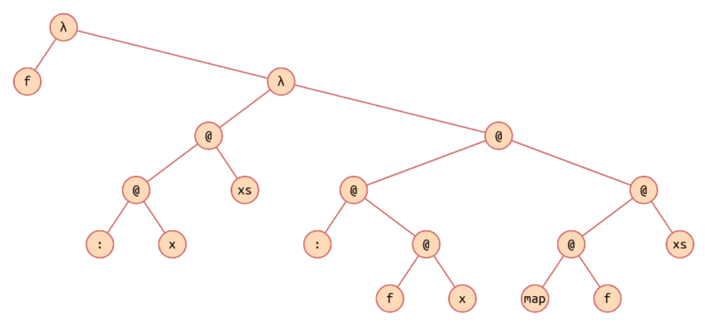]

---

# Algorisme de Milner

```haskell
\f -> \(x : xs) -> f x : map f xs
```

Arbre etiquetat amb tipus:

.center[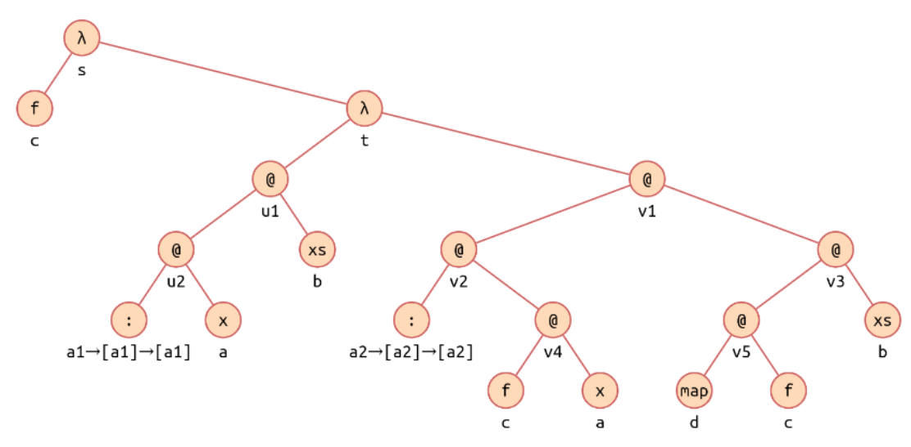]

---

# Algorisme de Milner

```haskell
\f -> \(x : xs) -> f x : map f xs
```

Equacions:

- `s = c  →  t`<br>
- `t = u1  →  v1`<br>
- `u2 = b  →  u1`<br>
- `a1 →  [a1] →  [a1] = a  →  u2`<br>
- `v2 = v3  →  v1`<br>
- `a2 →  [a2] →  [a2] = v4  →  v2`<br>
- `c = a  →  v4`<br>
- `v5 = b  →  v3`<br>
- `d = c  →  v5`<br><br>
- `s = d`<br>

---

# Algorisme de Milner

```haskell
\f -> \(x : xs) -> f x : map f xs
```

Solució:

- `a1 = a`
- `b  = [a]`
- `c  = a →  a2`
- `d  = (a →  a2) →  [a] →  [a2]`
- `s  = (a →  a2) →  [a] →  [a2]`
- `t  = [a] →  [a2]`
- `u1 = [a]`
- `u2 = [a] →  [a]`
- `v1 = [a2]`
- `v2 = [a2] →  [a2]`
- `v3 = [a2]`
- `v4 = a2`
- `v5 = [a] →  [a2]`

Per tant, el tipus de l'arrel és `s = (a →  a2) →  [a] → [a2]`.

---

# Funcions amb més d'una definició

```haskell
map f [] = []
map f (x : xs) = f x : map f xs
```

Quan hi ha més d'una definició, apareix un bosc d'arbres.

Les definicions per la mateixa funció tenen el mateix tipus a l'arrel.red[*].


.blue[Nota]: analitzant una sola definició, el tipus pot ser més general que l'esperat:

```haskell
foldr f z (x : xs) = f x (foldr f z xs)
```

`foldr :: (t1 -> t2 -> t2) -> t3 -> [t1] -> t2`  ⚠️ 

```haskell
foldr f z (x : xs) = f x (foldr f z xs)
foldr f z [] = z
```

`foldr :: (t1 -> t2 -> t2) -> t2 -> [t1] -> t2`  👌

.footnote[.red[*] Per tractar patrons múltiples s'exten el λ-càlcul amb l'operador ▯, que agrupa les diferents definicions d'una mateixa funció en una única expressió.]

---
class: left, middle, inverse

# Contingut

- .brown[Introducció]

- .brown[Tipus i funcions prefefinits]

- .brown[Funcions i condicionals]

- .brown[Funcions d'ordre superior]

- .brown[Patrons]

- .cyan[Classes]

- Errors

- Exercicis

---

# Classes

La presència de definicions com ara

```haskell
(+) :: Num a => a -> a -> a
(>) :: Ord a => a -> a -> Bool
```

introdueix unes noves *restriccions de context*.

<br>
Per tant, les solucions també han de contenir i satisfer les condicions de classe.

---

# Classes

```haskell
f x = 2 + x
```

Arbre etiquetat:

.center[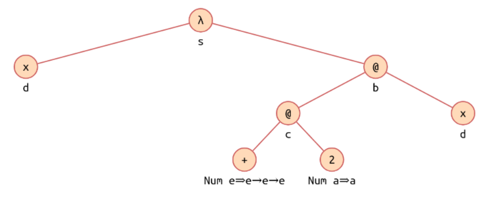]

---

# Classes

Equacions:

- `s = d  →  b`
- `c = d  →  b`
- `e →  e →  e = a  →  c`

Restriccions:

- `Num a`
- `Num e`

Solució:

- `s  = a  →  a`
- `b  = a`
- `c  = a →  a`
- `d  = a`
- `e  = a`

El tipus de l'arrel (de `f`) és doncs `Num a ⇒ a → a`.

---
class: left, middle, inverse

# Contingut

- .brown[Introducció]

- .brown[Tipus i funcions prefefinits]

- .brown[Funcions i condicionals]

- .brown[Funcions d'ordre superior]

- .brown[Patrons]

- .brown[Classes]

- .cyan[Errors]

- Exercicis

---

# Errors

```haskell
f x = '2' + x
```

Arbre etiquetat:

.center[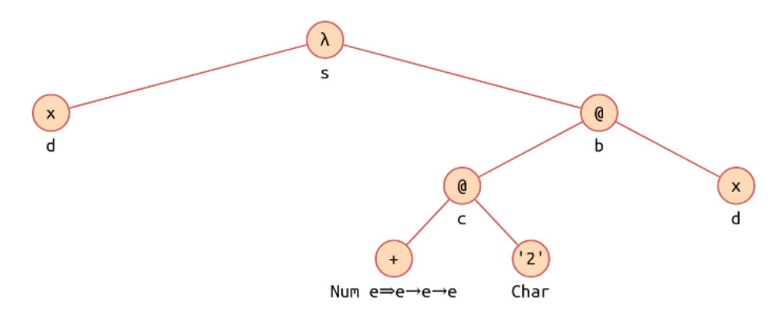]

---

# Errors

Equacions:

- `s = d  →  b`
- `c = d  →  b`
- `e →  e →  e = Char  →  c`

Restriccions:

- `Num e`

Intent de solució:

- `s  = Char   →  Char `
- `b  = Char `
- `c  = Char  →  Char `
- `d  = Char `
- `e  = Char `
- `Num Char` ❌

Perquè `Char` no és instància de `Num`!

---
class: left, middle, inverse

# Contingut

- .brown[Introducció]

- .brown[Tipus i funcions prefefinits]

- .brown[Funcions i condicionals]

- .brown[Funcions d'ordre superior]

- .brown[Patrons]

- .brown[Classes]

- .brown[Errors]

- .cyan[Exercicis]

---

# Exercicis


-   Utilitzeu l'algorisme de Milner per inferir el tipus de:

    ```haskell
    2 + 3 + 4
    ```

-   Utilitzeu l'algorisme de Milner per inferir el tipus de:

    ```haskell
    2 + 3 <= 2 + 2
    ```

-   Utilitzeu l'algorisme de Milner per inferir el tipus de:

    ```haskell
    map (* 2)
    ```

    (Suposeu `(*) :: Int -> Int -> Int`)

-   Utilitzeu l'algorisme de Milner per inferir el tipus de:

    ```haskell
    foldl (flip (:)) []
    ```


---

# Exercicis


-   Utilitzeu l'algorisme de Milner per inferir el tipus de:

    ```haskell
    \f x -> f $ f x
    ```


-   Utilitzeu l'algorisme de Milner per inferir el tipus de:

    ```haskell
    \f -> f . f
    ```


-   Utilitzeu l'algorisme de Milner per inferir el tipus de:

    ```haskell
    \x y -> if y /= 0 then Just (x `div` y) else Nothing
    ```
    (Suposeu `div :: Int -> Int -> Int`)


-   Utilitzeu l'algorisme de Milner per inferir el tipus de:

    ```haskell
    \xs ys -> zipWith (,) xs ys
    ```


---

# Exercicis

-   Inferiu el tipus de:

    ```haskell
    ones = 1 : ones
    ```

-   Inferiu el tipus de:

    ```haskell
    even x = if rem x 2 == 0 then True else False
    ```

    amb `rem :: Int → Int → Int`.

-   Inferiu el tipus de:

    ```haskell
    even x = rem x 2 == 0
    ```

-   Inferiu el tipus de:

    ```haskell
    last [x] = x
    ```

    Recordeu que `[x]` és `x:[]`.


---

# Exercicis

-   Inferiu el tipus de:

    ```haskell
    delete x (y:ys) =
        if x == y
        then ys
        else y : delete x ys
    ```
    amb `(==) :: Eq a ⇒ a → a → Bool`.
