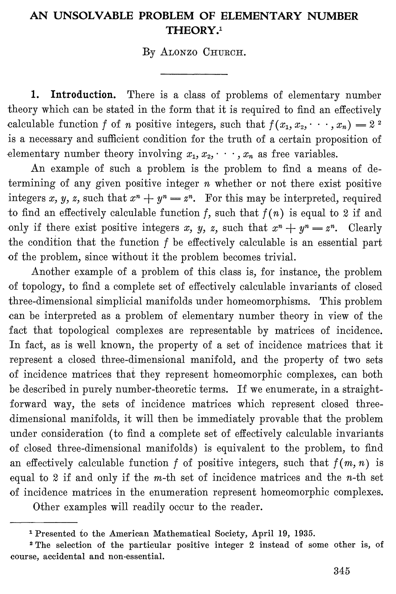
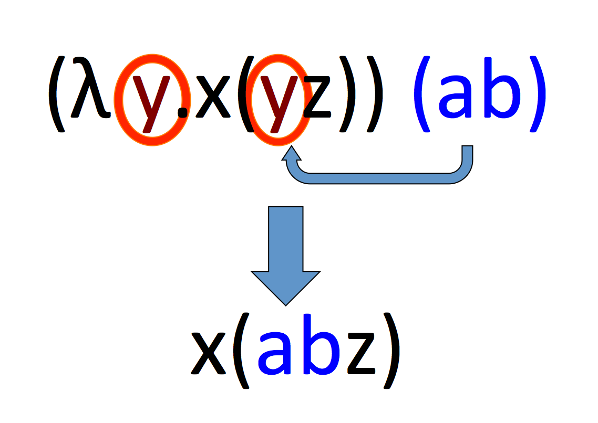
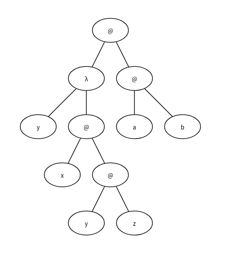
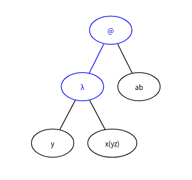

class: center, middle

## Llenguatges de Programació

# lambda càlcul

 

<br>

**Albert Rubio, Jordi Petit, Fernando Orejas, Gerard Escudero**


---
class: left, middle, inverse

## Contingut

- .cyan[Introducció]

- Estructura bàsica

- Codificacions de Church

- Recursivitat

- Universalitat

- Calculadores

---

# Introducció

El **λ-càlcul** és un model de computació funcional, l'origen dels llenguatges
funcionals, i la base de la seva implementació.

.cols5050[
.col1[
Inventat per Alonzo Church, cap al 1930.


.sepimg[]


]
.col2[

Consisteix en agafar una línia de símbols i aplicar una operació de *cut-and-paste*.


]
]

<br>

.small[
Fotos: Fair Use, [jstor.org](https://www.ics.uci.edu/~lopes/teaching/inf212W12/readings/church.pdf), [Lambda Calculus for Absolute Dummies](http://palmstroem.blogspot.com/2012/05/lambda-calculus-for-absolute-dummies.html)
]

---
class: left, middle, inverse

## Contingut

- .brown[Introducció]

- .cyan[Estructura bàsica] 

  - .cyan[Components]

  - Avaluació

  - Macros

- Codificacions de Church

- Recursivitat

- Universalitat

- Calculadores

---

# Gramàtica

```
      terme  →  lletra  |  ( terme )  |  abstracció  |  aplicació
 abstracció  →  λ  lletra  .  terme
  aplicació  →  terme  terme
```

.cols5050[
.col1[
Exemples de termes:
-  $x$
-  $λ x . x$
-  $(λ y . x(yz)) (ab)$

<br><br>

Arbre de  $(λ y . x(yz)) (ab)$:
]
.col2[

]]

---

# Gramàtica

Les lletres es diuen *variables* i no tenen cap significat. El seu nom no importa.
Si dues variables tenen el mateix nom, són la mateixa cosa.

Els parèntesis agrupen termes. Per claredat, s'agrupen per l'esquerra:

$$
  a b c d \equiv (((a b) c) d).
$$

La λ amb el punt introdueix funcions. Per claredat, es poden agrupar λs:
$$
    λ x . λ y . a \equiv λ x . (λ y . a) \equiv λ xy.a
$$


---

# Operacions

Només hi ha dues operacions per la construcció de termes:

- L'**abstracció** captura la idea de definir una funció amb un paràmetre:
$$
    λ x . u
$$
on $u$ és un terme.

  Diem que $λx$ és el *cap* i que $u$ és el *cos*.

  *Intuïció:*
$
    f(x, y) = x^2 + 2y + x - 1
$
és representat per
$
    λ x . λ y . x^2 + 2y + x - 1
$

<br>

- L'**aplicació** captura la idea d'aplicar una funció sobre un paràmetre:
$$
    f \ x
$$
on $f$ i $x$ són dos termes.

  *Intuïció:*
$
    f(x)
$
és representat per
$
    f x
$

---

# Currificació

Al λ-càlcul totes les funcions tenen un sol paràmetre.

Les funcions que
normalment consideraríem que tenen més d'un paràmetre es representen com a
funcions d'un sol paràmetre utilitzant la tècnica del *currying*:

- Una funció amb dos paràmetres, com ara la suma, +: int x int ⟶ int, es pot considerar equivalent a una funció d'un sol paràmetre que retorna una funció d'un paràmetre, +: int ⟶ (int ⟶ int).

- Això vol dir que $2 + 3$, amb notació prefixa $(+ 2 ~ 3)$, s'interpretaria com $(+2)~3$, on $(+2)$ és la funció que aplicada a qualsevol paràmetre $x$, retorna $x+2$.


<br>

**Currificar** és transformar una funció que accepta $n$ paràmetres i convertir-la en una
funció que, donat un paràmetre (el primer) retorna una funció que
accepta $n-1$ paràmetres (i són semànticament equivalents).

---
class: left, middle, inverse

## Contingut

- .brown[Introducció]

- .cyan[Estructura bàsica] 

  - .brown[Components]

  - .cyan[Avaluació]

  - Macros

- Codificacions de Church

- Recursivitat

- Universalitat

- Calculadores

---

# Computació

La **β-reducció** (*cut-and-paste*) és la regla essencial de computació del λ-càlcul:
.my-inverse[
$$
   (λ x . u) \  v ⟶_β  u[x:=v]
$$
]

on $u[x:=v]$ vol dir reescriure $u$ substituint les seves $x$ per $v$.

.cols5050[
.col1[
Exemple: 

| expressió  | acció efectuada  |
|:---|:---|
| $(λy.x(yz))(ab)$ &nbsp;&nbsp;&nbsp; | β-reducció de $y$ |
| $x((ab)z)$          | $≡$ |
| $x(abz)$          | |

No cal que aparegui el patró a l'arrel de l'arbre.
]
.col2[
.blue[Patró de la β-reducció]. <br>

]]

---

# Forma normal

Si una expressió no pot β-reduir-se, aleshores es diu que està en **forma normal**.

Si $t  ⟶  ... ⟶ t'$   i   $t'$ està en forma normal, aleshores es diu que $t'$ és la forma normal de $t$, i es considera que $t'$ es el resultat de l'avaluació de $t$.

Una λ-expressió té, com a màxim, una forma normal.

---

# Variables lliures i lligades

Dins d'un terme, una variable és **lligada** si apareix al cap d'una funció
que la conté. Altrament és **lliure**.

Les variables poden ser lliures i lligades alhora en un mateix terme.

Per exemple: $$(λx.xy)(λy.y)$$

- $y$ és lliure a la primera subexpressió.
- $y$ és lligada a la segona subexpressió.

---

# El problema de la captura de noms I

Quan s'aplica la β-reducció s'ha de tenir cura amb els noms de les variables i, si cal, reanomenar-les.

El problema es pot veure en el següent exemple:
Sigui $\text{TWICE}$: $$λf.λx.f(f x)$$

Calculem $(\text{TWICE} ~ \text{TWICE})$:

| expressió  | acció efectuada  |
|:---|:---|
| $\text{TWICE}$ $\text{TWICE}$ | definició de $\text{TWICE}$ |
| $(λf.λx.f(fx))\ \text{TWICE}$ | β-reducció de $f$ |
| $(λx.\text{TWICE}(\text{TWICE}\ x))\ \ \ $ | definició de $\text{TWICE}$ |
| $(λx.\text{TWICE}(λf.λx.f(f x)) x)\ \ \ $ | |

---

# El problema de la captura de noms II

Aplicant la β-reducció directament tindríem:

| expressió  | acció efectuada  |
|:---|:---|
| $(λx.\text{TWICE}(λf.λx.f(f x))\ x)\ \ \ $ | β-reducció de $f$ |
| $(λx.\text{TWICE}(λx.x(x x)))$ | **ERROR** |

El que hauríem de fer és reanomenar la variable lligada $x$ mes interna:

| expressió  | acció efectuada  |
|:---|:---|
| $(λx.\text{TWICE}(λf.λx.f(f x))\ x)\ \ \ $ | canvi de nom $x ⟶ y$ |
| $(λx.\text{TWICE}((λf.λy.f(f y))\ x)$ | β-reducció de $f$ |
| $(λx.\text{TWICE}((λy.x(x y))$ | **OK** |

---

#  α-Conversió

A més de la β-reducció, al λ-càlcul tenim la regla de l'α-conversió per reanomenar les variables. Per exemple:

$$
    λ x . λ y . xy ⟶_a λ z . λ y . zy ⟶_a λ z . λ t . zt
$$

Aleshores l'exemple del $\text{TWICE}$ el podríem escriure:

| expressió  | acció efectuada  |
|:---|:---|
| $\text{TWICE} ~ \text{TWICE}$ | definició de $\text{TWICE}$ |
| $(λf.λx.f(f x)) \text{TWICE}$ | β-reducció de $f$ |
| $(λx.\text{TWICE}(\text{TWICE} ~ x))$ | definició de $\text{TWICE}$ |
| $(λx.\text{TWICE}(λf.λx.f(f x))\ x)$ | $\alpha$-conversió $[x/y]$ |
| $(λx.\text{TWICE}((λf.λy.f(f y))\ x)\ \ \ $ | β-reducció de $f$ |
| $(λx.\text{TWICE}((λy.x(x y))$ | |

---
#  Ordres de reducció

Donada una λ-expressió, pot haver més d'un lloc on es pot aplicar  β-reducció, per exemple:

$$
(1)   ~~(λ x .x((λ z .zz)x)) t ⟶ t((λ z .zz)t) ⟶ t(tt)
$$

però també:

$$
(2)    ~~(λ x .x((λ z .zz)x)) t \longrightarrow (λ x .x(xx)) t ⟶ t(tt)
$$

Hi ha dues formes estàndard d'avaluar una λ-expressió:

- Avaluació en **ordre normal**: s'aplica l'estratègia **left-most outer-most**: Reduir la λ sintàcticament més a l'esquerra (1).

- Avaluació en  **ordre aplicatiu**: s'aplica l'estratègia **left-most inner-most**: Reduir la λ més a l'esquerra de les que són més endins (2).

---

#  Ordres de reducció

En principi, podríem pensar que no importa l'ordre d'avaluació que utilitzem, perquè la  β-reducció és  **confluent**:

Si $t → \dots → t_1$ i $t → \dots → t_2$ llavors<br>
$t_1 → \dots → t_3$ i $t_2 → \dots → t_3$

Tanmateix, si una expressió té una forma normal, aleshores la reducció en ordre normal la trobarà, però no necessàriament la reducció en ordre aplicatiu.

Per exemple, en ordre normal tenim:

$$(λx.a) ((λy.yy) (λz.zz)) ⟶ a$$

però en ordre aplicatiu:

$$(λx.a) ((λy.yy) (λz.zz)) ⟶ (λx.a) ((λz.zz) (λz.zz)) ⟶ ... $$

---
class: left, middle, inverse

## Contingut

- .brown[Introducció]

- .cyan[Estructura bàsica] 

  - .brown[Components]

  - .brown[Avaluació]

  - .cyan[Macros]

- Codificacions de Church

- Recursivitat

- Universalitat

- Calculadores

---

# Macros

En el λ-càlcul, les funcions no reben noms.

Per facilitar-ne la escriptura, utilitzarem **macros** que representen
funcions i les expandirem quan calgui, com vam fer a les transparències anteriors amb $\text{TWICE}$.

Les macros també es diuen **combinadors**.

⇒ És un recurs "meta" que no forma part del llenguatge (preprocessador).

Exemple: $\text{ID} ≡ λx.x$

Llavors:

| expressió  | acció efectuada  |
|:---|:---|
| $\text{ID}\ \text{ID}$ | definició $\text{ID}$ |
| $(λx.x)\ \text{ID}\ \ \ \ $ | β-reducció de $x$ |
| $\text{ID}$ | |

---
class: left, middle, inverse

## Contingut

- .brown[Introducció]

- .brown[Estructura bàsica]

- .cyan[Codificacions de Church]

  - Booleans

  - Naturals

  - Enters

- Recursivitat

- Universalitat

- Calculadores

---

# Codificació de Church

Com es representen els tipus dades i els seus operadors en λ-càlcul.

.blue[Naturals en λ-càlcul]: Una codificació estranya? 

| Dec | Bin | Romà | Xinès | Devanagari| λ-càlcul |
|----:|----:|:----:|:-----:|:---------:|:---|
| 0 | 0 | | 零 | ० | $λsz.z$ |
| 1 | 1 | I | 一 | १ | $λsz.sz$ |
| 2 | 10 | Ⅱ   | 二 | २ | $λsz.s(sz)$ |
| 3 | 11 | Ⅲ | 三 |३| $λsz.s(s(sz))$ |
| 4 | 100 | Ⅳ | 四 | ४ | $λsz.s(s(s(sz)))$ | 
| $\vdots$ |  | | | $\vdots$ | |

El natural $n$ és l'aplicació d'$n$ cops la funció $s$ a $z$.

L'important no és com es representen els naturals, sinó
establir una bijecció entre la seva representació i $\mathbb{N}$.

Tampoc estem considerant-ne l'eficiència.

---
class: left, middle, inverse

## Contingut

- .brown[Introducció]

- .brown[Estructura bàsica]

- .cyan[Codificacions de Church]

  - .cyan[Booleans]

  - Naturals

  - Enters

- Recursivitat

- Universalitat

- Calculadores

---

# Booleans I


.blue[Church encoding].red[*]:

- $T\equiv λt.λf.t$ <span style="float:right;">.small[el primer]</span>

- $F\equiv λt.λf.f$ <span style="float:right;">.small[el segon]</span>

<br>

.blue[Com fem el $not$?]

- $not\equiv λg.gFT$ <span style="float:right;">.small["flip"]</span>

- $not\ T ⟶ (λg.gFT)T ⟶ TFT ⟶ ... ⟶ F$ <span style="float:right;">.small[el primer]</span>

- $not\ F ⟶ (λg.gFT)F ⟶ FFT ⟶ ... ⟶ T$ <span style="float:right;">.small[el segon]</span>

<br>

**Exercici**: completar les β-reduccions.

.footnote[.red[*] [Church encoding - Wikipedia](https://en.wikipedia.org/wiki/Church_encoding)]

---

# Booleans II

.blue[Com fem el condicional?]

- $if\equiv λc.λx.λy.cxy$ <span style="float:right;">.small[el 1er o el 2on?]</span>

- **Exercicis**: codificar i avaluar:

  - `if F then poma else pera`

  - `if T then poma else pera`

<br>

.cols5050[
.col1[
.blue[Com fem l'$and$?]

- `and x y = if x then y else F`

- $and\equiv λx.λy.xyF$

- **Exercici**: demostreu l'anterior.
]
.col2[
.blue[I l'$or$?]

- ...
]
]

---
class: left, middle, inverse

## Contingut

- .brown[Introducció]

- .brown[Estructura bàsica]

- .cyan[Codificacions de Church]

  - .brown[Booleans]

  - .cyan[Naturals]

  - Enters

- Recursivitat

- Universalitat

- Calculadores

---

# Funcions aritmètiques bàsiques

- $0\equiv λs.λz.z\equiv F$

- $n\equiv λs.λz.s^n z$


.blue[Com fem el $succ$?]

- $succ=λn.λf.λx.f(nfx)$  <span style="float:right;">.small[1a $f$ per afegir, $fx$ per consumir]</span>

- **Exercici**: avalueu 

  - $succ\ 1$

<br>

.blue[Com fem la $suma$?]

- $suma\equiv λm.λn.n\ succ\ m$ <span style="float:right;">.small[$succ$ per cada $f$ de la $n$]</span> 

- **Exercici**: avalueu <span style="float:right;">.small[aplica $n$ vegades $succ$ a $m$]</span>

  -  $suma\ 2\ 1$ 

---

# Més funcions aritmètiques

.blue[Altres]:

- $mul\equiv λm.λn.λf.n(mf)$

- $power\equiv λm.λn.nm$

- **Exercici**: <br><br> penseu el perquè, interpreteu-les

<br>

.blue[Avançats]:

- $minus\equiv λm.λn.n\ pred\ m$

- $pred\equiv λn.λf.λx.n(λg.λh.h(gf))(λu.x)(λu.u)$

---

# Predicats

.blue[isZero?]

- $isZero\equiv λn.n(λx.F)T$ <span style="float:right;">.small[0 consumeix F i és queda la T]</span>

- **Exercici**: avalueu <span style="float:right;">.small[$n$ es queda F i $λx.F$ descarta la resta]</span>

  - $isZero\ 0$

  - $isZero\ 2$

<br>

.blue[Relacionals]:

- $leq\equiv λm.λn.IsZero\ (minus\ m\ n)$

- $eq\equiv λm.λn.and\ (leq\ m\ n) (leq\ n\ m)$

---
class: left, middle, inverse

## Contingut

- .brown[Introducció]

- .brown[Estructura bàsica]

- .cyan[Codificacions de Church]

  - .brown[Booleans]

  - .brown[Naturals]

  - .cyan[Enters]

- Recursivitat

- Universalitat

- Calculadores

---

# Tuples

.blue[Parells]:

- $pair\equiv λx.λy.λp.pxy$

- Exemple: $pair\ 2\ 3\equiv λp.p\ 2\ 3$

.blue[Accés]:

- $first\equiv λp.p(λx.λy.x)$

- $second\equiv λp.p(λx.λy.y)$

<br>

**Exercici**: avalueu

- $first\ (pair\ 2\ 3)$

- $second\ (pair\ 2\ 3)$

---

# Enters

Els codifiquem amb una resta en un parell:

```
     2 = pair 2 0
    -3 = pair 0 3
```

Funcions:

- $convert\equiv λx.pair\ x\ 0$ <span style="float:right;">.small[natural a enter]</span>

- $neg\equiv λx.pair\ (second\ x) (first\ x)$

<br>

S'utilitza una funció $oneZero$ per generar parells amb almenys un zero (amb recursivitat, $Y$). <br>
Totes les funcions aritmètiques es generen tenint el compte els parells.

<br>

De la mateixa forma els racionals són parells d'enters. <br>
Les llistes també es codifiquen a partir de parells (com en Lisp).

---
class: left, middle, inverse

## Contingut

- .brown[Introducció]

- .brown[Estructura bàsica]

- .brown[Codificacions de Church]

- .cyan[Recursivitat]

- Universalitat

- Calculadores

---

# Recursivitat

.blue[Combinador Y] (paradoxal o de punt fix):

$$Y\equiv λy.(λx.y(xx))(λx.y(xx))$$

Compleix la propietat:

$$YR\equiv R(YR)$$

Demostració:

| expressió  | acció efectuada  |
|:---|:---|
| $\text{Y} \ \text{R}$ | definició de $Y$ |
| $(λy . (λx.y(xx))(λx.y(xx)))\text{R}\ \ \ \ $ | β-reducció de $y$ |
| $(λx.\text{R}(xx))(λx.\text{R}(xx))$ | β-reducció de $x$ |
| $\text{R}((λx.\text{R}(xx))(λx.\text{R}(xx)))$ | per aquest resultat i l'anterior |
| $R(YR)$ | |

---

# Factorial I

El combinador Y ens permet definir la funció factorial. Sigui:

$$H\equiv λf.λn.\text{IF} (n=0) ~ 1 ~  (n × (f ~ (n-1)))$$

podem veure com $YH$ funciona com el factorial:

| expressió  | acció efectuada  |
|:---|:---|
| $Y H 1$ | combinador $Y$ |
| $H(Y H) 1$ | definició de $H$ |
| $(λf.λn.\text{IF} (n=0) 1 (n × (f  (n-1)))) (Y H)\ 1\ \ \ $ | β-reducció de $f$ |
| $(λn.IF (n=0) 1 (n × (Y H (n-1))))\ 1$ | β-reducció de $n$ |
| $IF (1=0) 1 (1 \times (Y H (1-1)))$ | $IF=fals$ |
| $1 × (Y H (1-1)))$ | trivial|
| $Y H 0$ | combinador $Y$ |
| ... | |

---

# Factorial II

| expressió  | acció efectuada  |
|:---|:---|
| $Y H 0$ | combinador $Y$ |
| $H (Y H) 0$ | definició de $H$ |
| $λf.λn.\text{IF} (n=0) 1 (n × (f (n-1))) (Y H)\ 0\ \ \ $ | β-reducció de $f$ |
| $λn.\text{IF} (n=0) 1 (n × (Y H (n-1)))\ 0$ |  β-reducció de $n$ |
| $\text{IF} (0=0) 1 (0 × (Y H (0-1)))$ | $IF=cert$ |
| $1$ | |

---
class: left, middle, inverse

## Contingut

- .brown[Introducció]

- .brown[Estructura bàsica]

- .brown[Codificacions de Church]

- .brown[Recursivitat]

- .cyan[Universalitat]

- Calculadores

---

# Universalitat del λ-càlcul

A partir d'aquí, ja només queda anar continuant fent definicions
i anar-les combinant.

Eventualment, es pot arribar a veure que qualsevol algorisme és implementable
en λ-càlcul perquè pot simular a una màquina de Turing.

**Teorema [Kleene i Rosser, 1936]:** Totes les funcions recursives poden ser
representades en λ-càlcul  (⟺ Turing complet).

<br>

A diferència de les màquines de Turing que són un model matemàtic d'una
màquina *hardware* imperativa, el λ-càlcul només utilitza reescriptura
i és un model matemàtic més *software* i funcional.

<br>

**λ-càlcul amb tipus**: existeixen extensions amb tipus; que són les que solen utilitzar els llenguatges funcionals com model.

---
class: left, middle, inverse

## Contingut

- .brown[Introducció]

- .brown[Estructura bàsica]

- .brown[Codificacions de Church]

- .brown[Recursivitat]

- .brown[Universalitat]

- .cyan[Calculadores]

---

# Calculadores

Existeixen moltes calculadores de λ-càlcul *online*:

- https://www.cl.cam.ac.uk/~rmk35/lambda_calculus/lambda_calculus.html
- https://jacksongl.github.io/files/demo/lambda/index.htm
- http://www-cs-students.stanford.edu/~blynn/lambda/ (amb notació Haskell)


