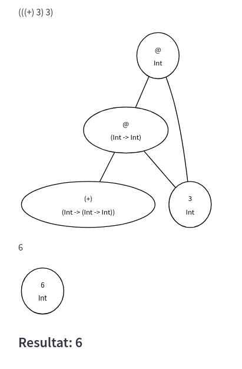
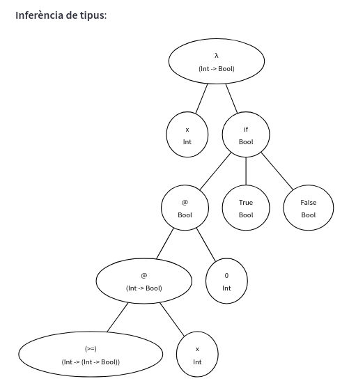

class: center, middle

# Implementació d'un llenguatge funcional

<br>


<br><br>

### Gerard Escudero

<br>


---
class: left, middle, inverse

## Contingut

- .cyan[Nucli bàsic]

- Avaluació _lazy_

- Supercombinadors

- Guardes i recursivitat

- Funcions d'ordre superior

- Constructors

- Referències

---

# Model computacional

El .blue[λ-càlcul] serà la base del nostre sistema. Ens proporciona:

- Aplicació: `f x`

- Abstracció: `λx.xy` (funcions anònimes)

- Mecanisme d'avaluació:
    ```
    β-reducció:
    (λx.xb) a → ab   # redex: aplicació d'una abstracció a un terme
    ```

    ```
    α-conversió:
    λx.xa ↔ λy.ya
    ```

    ```
    η-conversió:
    λx.F x ↔ F       # si x no hi és lliure a F 
    ```

- Ordre de reducció normal: base de l'avaluació _lazy_.
    
---

# Tipus i funcions predefinits

El λ-càlcul bàsic utilitza les codificacions de Church pels tipus:

| `Int` | `Bool` | Operadors |
|:---|:---|:---|
| 0 ≡ λs.λz.z | False ≡ λt.λf.f | succ ≡ λn.λf.λx.f(nfx) |
| 2 ≡ λs.λz.s(sz) | True ≡ λt.λf.t | not ≡ λg.gFalseTrue |

En implementar un llenguatge funcional s'utilitzen tipus predefinits.red[*]:

- `Int` (Integer): 2, -1...

    - Operadors aritmètics sense prioritat: `+ - * div mod`

    - Operadors relacionals: `== /= < > <= >=`

- `Bool`: True, False

    - Operadors booleans: `and or not`

.footnote[.red[*] .red[Model matemàtic]: λ-càlcul amb tipus ( λ → ) (_simply typed lambda calculus_)]

---

# Operacions i codificació

Operacions λ-càlcul:

```
β-reducció:
(\x -> x + x) 5  ≡  (λx.+ x x) 5 → + 5 5 → 10
```

```
η-conversió:
\x -> x + 1  ≡  λx.+ 1 x  ↔  + 1  ≡  (+) 1
```

Exemples:

```
2 + 3  ≡  (+) 2 3 
(+) 2 3  ≡  (+) 2 3

not True  ≡  not True

```

.blue[Procés]:

```
(\x -> x + x) 3

(root (expr (expr ( (expr \ x → (expr (expr x) + (expr x))) )) (expr 3)) <EOF>)
```

---

### (\x -> x + x) 3

.cols5050[
.col1[

]
.col2[

]]

---

### (\x -> x + x) 3

.cols5050[
.col1[

]
.col2[

]]

---

### (\x -> x + x) 3

.cols5050[
.col1[

]
.col2[

]]

---
class: left, middle, inverse

## Contingut

- .brown[Nucli bàsic]

- .cyan[Avaluació _lazy_]

- Supercombinadors

- Guardes i recursivitat

- Funcions d'ordre superior

- Constructors

- Referències

---

# Ordre d'avaluació

- .blue[Eager] (*call by value*): els paràmetres d'una funció són avaluats abans de la crida (ordre *aplicatiu*).

- .blue[Lazy] (*call by need*): els paràmetres d'una funció només s'han d'avaluar quan els seus valors són necessaris.

  - En cas d'avaluació, els paràmetres només s'han d'avaluar una vegada.


.blue[Avaluació lazy]: hem d'aplicar l'ordre de reducció normal, però **parar** quan no quedi cap **redex** en el nivell superior (**WHNF**). 

  *Weak Head Normal Form* (.blue[WHNF]): una expressió està en WHNF si és:

  - literal, variable, una abstracció lambda (`λx.(+) x 1`), ó

  - funció predefinida parcialment aplicada (`(+) ((-) 4 3)`).

.blue[Nota]: el resultat d'un programa funcional no pot tenir mai variables lliures.

.blue[Thunk]: funció o node aplicació per avaluar.

---

# Reducció de grafs.red[*]

.cols5050[
.col1[
.blue[Abstracció]:


1. β-reducció

2. Canvi arrel
]
.col2[
Forma del .blue[redex] (_spine_):


Pila d'@ per processar.
]]

.footnote[.red[*] Actualment s'utilitzen la .blue[G-Machine] i altres algorismes per fer la reducció de grafs.]

---

# Reducció de grafs

.cols5050[
.col1[
.blue[Funció primitiva]:


1. Reducció paràmetres 
  - Comprovació aritat
  - Reducció recursiva

2. Canvi arrel
]
.col2[
Forma del .blue[redex] (_spine_):


Pila d'@ per processar.
]]

---
class: left, middle, inverse

## Contingut

- .brown[Nucli bàsic]

- .brown[Avaluació _lazy_]

- .cyan[Supercombinadors]

- Guardes i recursivitat

- Funcions d'ordre superior

- Constructors

- Referències

---

# Supercombinadors

.blue[Supercombinador]: funció que només conté referències als seus paràmetres o a altres *supercombinadors*.

  - Faciliten la programació i la implementació.

.cols5050[
.col1[
.blue[Exemples]:

```haskell
inc = \x -> x + 1
inc 3
```

```haskell
doble x = x + x
doble (doble 3)
```

```haskell
dmu x y = inc x + inc y
```

.blue[Traducció]:

```
f x y = E  ≡  λx.λy.E 
```
]
.col2[
**Reduccions**:

```
(doble (doble 3))

((λx.(((+) x) x)) (doble 3))

(((+) (doble 3)) (doble 3))

(((+) ((λx.(((+) x) x)) 3)) 
      ((λx.(((+) x) x)) 3))

(((+) (((+) 3) 3)) (((+) 3) 3))

(((+) 6) 6)

12
```
]]

---

# Variables locals

Podem definir "variables" locals amb el `let`

.cols5050[
.col1[
.blue[Exemples]:


```
let x = 1 in (x + 2)

let x = 1
    y = 2
in (x + y)
```

.blue[Traducció]:

```
let v = B in E  ≡  (λv.E) B
```
]
.col2[
```
Entrada:

let x = 1
    y = 2
in (x + y)

Reduccions:

(((λx.(λy.(((+) x) y))) 1) 2)

((λy.(((+) 1) y)) 2)

(((+) 1) 2)

3
```
]]

---
class: left, middle, inverse

## Contingut

- .brown[Nucli bàsic]

- .brown[Avaluació _lazy_]

- .brown[Supercombinadors]

- .cyan[Guardes i recursivitat]

- Funcions d'ordre superior

- Constructors

- Referències

---

# Guardes

.cols5050[
.col1[
```haskell
positiu x 
  | x >= 0 = True
  | otherwise = False
```


]
.col2[
```haskell
Entrada:

signe x 
    | x < 0 = -1
    | x > 0 = 1
    | otherwise = 0

Reduccions:

signe 3

((λx.(if (((<) x) 0) -1 
     (if (((>) x) 0) 1 0))) 3)

(if (((<) 3) 0) -1 (if (((>) 3) 0) 1 0))

(if False -1 (if (((>) 3) 0) 1 0))

(if (((>) 3) 0) 1 0)

(if True 1 0)

1
```
]]

---

# Recursivitat

En la bibliografia implementen la recursivitat enriquint el λ-càlcul amb una instrucció adicional:

```
letrec v = B in E
    ≡ (let v = Y (λv.B) in E)
    ≡ (λv.E) (Y (λv.B))
```

```
Y ≡ λh.(λx.h (x x)) (λx.h (x x))
```

```
letrec factorial = λn.if (n == 0) 1 (factorial (n - 1) 
    in (factorial 4)
```

Una alternativa és utilitzar directament els _supercombinadors_.

---

# Implementació

- Enriquim el λ-càlcul amb el condicional.

  - L'implementació del condicional es fa a nivell de *visitor*.

  - S'ha de modificar la inferència de tipus per incloure el condicional.

  - Les guardes es tradueixen com a condicionals encadenats.

- La recursivitat l'implementarem directament amb supercombinadors:

    ```
    factorial n
        | n == 0 = 1
        | otherwise = n * factorial (n - 1) 
    ```

    ```
    fibonacci n
        | n < 2 = n
        | otherwise = fibonacci (n - 1) + fibonacci (n - 2) 
    ```

---

# Exemple

```
(factorial 1)

((λn.(if (((==) n) 0) 1 (((*) n) (factorial (((-) n) 1))))) 1)

(if (((==) 1) 0) 1 (((*) 1) (factorial (((-) 1) 1))))

(if False 1 (((*) 1) (factorial (((-) 1) 1))))

(((*) 1) (factorial (((-) 1) 1)))

(((*) 1) ((λn.(if (((==) n) 0) 1 (((*) n) 
    (factorial (((-) n) 1))))) (((-) 1) 1)))

(((*) 1) (if (((==) (((-) 1) 1)) 0) 1 (((*) (((-) 1) 1)) 
    (factorial (((-) (((-) 1) 1)) 1)))))

(((*) 1) (if (((==) 0) 0) 1 (((*) (((-) 1) 1)) 
    (factorial (((-) (((-) 1) 1)) 1)))))

(((*) 1) (if True 1 (((*) (((-) 1) 1)) (factorial (((-) (((-) 1) 1)) 1)))))

(((*) 1) 1)

1
```

---
class: left, middle, inverse

## Contingut

- .brown[Nucli bàsic]

- .brown[Avaluació _lazy_]

- .brown[Supercombinadors]

- .brown[Guardes i recursivitat]

- .cyan[Funcions d'ordre superior]

- Constructors

- Referències

---

# Composició

.cols5050[
.col1[
.blue[Exemples]:

```haskell
mp = (.) ((+) 1) ((*) 2)
mp 3

((.) ((+) 1) ((*) 2)) 3
```

.blue[Implementació]:

```
(.)  ≡  λf.λg.λx.f(gx) 
```

Implementació a nivell de _visitor_.

S'ha d'afegir polimorfisme a la inferència de tipus (variables de tipus).
]
.col2[
```
Reduccions:

(mp 3)

((((λf.(λg.(λx.(f (g x))))) 
    ((+) 1)) ((*) 2)) 3)

(((λg.(λx.(((+) 1) (g x)))) 
    ((*) 2)) 3)

((λx.(((+) 1) (((*) 2) x))) 3)

(((+) 1) (((*) 2) 3))

(((+) 1) 6)

7
```

]]

.footnote[.red[*] .red[Model matemàtic]: λ-càlcul polimòrfic (System F o λ-càlcul de 2on ordre). Introdueix un mecanisme de quantificació universal (lògica amb ∀x) sobre els tipus.]

---
class: left, middle, inverse

## Contingut

- .brown[Nucli bàsic]

- .brown[Avaluació _lazy_]

- .brown[Supercombinadors]

- .brown[Guardes i recursivitat]

- .brown[Funcions d'ordre superior]

- .cyan[Constructors]

- Referències

---

# Tipus enumerats

En una definició com la que segueix:

```haskell
data Jugada = Pedra | Paper | Tisores
```

es defineix un tipus: `type Jugada :: *`.

<br>

`Pedra`, `Paper` i `Tisores` valors del tipus `Jugada`. 

  - `Pedra :: Jugada`

  - És una funció _lazy_ sense paràmetres.

---

# Definició amb patrons

```haskell
guanya Paper Pedra = True
```
.cols5050[
.col1[

]
.col2[

]]

**Traducció**:

```
guanya = λPaper.λPedra.True

```

---

# Aplicació amb patrons

```
guanya = λPaper.λPedra.True

guanya Paper Pedra
```

**Reduccions**:

```
((guanya Paper) Pedra)

(((λPaper.(λPedra.True)) Paper) Pedra)

((λPedra.True) Pedra)

True
```

β-reducció: comprovar constructors.

  - Igual: aplicar funció

  - Diferents: no es pot aplicar la funció

El tractament de constructors també es pot aplicar a literals (`Int` i `Bool`).

---

# Patrons múltiples

.cols5050[
.col1[
**Exemple**:

```haskell
esPedra Pedra = True
esPedra x = False
```

**Operador ▯**:

```
⊥ ▯ b = ⊥
FAIL ▯ b = b
a ▯ b = a
```

**Traducció**:

```
esPedra = λp.(
    ((λPedra.True) p)
  ▯ ((λx.False) p)
  ▯ Error)
```
]
.col2[

]]

---

# Exemple complert

```haskell
data Jugada = Pedra | Paper | Tisores

guanya Paper Pedra = True
guanya Pedra Tisores = True
guanya Tisores Paper = True
guanya x y = False
```

**guanya Pedra Tisores**:

```
(((λp_1.(λp_2.((((λPaper.(λPedra.True)) p_1) p_2) ▯ 
              ((((λPedra.(λTisores.True)) p_1) p_2) ▯ 
              ((((λTisores.(λPaper.True)) p_1) p_2) ▯ 
              ((((λx.(λy.False)) p_1) p_2) ▯ FAIL)))))) Pedra) Tisores)

((λp_2.((((λPaper.(λPedra.True)) Pedra) p_2) ▯ 
       ((((λPedra.(λTisores.True)) Pedra) p_2) ▯ 
       ((((λTisores.(λPaper.True)) Pedra) p_2) ▯ 
       ((((λx.(λy.False)) Pedra) p_2) ▯ FAIL))))) Tisores)
```

---

### guanya Pedra Tisores

```
((λp_2.((((λPaper.(λPedra.True)) Pedra) p_2) ▯ 
       ((((λPedra.(λTisores.True)) Pedra) p_2) ▯ 
       ((((λTisores.(λPaper.True)) Pedra) p_2) ▯ 
       ((((λx.(λy.False)) Pedra) p_2) ▯ FAIL))))) Tisores)

((((λPaper.(λPedra.True)) Pedra) Tisores) ▯ 
((((λPedra.(λTisores.True)) Pedra) Tisores) ▯ 
((((λTisores.(λPaper.True)) Pedra) Tisores) ▯ 
((((λx.(λy.False)) Pedra) Tisores) ▯ FAIL))))

((((λPedra.(λTisores.True)) Pedra) Tisores) ▯ 
((((λTisores.(λPaper.True)) Pedra) Tisores) ▯ 
((((λx.(λy.False)) Pedra) Tisores) ▯ FAIL)))

(((λTisores.True) Tisores) ▯ 
((((λTisores.(λPaper.True)) Pedra) Tisores) ▯ 
((((λx.(λy.False)) Pedra) Tisores) ▯ FAIL)))

True
```

---

# Literals en patrons

```haskell
factorial 1 = 1
factorial n = n * factorial (n - 1)
factorial 2
```

```
((λp_1.(((λ1.1) p_1) ▯ (((λn.(((*) n) (factorial (((-) n) 1)))) p_1) ▯ FAIL))) 2)

(((λ1.1) 2) ▯ (((λn.(((*) n) (factorial (((-) n) 1)))) 2) ▯ FAIL))

(((λn.(((*) n) (factorial (((-) n) 1)))) 2) ▯ FAIL)

((((*) 2) (factorial (((-) 2) 1))) ▯ FAIL)

((((*) 2) ((λp_1.(((λ1.1) p_1) ▯ (((λn.(((*) n) (factorial (((-) n) 1)))) p_1) ▯ 
                  FAIL))) (((-) 2) 1))) ▯ FAIL)

((((*) 2) (((λ1.1) (((-) 2) 1)) ▯ 
          (((λn.(((*) n) (factorial (((-) n) 1)))) (((-) 2) 1)) ▯ FAIL))) ▯ FAIL)

((((*) 2) (((λ1.1) 1) ▯ (((λn.(((*) n) (factorial (((-) n) 1)))) (((-) 2) 1)) ▯ 
    FAIL))) ▯ FAIL)

((((*) 2) 1) ▯ FAIL)

2
```


---

# Tipus algebraics

**Maybe**:

- `type Maybe :: * -> *`

- `Just :: a -> Maybe a`

- `Nothing :: Maybe a` 

**Exemple**:

```haskell
data MaybeInt = Nothing | Just Int

isNothing Nothing = True
isNothing x = False

fromJust (Just x) = x

divisio x y
    | y == 0 = Nothing
    | otherwise = Just (div x y)

lift f Nothing = Nothing 
lift g (Just x) = Just (g x)  
```

---

# Maybe

```haskell
((lift inc) (Just 2))

(((λp_1.(λp_2.((((λf.(λNothing.Nothing)) p_1) p_2) ▯ 
              ((((λg.(λ(Just x).(Just (g x)))) p_1) p_2) ▯ FAIL)))) inc) (Just 2))

((λp_2.((((λf.(λNothing.Nothing)) inc) p_2) ▯ 
       ((((λg.(λ(Just x).(Just (g x)))) inc) p_2) ▯ FAIL))) (Just 2))

((((λf.(λNothing.Nothing)) inc) (Just 2)) ▯ 
  ((((λg.(λ(Just x).(Just (g x)))) inc) (Just 2)) ▯ FAIL))

(((λNothing.Nothing) (Just 2)) ▯ 
  ((((λg.(λ(Just x).(Just (g x)))) inc) (Just 2)) ▯ FAIL))

((((λg.(λ(Just x).(Just (g x)))) inc) (Just 2)) ▯ FAIL)

(((λ(Just x).(Just (inc x))) (Just 2)) ▯ FAIL)

((Just (inc 2)) ▯ FAIL)

((Just ((λx.(((+) x) 1)) 2)) ▯ FAIL)

((Just (((+) 2) 1)) ▯ FAIL)

(Just 3)
```

---

# Llistes

.cols5050[
.col1[
```haskell
data Llista = Nil | Cons Int Llista

empty Nil = True
empty x = False

head (Cons x l) = x

tail (Cons x l) = l
```

.blue[Exemple]:

```haskell
(head ((Cons 1) ((Cons 2) Nil)))

((λ((Cons x) l).x) ((Cons 1) 
                    ((Cons 2) Nil)))

1
```
]
.col2[

]]

---

# Arbres binaris

```
data Arbin = Buit | Node Int Arbin Arbin

mida Buit = 0
mida (Node n fe fd) = 1 + mida fe + mida fd
```


---

# Llistes infinites

.blue[ones]:

```haskell
data Llista = Nil | Cons Int Llista

take 0 l = Nil 
take n (Cons m l) = Cons m (take (n - 1) l)

ones = Cons 1 ones

take 3 ones
```

```
((take 3) ones)

(((λp_1.(λp_2.((((λ0.(λl.Nil)) p_1) p_2) ▯ ((((λn.(λ((Cons o) l).((Cons o) 
            ((take (((-) n) 1)) l)))) p_1) p_2) ▯ FAIL)))) 3) ones)

((λp_2.((((λ0.(λl.Nil)) 3) p_2) ▯ ((((λn.(λ((Cons o) l).((Cons o) 
            ((take (((-) n) 1)) l)))) 3) p_2) ▯ FAIL))) ones)

...

Resultat: ((Cons 1) ((Cons 1) ((Cons 1) Nil)))
```

---

# Llistes infinites

.blue[nats]:

```haskell
map g Nil = Nil
map f (Cons x l) = Cons (f x) (map f l)

inc x = x + 1

nats = Cons 0 (map inc nats)

take 3 nats
```

---
class: left, middle, inverse

## Contingut

- .brown[Nucli bàsic]

- .brown[Avaluació _lazy_]

- .brown[Supercombinadors]

- .brown[Guardes i recursivitat]

- .brown[Funcions d'ordre superior]

- .brown[Constructors]

- .cyan[Referències]

---

# Referències

- Gerard Escudero. [Mini Haskell en Python](), 2024. Enllaç a HuggingFace!!!!

- Simon L. Peyton Jones. *Implementation of functional programming languages*. Prentice Hall, 1987.

- Benjamin C. Pierce. *Types and Programming Languages*. The MIT Press, 2002.

---

# Treball futur

- Classes: com a interfícies

    ```
    type Eq :: * -> Constraint

    class Eq a where
      (==) :: a -> a -> Bool
      (/=) :: a -> a -> Bool
      -- let's just implement one function in terms of the other
      x /= y = not (x == y)
    ```

- Functors (fmap) i mònades (`>>=`)

- Constructors polimòrfics?

- Mònades + Teoria categories?

