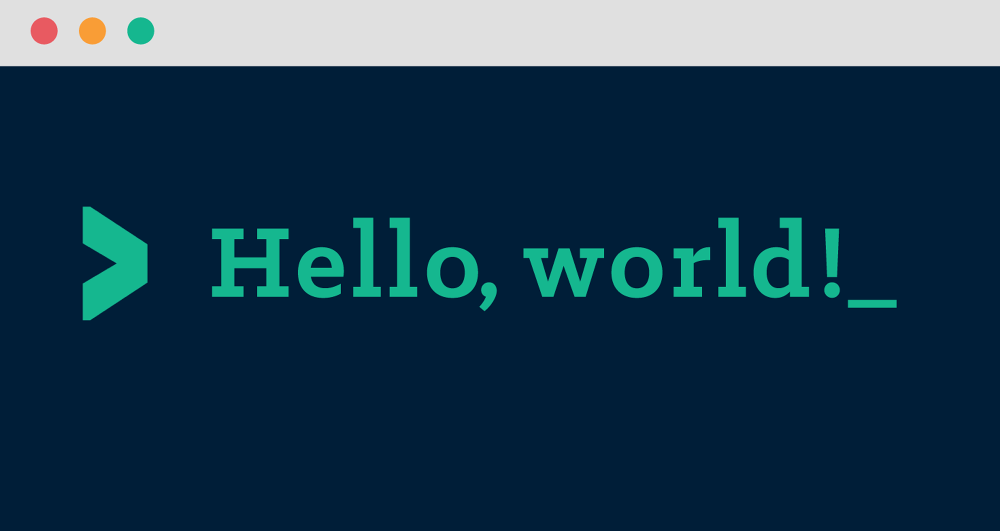
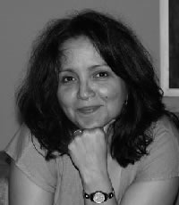

class: center, middle

## Llenguatges de Programació

# Presentació del curs

 

 

**Jordi Petit**

---
class: left, middle, inverse

## Contingut

- .cyan[Objectius]

- .cyan[Continguts]

- .cyan[Professorat]

- .cyan[Avaluació]

- .cyan[Bibliografia]

---

# Objectius

- Conèixer millor els llenguatges de programació

- Conèixer les característiques dels llenguatges funcionals

- Conèixer les característiques dels llenguatges de scripting

- Conèixer construccions avançades dels LPs

- Conèixer els elements bàsics de la compilació

- Millorar la capacitat d'aprendre nous llenguatges

- Millorar la capacitat de triar el LP adient

---

# Continguts

- Fonaments de Llenguatges de Programació

- Llenguatges funcionals: Haskell

- Llenguatges de scripting: Python

- Introducció a la compilació

- Sistemes de tipus

---

# Professorat

 &nbsp;
 &nbsp;
 &nbsp;
 &nbsp;

 

- Jordi Petit .xs[jordi.petit-silvestre@upc]

- Gerard Escudero .xs[gerard.escudero@upc]

- Edelmira Pasarella .xs[edelmira.pasarella@upc]

- Jordi Delgado .xs[jordi.delgado@upc]

---

## Mètode d'avaluació

La [Guia docent](https://www.fib.upc.edu/ca/estudis/graus/grau-en-enginyeria-informatica/pla-destudis/assignatures/LP)
estableix aquesta avaluació: N = 0.5·F + 0.25·P1 + 0.25·P2,
on:

- P1 = nota de l'examen parcial (mitjans de curs)
- P2 = nota de la pràctica (finals de curs)
- F = nota de l'examen final

El parcial serà un examen a Jutge.org sobre programació funcional en Haskell.

La pràctica consisteix en utilitzar eines per generar compiladors i
Python per a resoldre un cas pràctic. S'hauran de lliurar un informe i un vídeo que serviran per obtenir les qualificacions de les competències transversals.

El final serà un examen escrit que avaluarà sobre *tots* els continguts
del curs.

---

# Calendari

- Classes:

    - Inici: dl 7 de setembre

    - Final: dc 23 de desembre

- Exàmens:

    - Examen parcial: dv 30 d'octubre
        (10:30 - 12:30)

    - Examen final: dj 7 de gener
        (9:00 - 11:00)

- Pràctica:

    - Lliurament: dj 7 de gener (08:00)

---

# Bibliografia

- *Concepts in programming languages*. Mitchell, J.C, Cambridge University Press, 2003.

- *Compiler design*. Wilhelm, R.; Maurer, D, Addison-Wesley, 1995.

- *Compilers: principles, techniques, and tools*. Aho, A.V.; Sethi, R.;
Ullman, J.D, Addison-Wesley, 2007.

- *Programming language pragmatics*. Scott, M.L, Morgan Kaufmann, 2009.

- *Haskell: the craft of functional programming*. Thompson, S, Addison-Wesley, 2011.

- *Razonando con Haskell: un curso sobre programación funcional*. Ruiz Jiménez, B.C,
Thomson-Paraninfo, 2004.

- *Learn You Haskell for a Great Good*. Miran Lipovaĉa. .small[[Disponible online](http://learnyouahaskell.com/).]

- *Think Python*. Downey, B. O'Reilly, 2015. .small[[Disponible online](https://greenteapress.com/wp/think-python-2e/).]

